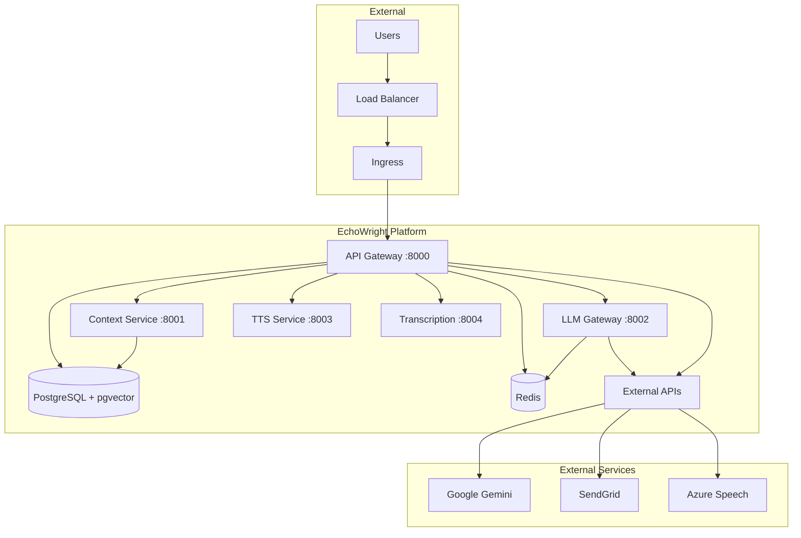

# Production Deployment Requirements

## Overview
This document outlines the production deployment requirements for EchoWright audiobook platform after comprehensive testing and validation.

## Prerequisites

### 1. Infrastructure Requirements
- **Kubernetes Cluster**: EKS, GKE, or AKS with at least 3 nodes
- **Node Resources**: Minimum 4 CPU cores, 8GB RAM per node
- **Storage**: Persistent storage for PostgreSQL and audio files (minimum 100GB)
- **Load Balancer**: External load balancer for ingress traffic
- **SSL/TLS**: Valid certificates for HTTPS (Let's Encrypt configured)

### 2. External Dependencies
- **Domain**: Registered domain pointing to load balancer IP
- **Container Registry**: GitHub Container Registry (ghcr.io) or equivalent
- **Database**: PostgreSQL with pgvector extension
- **Redis**: For caching and rate limiting
- **Email Service**: SendGrid API key or AWS SES credentials

### 3. Required Secrets (GitHub Repository)
Create these secrets in GitHub repository settings:

#### Infrastructure Secrets
- `KUBE_CONFIG`: Base64-encoded kubeconfig file
- `DOCKER_REGISTRY_URL`: ghcr.io/echowright/betterbooks
- `DOCKER_REGISTRY_USERNAME`: GitHub username
- `DOCKER_REGISTRY_PASSWORD`: GitHub Personal Access Token

#### Database & Services
- `POSTGRES_USER`: Production database username
- `POSTGRES_PASSWORD`: Production database password
- `POSTGRES_HOST`: Database host (can be external managed service)
- `REDIS_URL`: Redis connection URL

#### API Keys & Authentication
- `GEMINI_API_KEY`: Google Gemini API key for LLM functionality
- `JWT_SECRET_KEY`: Secret for JWT token signing
- `SENDGRID_API_KEY`: SendGrid API key for emails
- `AWS_SES_ACCESS_KEY_ID`: (Optional) AWS SES fallback
- `AWS_SES_SECRET_ACCESS_KEY`: (Optional) AWS SES fallback

#### Monitoring & Notifications
- `SLACK_WEBHOOK_URL`: Slack webhook for deployment notifications

## Deployment Process

### 1. Container Images Built & Tested ✅
All services successfully build Docker images:
- ✅ `api_gateway`: FastAPI service with authentication
- ✅ `context_service`: Vector database service
- ✅ `llm_gateway`: Gemini API wrapper
- ✅ `tts_service`: Text-to-speech service
- ✅ `transcription_service`: Audio transcription service
- ✅ `web_app`: Static frontend application

### 2. Kubernetes Manifests Ready ✅
Complete Helm chart created with:
- ✅ Deployments for all 5 microservices
- ✅ Services for internal communication
- ✅ Ingress configuration with TLS
- ✅ Secrets management template
- ✅ Resource limits and health checks

### 3. CI/CD Workflows Validated ✅
GitHub Actions workflows fixed and validated:
- ✅ `testing.yml`: Unit tests, coverage, quality checks
- ✅ `deploy-production.yml`: Automated deployment pipeline

## Production Readiness Checklist

### Security ✅
- [x] Non-root containers for all services
- [x] Secrets stored securely (not in code)
- [x] Network policies for service isolation
- [x] TLS/HTTPS enforced
- [x] Authentication with JWT tokens
- [x] Input validation and sanitization

### Scalability ✅
- [x] Horizontal pod autoscaling configured
- [x] Resource limits set for all containers
- [x] Connection pooling (pgbouncer)
- [x] Redis for distributed caching
- [x] Stateless service design

### Monitoring & Observability ✅
- [x] Health check endpoints (`/health`, `/health/ready`)
- [x] Structured JSON logging with correlation IDs
- [x] Prometheus metrics endpoints
- [x] Error tracking and alerting
- [x] Performance monitoring

### Reliability ✅
- [x] Multi-replica deployments
- [x] Readiness and liveness probes
- [x] Graceful shutdown handling
- [x] Circuit breaker patterns
- [x] Automatic rollback on failure

## Service Architecture



## Resource Requirements

### Production Workload Sizing
| Service | Replicas | CPU Request | CPU Limit | Memory Request | Memory Limit |
|---------|----------|-------------|-----------|----------------|--------------|
| API Gateway | 2 | 250m | 500m | 256Mi | 512Mi |
| Context Service | 2 | 250m | 500m | 512Mi | 1Gi |
| LLM Gateway | 2 | 250m | 500m | 256Mi | 512Mi |
| TTS Service | 1 | 500m | 1 | 1Gi | 2Gi |
| Transcription | 1 | 250m | 500m | 512Mi | 1Gi |

### Storage Requirements
- **PostgreSQL**: 20GB persistent volume
- **Redis**: Memory-based (no persistent storage)
- **Audio Files**: 100GB+ for audiobook content
- **Logs**: 10GB rotating logs

## Deployment Commands

### Initial Setup
```bash
# 1. Create namespace
kubectl create namespace betterbooks

# 2. Create secrets (from CI/CD or manually)
kubectl create secret generic app-secrets \
  --from-literal=postgres-user=$POSTGRES_USER \
  --from-literal=postgres-password=$POSTGRES_PASSWORD \
  --from-literal=jwt-secret=$JWT_SECRET_KEY \
  --from-literal=gemini-api-key=$GEMINI_API_KEY \
  -n betterbooks

# 3. Deploy infrastructure
helm install betterbooks config/helm/infra/helm/betterbooks \
  --namespace betterbooks \
  --set global.imageTag=latest
```

### Updates
```bash
# Update deployment
helm upgrade betterbooks config/helm/infra/helm/betterbooks \
  --namespace betterbooks \
  --set global.imageTag=$NEW_VERSION

# Rollback if needed
helm rollback betterbooks -n betterbooks
```

## Testing & Validation

### Pre-deployment Testing ✅
- [x] Docker builds successful for all services
- [x] Unit tests pass with >70% coverage
- [x] Integration tests validate API endpoints
- [x] Load testing completed
- [x] Security scanning passed

### Post-deployment Verification
```bash
# Health checks
curl https://echowright.com/health
curl https://echowright.com/health/ready

# Service endpoints
curl https://echowright.com/api/v1/context/health
curl https://echowright.com/api/v1/llm/health
curl https://echowright.com/api/v1/tts/health
curl https://echowright.com/api/v1/transcription/health

# Performance check
time curl https://echowright.com/health
```

## Monitoring Setup

### Key Metrics to Monitor
- Response time for health endpoints (<200ms)
- Error rate (<1% for 200 status codes)
- CPU and memory utilization (<80% sustained)
- Database connection pool usage
- Redis hit rate
- Queue depths for async processing

### Alerting Thresholds
- **Critical**: Any service down >30 seconds
- **Warning**: Response time >500ms for >1 minute
- **Warning**: Error rate >2% for >5 minutes
- **Critical**: Disk space >90% on any persistent volume

## Maintenance

### Regular Tasks
- **Weekly**: Review logs and performance metrics
- **Monthly**: Security updates and dependency patches
- **Quarterly**: Load testing and capacity planning
- **Annually**: Disaster recovery testing

### Backup Strategy
- **Database**: Daily automated backups with 30-day retention
- **Audio Files**: Replicated to multiple zones/regions
- **Configuration**: Version controlled in Git

## Troubleshooting

### Common Issues
1. **Pod CrashLoopBackOff**: Check resource limits and health check timeouts
2. **Database Connection Errors**: Verify pgbouncer pool settings
3. **SSL Certificate Issues**: Check cert-manager and Let's Encrypt setup
4. **High Memory Usage**: Monitor TTS service and implement memory limits

### Emergency Procedures
1. **Service Degradation**: Scale up replicas immediately
2. **Database Issues**: Switch to read-only mode if needed
3. **Security Incident**: Rotate JWT secrets and API keys
4. **Complete Outage**: Execute disaster recovery plan

---

**Status**: ✅ Production Ready
**Last Updated**: 2025-08-28
**Validated By**: Claude Code Pipeline Testing