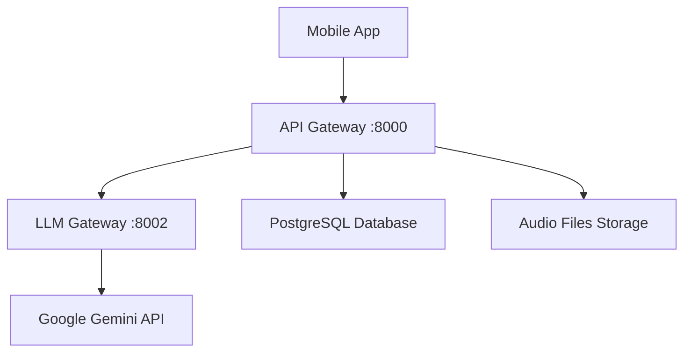

# EchoWright - Audiobooks with AI Chat

An MVP audiobook platform that combines traditional audiobook listening with AI-powered chat companions - like "Audible with an AI chatbot".

## 🚀 Quick Start

### Prerequisites
- **Docker & Docker Compose**
- **Flutter 3.0+** (for mobile app)

### Setup
1. **Clone and start:**
   ```bash
   git clone https://github.com/username/echowright.git
   cd echowright
   export GEMINI_API_KEY=your-key
   docker-compose up --build
   ```

2. **Access the platform:**
   - **API Gateway:** http://localhost:8000
   - **Mobile App:** `cd platform/mobile/mobile_app && flutter run`

## ✨ Current MVP Features

### Core Platform
- **📚 Book Library** - Browse and manage audiobooks
- **🎵 Audio Playback** - Stream audiobooks with standard controls
- **👤 User Accounts** - Email/password authentication
- **💳 Credits System** - Purchase books with credits

### AI Features
- **🤖 AI Chat Companions** - Chat with AI personas while listening
- **🎭 Multiple Personas** - English Teacher, Language Tutor, General Helper
- **💬 Context-Aware** - AI knows what book you're listening to
- **🔤 Text & Voice** - Chat via text or voice interaction

## 🏗️ Architecture



### Services
- **API Gateway** (port 8000) - Main backend API
- **LLM Gateway** (port 8002) - AI persona management
- **PostgreSQL** - User data, books, libraries
- **Mobile App** - Flutter iOS/Android app

## 📱 Mobile App

The main user interface is a Flutter mobile app with:
- **Home Screen** - Browse books and continue listening
- **Player Screen** - Audio controls + AI chat interface
- **Library Screen** - Your purchased books
- **Chat Screen** - Full conversation history with AI personas

```bash
cd platform/mobile/mobile_app
flutter pub get
flutter run
```

## 🛠️ Development

### Local Backend
```bash
# Start all services
docker-compose up --build

# Run tests
pytest tests/unit/ -v
```

### Key Files
- `platform/backend/services/api_gateway/` - Main backend API
- `platform/backend/services/llm_gateway/` - AI chat functionality  
- `platform/mobile/mobile_app/` - Flutter mobile app
- `config/helm/` - Kubernetes deployment

## 📋 Current Status

### ✅ Working
- Basic authentication (email/password)
- Book catalog and library management
- Audio playback functionality
- AI personas and chat system
- Flutter mobile app UI

### 🚧 In Progress
- Real database connections for all services
- Azure blob storage for audio files
- Email verification system
- Real payment integration

### 🔧 Known Issues
See [backLog.md](backLog.md) and [TECHNICAL_DEBT.md](TECHNICAL_DEBT.md) for current bugs and technical debt.

## 🚀 Deployment

### Local Development
```bash
docker-compose up --build
```

### Production (Azure)
See [azure_progress.md](azure_progress.md) for current Azure deployment status.

## 📖 Documentation

- [CLAUDE.md](CLAUDE.md) - Development commands and architecture
- [completeFeatures.md](completeFeatures.md) - Long-term feature vision
- [TECHNICAL_DEBT.md](TECHNICAL_DEBT.md) - Current technical debt and priorities
- [backLog.md](backLog.md) - Bug reports and feature requests

## 🎯 Vision

The goal is to create an audiobook platform where:
1. Users browse and purchase audiobooks (like Audible)
2. While listening, they can chat with AI personas about the content
3. AI provides educational insights, answers questions, and enhances comprehension
4. Different personas offer different perspectives (teacher, tutor, character analysis)

---

**Current Focus:** Getting the MVP to production-ready state with working authentication, real book data, and stable AI chat functionality.