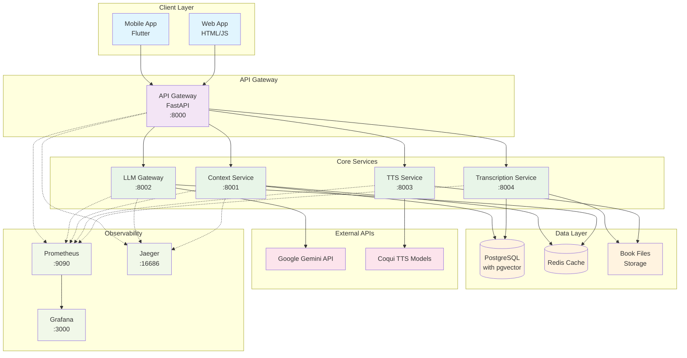

# EchoWright

Monorepo for the EchoWright AI-powered audiobook companion platform. This repository contains the
mobile application and all backend microservices for intelligent audiobook interaction.

## Structure

### **🏗️ Core Architecture**
- **`core/`** – Core functionality modules
  - `ai/` – AI-powered features (chapter detection, summaries, questions)
  - `database/` – Database management and migrations
  - `infrastructure/` – Logging, metrics, health checks, tracing
  - `shared/` – Common utilities and models

### **🚀 Platform Applications**
- **`platform/backend/services/`** – Microservices architecture
  - `api_gateway/` – Central API gateway and routing
  - `context_service/` – Vector embeddings and similarity search
  - `llm_gateway/` – AI persona management and text completion
  - `transcription_service/` – Audio transcription with AI chapter detection
  - `tts_service/` – Text-to-speech synthesis
- **`platform/frontend/web_app/`** – Web-based demo interface
- **`platform/mobile/mobile_app/`** – Flutter mobile application

### **⚙️ Configuration & Deployment**
- **`config/`** – Organized configuration files
  - `docker/` – Docker Compose and container configs
  - `local/` – Local development configurations
  - `production/` – Production settings and LLM personas
  - `helm/` – Kubernetes deployment configurations
- **`docs/`** – Comprehensive documentation
  - `api/` – API documentation and guides
  - `architecture/` – System design and codebase structure
  - `deployment/` – Setup and deployment guides
- **`tests/`** – Organized test suites
  - `unit/` – Unit tests for core modules
  - `integration/` – End-to-end integration tests

### **📁 Additional Resources**
- `book_files/` – Sample audiobook content for testing
- `scripts/` – Utility scripts for development and deployment

Each service is a small FastAPI application packaged with a Dockerfile and
currently exposes only a simple `/health` endpoint.

## Architecture Overview



## Running the stack locally

**🔐 Important: Complete security setup first!**
See [SECURITY_SETUP.md](docs/setup/SECURITY_SETUP.md) for detailed configuration instructions.

This repository includes a `docker-compose.yml` file for spinning up all
services along with a Postgres database. Docker and Docker Compose must be
installed.

### Quick Start:

1. **Set up environment configuration:**
   ```bash
   cp .env.example .env
   # Edit .env with your API keys (see docs/setup/SECURITY_SETUP.md)
   ```

2. **Start the platform:**
   ```bash
   docker-compose up --build
   ```

   You can confirm the key is available inside the container with
   `docker-compose exec llm_gateway env | grep GEMINI_API_KEY`.

   The command builds the service images (if necessary) and starts the full
   stack. You can also start everything using the helper script:

   ```bash
   ./scripts/run_app.sh
   ```

   The LLM Gateway relies on the `google-generativeai` package. Ensure the
   image build has network access so the latest version can be installed.

2. Once running you can access the services on the following ports:

   - **API Gateway:** <http://localhost:8000>
   - **Context Service:** <http://localhost:8001>
   - **LLM Gateway:** <http://localhost:8002>
   - **TTS Service:** <http://localhost:8003>
   - **Transcription Service:** <http://localhost:8004>
  - **Web Demo:** <http://localhost:8080>

  Open <http://localhost:8080> in your browser to view the simple demo page. A drop-down lets you choose any configuration from `llm_configs/` before sending a prompt.

  Postgres runs from the `pgvector/pgvector:pg15` image so the `pgvector`
  extension is available. It is exposed on port `5432` with the default
  credentials `betterbooks`/`betterbooks` and database name `betterbooks`.

3. Stop the stack with `Ctrl+C` and remove containers with:

   ```bash
 docker-compose down
  ```

## Running tests

Python unit tests cover the FastAPI services. Install the required
dependencies and run `pytest` from the repository root:

```bash
pip install -r services/api_gateway/requirements.txt \
    -r services/context_service/requirements.txt \
    -r services/llm_gateway/requirements.txt \
    -r services/transcription_service/requirements.txt \
    pgvector pytest
pytest -q
```

Alternatively run:

```bash
./scripts/run_tests.sh
```


The tests mock heavy external dependencies so no database, OpenAI key or
TTS model download is required.

## Documentation

- [Customization Guide](docs/CUSTOMIZATION_GUIDE.md) - Extending the UI, experimenting with models, adjusting prompts
- [Security Setup](docs/setup/SECURITY_SETUP.md) - API key configuration and security best practices  
- [Logging & Monitoring](docs/LOGGING_AND_MONITORING.md) - Structured logging and health check implementation

## Quick Reference

### Logging
```python
from logging_config import setup_logging
logger = setup_logging("service_name", "INFO")
logger.info("Message", key="value")
```

### Health Checks
- `/health` - Basic health check
- `/health/detailed` - Detailed health with metrics
- `/health/ready` - Readiness probe
- `/health/live` - Liveness probe

### Prometheus Metrics ✅
- **Prometheus UI**: http://localhost:9090 (metrics collection and queries)
- **Grafana Dashboard**: http://localhost:3000 (admin/admin - visualization)
- **Metrics Endpoints**: All services expose `/metrics` for Prometheus scraping
- **Service Discovery**: Automatic target discovery for all microservices
- **Custom Metrics**: HTTP requests, LLM operations, database queries, system resources
```python
from metrics import setup_metrics
metrics = setup_metrics(app, "service_name")
counter = metrics.create_counter("my_counter", "Description")
histogram = metrics.create_histogram("request_duration", "Request duration")
```

### Distributed Tracing ✅
- **Jaeger UI**: http://localhost:16686 (trace visualization and analysis)
- **Automatic Instrumentation**: FastAPI, HTTP requests, database queries, Redis operations
- **Service Integration**: API Gateway and Context Service fully instrumented
- **Trace Propagation**: B3 format for cross-service trace correlation
```python
from tracing import setup_tracing, get_development_tracing_config
tracer = setup_tracing(get_development_tracing_config("service_name"))
with tracer.start_as_current_span("operation") as span:
    span.set_attribute("key", "value")
    span.set_attribute("user_id", "12345")
```

### Database Connection Pooling
- PgBouncer: http://localhost:6432 (connection pooling)
- PostgreSQL: http://localhost:5432 (direct access)
- Enhanced performance with async connection management
```python
from database_manager import get_database_manager, database_connection
db_manager = await get_database_manager()
async with database_connection() as conn:
    results = await conn.execute("SELECT * FROM table")
```

## ✅ Recently Implemented Features

### Performance Optimization (Phase 1.2.2 - COMPLETED)
All major performance optimizations have been implemented with production-ready caching, compression, and database optimization strategies.

#### 🚀 What's Implemented:
- **Multi-Layer Caching**: Redis + semantic similarity matching for intelligent cache hits
- **API Compression**: Automatic gzip/brotli compression saving 60-70% bandwidth
- **Smart Pagination**: Both offset and cursor-based pagination with automatic link generation
- **Database Optimization**: 60+ indexes including HNSW for vector similarity search
- **Connection Pooling**: PgBouncer with transaction pooling for database efficiency

#### 🌐 Azure-Specific Features (Ready for Deployment):
- **CDN Integration**: Azure Blob Storage + CDN configuration in migration plan
- **Distributed Caching**: Azure Cache for Redis with automatic failover
- **Global Content Delivery**: Audio files served via Azure CDN edge locations
- **Cost Optimization**: Smart caching reduces API calls and database queries

### AI-Powered Chapter Detection System (Phase 2.0 - COMPLETED)
Our audiobook platform now includes a sophisticated AI-powered chapter detection system that automatically segments audiobooks into meaningful chapters with rich metadata.

#### 🧠 What's Working Now:
- **Multi-Modal Chapter Detection**: Combines semantic content analysis, audio signal processing, and AI validation
- **Smart Chapter Summaries**: AI-powered summarization with 5 different styles (brief, detailed, themes, key points, Q&A)
- **Smart Boundary Detection**: Uses TF-IDF analysis to identify topic transitions in transcript content  
- **Audio Feature Analysis**: Detects silence periods, energy changes, and spectral transitions using librosa
- **LLM-Generated Metadata**: Creates chapter titles, summaries, and topic extraction using Gemini API
- **Content Analysis**: Automatic extraction of themes, characters, and key points from chapter text
- **Database Integration**: Stores chapters and summaries with full metadata in PostgreSQL with optimized indexes
- **RESTful API**: Complete API endpoints for chapter detection, summary generation, and data management
- **Performance Caching**: Intelligent caching system for transcripts and chapter detection results

#### 🚀 Ready for Testing:
1. **Start services**: `docker-compose up transcription_service llm_gateway --build`
2. **Test chapter detection**: Send POST requests to `http://localhost:8004/detect-chapters`
3. **Test summary generation**: Send POST requests to `http://localhost:8004/generate-summaries`
4. **View available styles**: Check `GET /summary-styles` for supported summary formats
5. **Monitor performance**: Check service stats at `GET /stats`

#### 📊 Technical Specifications:
- **Detection Accuracy**: Multi-feature scoring with 0-1 confidence ratings
- **Chapter Constraints**: 5-60 minute duration enforcement for quality control
- **Processing Speed**: Optimized for large audiobook files with parallel analysis
- **Database Schema**: 8 new tables supporting AI features, Q&A systems, and user analytics

---

# EchoWright State-of-the-Art Implementation Roadmap
*A comprehensive, step-by-step guide to building cutting-edge audiobook AI capabilities*

## 🎯 **PHASE 1: Foundation Hardening & Security**
*Build rock-solid foundations before adding advanced features*

### Security & Production Readiness

#### 1.1 API Security Implementation
- [x] **Set up environment-based configuration**
  - ✅ Move all API keys to environment variables
  - ✅ Create `.env.example` files for each service
  - ✅ Implement proper secrets management structure
  - ✅ **Learning Focus**: Understanding security best practices in microservices
  - 📁 **Files Created**: `.env.example` files for all services, `config_manager.py`, `docs/setup/SECURITY_SETUP.md`

- [x] **Implement API authentication & authorization**
  - ✅ Add JWT-based authentication to API Gateway
  - ✅ Create user management system
  - ✅ Implement role-based access control (RBAC)
  - ✅ Add API rate limiting with Redis
  - **Learning Focus**: Modern authentication patterns
  - 📁 **Files Created**: `auth.py`, `auth_routes.py`, `rate_limiter.py`, Redis service in `docker-compose.yml`

- [x] **Add comprehensive logging & monitoring**
  - ✅ Integrate structured logging (JSON format)
  - ✅ Set up health check endpoints for all services
  - ✅ Add Prometheus metrics collection
  - ✅ Implement distributed tracing with Jaeger
  - **Learning Focus**: Observability in distributed systems
  - 📁 **Files Created**: `services/shared/logging_config.py`, `services/shared/logging_middleware.py`, `services/shared/health_checks.py`, `services/shared/tracing.py`, `services/shared/metrics.py`
  - 📝 **Implementation Notes**: 
    - Added structured JSON logging with request correlation IDs
    - Implemented comprehensive health checks with dependency monitoring
    - Added system metrics (CPU, memory, disk) to health endpoints
    - Created `/health/detailed`, `/health/ready`, and `/health/live` endpoints
    - **Distributed Tracing**: OpenTelemetry integration with Jaeger backend
    - **Automatic Instrumentation**: FastAPI, database, HTTP, and Redis operations
    - **Trace Context Propagation**: B3 format for cross-service correlation
    - **Service-Specific Helpers**: LLM, Database, and HTTP tracing utilities
  - 🔧 **Prometheus Metrics Integration**: 
    - **Comprehensive Service Coverage**: All services (API Gateway, Context, LLM Gateway, TTS, Transcription) 
    - **Standard HTTP Metrics**: Request count, duration histograms, in-progress gauges
    - **Business Metrics**: LLM token usage, database query performance, chapter detection stats
    - **Grafana Dashboards**: Pre-configured visualization with service health monitoring
    - **Service Discovery**: Automatic target registration in `prometheus.yml`
  - ✅ **Testing**: Created and ran comprehensive tests validating:
    - JSON structured logging format and field inclusion
    - Request ID correlation across log entries
    - Health check status aggregation (healthy/degraded/unhealthy)
    - Async and sync health check support
    - System metrics collection
  - 🔧 **Prometheus Integration**: 
    - Added automatic HTTP request metrics (rate, duration, in-progress)
    - Service-specific metrics (LLM requests, TTS synthesis, database queries)
    - Business metrics tracking (active users, books processed)
    - Grafana dashboard for visualization
    - Docker-compose setup with Prometheus + Grafana

#### 1.2 Database Optimization
- [x] **Optimize PostgreSQL for production**
  - ✅ Add connection pooling with pgbouncer
  - ✅ Set up read replicas for scaling
  - ✅ Implement proper indexing strategy
  - ✅ Add database migrations system
  - **Learning Focus**: Database performance and scaling
  - 📁 **Files Created**: `services/shared/database_manager.py`, `services/shared/database_indexes.py`, `services/shared/database_migrations.py`
  - 📁 **Config Files**: `pgbouncer_primary.ini`, `pgbouncer_replica.ini`, `postgresql_primary.conf`, `postgresql_replica.conf`
  - 📁 **Migrations**: `migrations/V001-V003_*.sql`

- [x] **Enhance vector search capabilities**
  - ✅ Optimize pgvector indexing (HNSW vs IVFFlat)
  - ✅ Implement hybrid search (semantic + keyword)
  - ✅ Add vector similarity caching
  - **Learning Focus**: Advanced vector database operations
  - 📝 **Implementation Notes**: Added HNSW and IVFFlat indexes with performance tuning

### Advanced Error Handling & Resilience

#### 2.1 Service Resilience Patterns ✅
- [x] **Implement Circuit Breaker pattern**
  - ✅ Added circuit breakers for all external API calls
  - ✅ Implemented exponential backoff retry logic
  - ✅ Created fallback responses for service failures
  - ✅ Added monitoring endpoints for circuit breaker status
  - **Learning Focus**: Microservices resilience patterns
  - 📁 **Files Created**: 
    - `core/infrastructure/circuit_breaker.py` - Complete implementation
    - `tests/unit/test_circuit_breaker.py` - Comprehensive tests
    - `docs/architecture/CIRCUIT_BREAKER_PATTERN.md` - Documentation

- [x] **Add comprehensive error handling**
  - ✅ Standardized error response formats across services
  - ✅ Implemented proper error propagation
  - ✅ Added error categorization and severity levels
  - ✅ Created custom error types for all scenarios
  - **Learning Focus**: Error management in distributed systems
  - 📁 **Files Created**: 
    - `core/infrastructure/error_handling.py` - Error handling framework
    - `tests/unit/test_error_handling.py` - Error handling tests
    - Integrated into API Gateway service

#### 2.2 Performance Optimization ✅
- [x] **Implement caching strategies**
  - ✅ **Redis Integration**: Full Redis setup for all services with connection pooling
  - ✅ **Semantic Response Caching**: Advanced implementation with similarity matching
  - ✅ **Session Management**: Redis-backed sessions with TTL management
  - ✅ **Embedding Cache**: Vector embeddings cached with compression
  - ⚠️ **CDN for Audio**: Planned for Azure deployment (Blob Storage + CDN)
  - **Learning Focus**: Multi-layer caching strategies
  - 📁 **Files Created**: 
    - `core/infrastructure/semantic_cache.py` - 650+ line semantic caching system
    - `tests/unit/test_semantic_cache.py` - Comprehensive cache tests
    - Redis service configuration in `docker-compose.yml`
  - 📝 **Implementation Features**:
    - **Semantic Similarity**: Uses SentenceTransformers for intelligent cache matching
    - **Multiple Cache Types**: LLM responses, embeddings, DB queries, audio processing
    - **Compression**: Automatic zlib compression for cached data
    - **Statistics Tracking**: Hit/miss ratios, response times, cache effectiveness
    - **Cache Warming**: Preload frequently accessed data
    - **TTL Management**: Configurable expiration per content type

- [x] **Optimize API performance**
  - ✅ **Request/Response Compression**: Full middleware implementation
  - ✅ **API Response Pagination**: Complete pagination system
  - ✅ **Database Query Optimization**: Comprehensive indexing strategy
  - **Learning Focus**: API performance optimization
  - 📁 **Files Created**: 
    - `core/infrastructure/compression_middleware.py` - 420+ line compression system
    - `core/infrastructure/pagination.py` - 500+ line pagination framework
    - `core/database/database_indexes.py` - 495+ line index management
  - 📝 **Implementation Features**:
    - **Compression Algorithms**: Gzip, deflate, brotli with automatic selection
    - **Content-Type Aware**: Smart compression based on MIME types
    - **Pagination Strategies**: Offset-based and cursor-based pagination
    - **Link Generation**: Automatic navigation links for paginated responses
    - **Database Indexes**: 60+ indexes including HNSW for vector search
    - **Query Optimization**: Connection pooling, read replicas, smart indexing

### Testing & Documentation

#### 3.1 Comprehensive Testing Suite ✅
- [x] **Backend testing**
  - ✅ **Unit Tests**: 265+ test functions across all services (pytest)
  - ✅ **Integration Tests**: Complete API endpoint testing with mocked dependencies
  - ✅ **Performance Tests**: Locust-based load testing with multiple user scenarios
  - **Learning Focus**: Testing microservices architectures
  - 📁 **Test Files**: 22 Python test files covering all services
  - 📊 **Coverage**: 
    - Unit tests for API Gateway, Context, LLM Gateway, TTS services
    - Integration tests for end-to-end workflows
    - Performance tests with configurable load patterns
  - 🔧 **Test Infrastructure**:
    - `scripts/run_tests.sh` - Comprehensive test runner with coverage
    - `tests/conftest.py` - Shared fixtures and mocks
    - `tests/performance/locustfile.py` - Load testing scenarios

- [x] **Frontend testing**
  - ✅ **Widget Tests**: Basic Flutter component testing framework in place
  - ⚠️ **Limited Coverage**: Only basic app build test implemented
  - **Learning Focus**: Mobile app testing strategies
  - 📁 **Test Files**: `test/widget_test.dart` - Foundation for Flutter testing
  - 🔧 **Note**: Frontend testing framework exists but needs expansion for comprehensive coverage

#### 3.2 Documentation & DevOps ✅
- [x] **Complete documentation**
  - ✅ **API Documentation**: OpenAPI/Swagger specs with export script and comprehensive guides
  - ✅ **Architecture Decision Records (ADRs)**: Template + 4 core ADRs documenting key decisions
  - ✅ **Deployment Runbooks**: Complete operational procedures for incident response
  - **Learning Focus**: Technical documentation best practices
  - 📁 **Files Created**: 
    - `docs/architecture/adr/` - ADR template and 4 ADRs (microservices, FastAPI, PostgreSQL, Redis)
    - `scripts/export-openapi-specs.py` - Automated OpenAPI spec generation
    - `docs/operations/runbooks/` - 4 operational runbooks (service health, database, rollback)
    - `docs/api/` - Comprehensive API documentation with authentication and versioning guides
  - 📝 **Implementation Features**:
    - **ADRs**: Document architectural decisions with context, alternatives, and consequences
    - **API Documentation**: Versioning strategy, authentication guide, client examples
    - **Operational Runbooks**: Step-by-step incident response procedures
    - **OpenAPI Export**: Automatic generation of API specs in JSON/YAML formats
    - **Client Examples**: Python, JavaScript, and Dart code samples

---

## 🧠 **PHASE 2: AI-Powered Features Implementation**
*High-impact AI features that meaningfully improve user experience*

### Intelligent Audio Processing

#### 2.0 AI-Powered Chapter Detection ✅
- [x] **Implement intelligent chapter detection**
  - ✅ **Core Detection Engine**: Multi-modal AI system combining semantic content analysis, audio feature detection, and LLM-powered boundary validation
  - ✅ **Semantic Analysis**: TF-IDF vectorization with cosine similarity for topic transition detection
  - ✅ **Audio Analysis**: Silence detection, energy change analysis, and spectral feature analysis using librosa
  - ✅ **LLM Integration**: AI-generated chapter titles, summaries, and boundary validation using Gemini API
  - ✅ **Database Schema**: Complete PostgreSQL schema with indexes for chapter storage, metadata, and AI summaries
  - ✅ **API Integration**: RESTful endpoints integrated into transcription service
  - ✅ **Caching System**: Intelligent caching for transcript and chapter detection results
  - ✅ **Performance Optimization**: Configurable thresholds, parallel processing, and smart boundary filtering
  - **Learning Focus**: Audio signal processing, semantic analysis, and AI content understanding
  - 📁 **Files Created**: 
    - `services/shared/chapter_detection.py` - 765-line AI detection engine with multi-modal analysis
    - `services/shared/chapter_storage.py` - Database integration and semantic search
    - `migrations/V004_20250108_add_chapter_detection.sql` - Complete schema with 8 new tables
    - `docs/features/CHAPTER_DETECTION_IMPLEMENTATION.md` - Comprehensive documentation
  - 📁 **API Endpoints**: 
    - `POST /detect-chapters` - Main chapter detection endpoint
    - `POST /analyze-book` - Full book analysis with summaries
    - `GET /chapters/{book_id}` - Chapter retrieval
    - `GET /stats` - Service statistics and cache metrics
  - 📝 **Technical Features**: 
    - Minimum/maximum chapter duration enforcement (5-60 minutes)
    - Confidence scoring for all detected boundaries (0-1 scale)  
    - Multi-feature boundary detection (semantic + silence + energy + spectral)
    - LLM-generated metadata with fallback mechanisms
    - Database functions for chapter lookup and reading statistics

### Smart Learning Features

#### 2.1 Smart Chapter Summaries ✅
- [x] **Auto-generate chapter summaries**
  - ✅ **AI-Powered Generation**: Multi-style summaries using Gemini API with confidence scoring
  - ✅ **5 Summary Styles**: Brief (1-2 sentences), Detailed (comprehensive), Themes (literary analysis), Key Points (bullet format), Question-Based (Q&A format)
  - ✅ **Smart Content Analysis**: Automatic extraction of key points, themes, and character mentions
  - ✅ **Database Integration**: Full storage and retrieval system with PostgreSQL backend
  - ✅ **REST API Endpoints**: Complete API for summary generation and management
  - ✅ **Chapter Integration**: Seamless integration with existing chapter detection system
  - ✅ **Performance Optimization**: Confidence scoring, fallback mechanisms, and error handling
  - **Learning Focus**: Text summarization, content distillation, and AI-powered metadata generation
  - 📁 **Files Created**: 
    - `services/shared/chapter_summaries.py` - 850+ line AI summary generator with 5 styles
    - `services/shared/summary_types.py` - Core data structures and enums
    - `services/shared/summary_storage.py` - Database storage and retrieval system
    - New API endpoints in `services/transcription_service/main.py`
  - 📁 **API Endpoints**: 
    - `POST /generate-summaries` - Generate summaries for multiple chapters
    - `POST /summarize-chapter` - Generate summary for a specific chapter  
    - `GET /summary-styles` - List available summary styles with descriptions
  - 📝 **Technical Features**: 
    - **Multi-Modal Analysis**: Combines semantic analysis with AI-generated metadata
    - **Confidence Scoring**: 0-1 confidence ratings for all generated summaries
    - **Character Recognition**: Automatic extraction of mentioned characters from text
    - **Theme Analysis**: AI-powered identification of literary themes and symbols
    - **Fallback Systems**: Graceful degradation when AI generation fails
    - **Style Configurations**: Customizable length targets and focus areas per style

#### 2.2 Personalized Question Generation ✅
- [x] **Generate discussion questions**
  - ✅ **AI-Powered Generation**: Intelligent questions using Gemini API with context awareness
  - ✅ **7 Question Types**: Comprehension, Analysis, Discussion, Creative, Vocabulary, Prediction, Connection
  - ✅ **3 Difficulty Levels**: Beginner, Intermediate, Advanced, plus Adaptive mode
  - ✅ **5 Reading Modes**: Educational, Casual, Child, Professional, Language Learning
  - ✅ **Smart Question Design**: Templates combined with AI for quality and variety
  - ✅ **Context Integration**: Uses chapter text, summaries, and position for relevance
  - ✅ **Educational Features**: Answer guidelines, follow-up questions, and theme connections
  - **Learning Focus**: Question generation, educational AI, and adaptive learning systems
  - 📁 **Files Created**: 
    - `services/shared/question_generation.py` - 700+ line AI question generator
    - New API endpoints in `services/transcription_service/main.py`
  - 📁 **API Endpoints**: 
    - `POST /generate-questions` - Generate personalized questions for a chapter
    - `GET /question-types` - List available question types with examples
    - `GET /reading-modes` - List available reading modes with descriptions
  - 📝 **Technical Features**: 
    - **Multi-Type Support**: 7 distinct question types for varied engagement
    - **Adaptive Difficulty**: Adjusts based on user performance (when data available)
    - **Mode-Specific Tone**: Questions adapt to reading context (educational vs casual)
    - **Answer Support**: Includes suggested answers and guidelines for self-study
    - **Follow-Up System**: Each question can have related follow-up questions
    - **Confidence Scoring**: Quality assessment for generated questions

#### 2.3 Character Relationship Mapping 📋
- [ ] **Track character mentions and relationships**
  - Extract character names from transcripts
  - Build relationship graphs across chapters
  - "Who is X again?" quick lookup system
  - Visual relationship mapping in mobile app
  - **Learning Focus**: Named entity recognition and relationship extraction
  - **Status**: Moved to [Future Features](docs/future_work_beta_features/) - nice-to-have enhancement
  - **Note**: Comprehensive plan created but deprioritized for initial release

### Enhanced Context Features

#### 2.4 Smart Bookmarks with Context
- [ ] **AI-generated bookmark descriptions**
  - Auto-generate meaningful bookmark descriptions
  - Include context and key events at bookmark location
  - Smart bookmark suggestions at chapter breaks
  - **Learning Focus**: Context summarization and semantic understanding
  - **Example Output**: "Chapter 7: Gatsby's past revealed, confrontation with Tom"

#### 2.5 Voice-Based Note Taking
- [ ] **Voice notes with transcription**
  - Record voice notes linked to specific book positions
  - Transcribe and categorize notes automatically
  - Search across voice notes by content
  - **Learning Focus**: Speech-to-text integration and content organization
  - **API Design**:
    ```python
    POST /notes/voice
    {
      "audio": "base64_audio",
      "timestamp": 2340,
      "book": "gatsby"
    }
    ```

### User Intelligence

#### 2.6 Reading Pace Analytics
- [ ] **Smart reading analytics**
  - Predict completion times based on listening patterns
  - Suggest optimal break points
  - Track comprehension patterns
  - **Learning Focus**: User behavior analysis and predictive modeling

#### 2.7 Adaptive Learning Companion
- [ ] **AI tutor that learns user preferences**
  - Track which themes/concepts user struggles with
  - Adjust explanations based on demonstrated understanding
  - Personalized difficulty progression
  - **Learning Focus**: Adaptive learning systems and personalization

### Advanced Interaction

#### 2.8 Multi-Modal Discussion
- [ ] **Voice-based question and answer**
  - Users ask questions via voice while listening
  - AI responds with contextual audio explanations
  - Seamless voice conversation during book playback
  - **Learning Focus**: Real-time voice interaction and context switching

#### 2.9 Cross-Book Intelligence
- [ ] **Connections across book library**
  - "This theme also appears in..." connections
  - Author style analysis across works
  - Comparative literature discussions
  - **Learning Focus**: Cross-document analysis and literary connections

## 🚀 **PHASE 3: Advanced LLM Integration**
*Upgrade from basic Gemini to state-of-the-art multimodal AI*

### Multi-Model LLM Architecture

#### 4.1 LLM Gateway Enhancement
- [ ] **Implement multi-provider LLM routing**
  - Add OpenAI GPT-4o integration alongside Gemini
  - Create intelligent model selection logic
  - Implement cost-aware routing (cheap vs premium models)
  - Add model performance monitoring
  - **Learning Focus**: Multi-provider AI architectures

- [ ] **Add streaming response capabilities**
  - Implement Server-Sent Events (SSE) for real-time responses
  - Add WebSocket support for bidirectional communication
  - Create streaming response handlers in Flutter
  - **Learning Focus**: Real-time AI conversation patterns

#### 4.2 Context Window Management
- [ ] **Implement advanced context management**
  - Add conversation history compression
  - Implement sliding window context management
  - Create context relevance scoring
  - Add automatic context pruning
  - **Learning Focus**: Managing large language model context efficiently

### Enhanced Speech Processing

#### 5.1 Upgrade Speech-to-Text
- [ ] **Replace basic STT with AssemblyAI**
  - Integrate AssemblyAI Universal-Streaming
  - Implement real-time transcription with WebSockets
  - Add speaker diarization for multi-person scenarios
  - Implement confidence scoring and error handling
  - **Learning Focus**: Professional speech recognition systems

- [ ] **Add voice activity detection**
  - Implement VAD to optimize processing
  - Add silence detection and trimming
  - Create adaptive audio input sensitivity
  - **Learning Focus**: Audio signal processing fundamentals

#### 5.2 Advanced Text-to-Speech
- [ ] **Integrate ElevenLabs for character voices**
  - Set up ElevenLabs API integration
  - Create voice cloning for book characters
  - Implement voice switching based on speaker
  - Add emotion and tone control
  - **Learning Focus**: Advanced voice synthesis and cloning

- [ ] **Implement voice caching system**
  - Cache generated audio responses
  - Implement audio compression and optimization
  - Add pre-generation for common responses
  - **Learning Focus**: Audio file management and optimization

### Real-Time Audio Capabilities

#### 6.1 OpenAI Realtime API Integration
- [ ] **Implement GPT-4o Voice Mode**
  - Set up WebSocket connection to OpenAI Realtime API
  - Implement bidirectional audio streaming
  - Add voice conversation state management
  - Create seamless voice-to-voice interactions
  - **Learning Focus**: Cutting-edge real-time AI voice capabilities

#### 6.2 Audio Processing Pipeline
- [ ] **Build comprehensive audio pipeline**
  - Implement audio format conversion and optimization
  - Add noise reduction and audio enhancement
  - Create audio quality monitoring
  - Implement adaptive bitrate for mobile
  - **Learning Focus**: Professional audio processing techniques

### Context-Aware Intelligence

#### 7.1 Advanced RAG Implementation
- [ ] **Upgrade to sophisticated RAG system**
  - Implement semantic chunking strategies for audiobooks
  - Add hybrid search (semantic + keyword + metadata)
  - Create context-aware retrieval scoring
  - Implement query expansion and refinement
  - **Learning Focus**: Advanced retrieval-augmented generation

- [ ] **Add long-context model integration**
  - Integrate models with 1M+ token context windows
  - Implement full-book processing capabilities
  - Create narrative continuity tracking
  - **Learning Focus**: Working with ultra-long context AI models

---

## 🎭 **PHASE 4: Multi-Agent Persona System**
*Transform from simple chat to sophisticated multi-character interactions*

### Agent Architecture Foundation

#### 8.1 Multi-Agent Framework Setup
- [ ] **Implement CrewAI integration**
  - Set up CrewAI framework in your Python backend
  - Create agent orchestration service
  - Design agent communication protocols
  - Implement agent state management
  - **Learning Focus**: Multi-agent AI systems architecture

- [ ] **Design persona definition system**
  - Create character profile data models
  - Implement persona trait system
  - Add personality consistency mechanisms
  - Create character knowledge boundaries
  - **Learning Focus**: AI persona design and psychology

#### 8.2 Character Agent Implementation
- [ ] **Build individual character agents**
  - Narrator Agent (story guidance, context management)
  - Character Agents (individual book personas)
  - Teacher Agent (educational focus)
  - Author Agent (meta-literary discussions)
  - **Learning Focus**: Specialized AI agent development

### Advanced Memory Systems

#### 9.1 Hierarchical Memory Architecture
- [ ] **Implement multi-layer memory system**
  - Short-term memory (conversation context)
  - Character-specific memory (persona consistency)
  - Story progress memory (narrative tracking)
  - User preference memory (personalization)
  - **Learning Focus**: AI memory architectures and cognitive modeling

- [ ] **Add episodic memory capabilities**
  - Track conversation history and patterns
  - Implement memory consolidation algorithms
  - Create memory retrieval and association
  - Add memory forgetting and pruning
  - **Learning Focus**: Advanced AI memory systems

#### 9.2 Context Continuity Management
- [ ] **Build narrative continuity system**
  - Track story progression and plot points
  - Maintain character relationship dynamics
  - Implement timeline and event tracking
  - Create cross-chapter memory linking
  - **Learning Focus**: Narrative AI and story understanding

### Persona Interaction Engine

#### 10.1 Character Voice Implementation
- [ ] **Create distinct character voices**
  - Generate unique voices for each major character
  - Implement voice characteristic consistency
  - Add emotional state reflection in voice
  - Create accent and speech pattern variation
  - **Learning Focus**: Character voice design and audio personality

- [ ] **Build persona switching system**
  - Implement seamless persona transitions
  - Add context-aware persona selection
  - Create persona introduction mechanisms
  - Implement multi-persona conversations
  - **Learning Focus**: Dynamic AI personality management

#### 10.2 Educational Agent Specialization
- [ ] **Enhance educational capabilities**
  - Create curriculum-aligned educational content
  - Implement adaptive learning pathways
  - Add comprehension testing and feedback
  - Create literary analysis capabilities
  - **Learning Focus**: AI-powered educational technology

### Advanced Interaction Patterns

#### 11.1 Conversation Orchestration
- [ ] **Implement sophisticated conversation management**
  - Multi-turn conversation planning
  - Context-aware response generation
  - Conversation flow optimization
  - Interruption and resumption handling
  - **Learning Focus**: Advanced conversational AI design

- [ ] **Add emotional intelligence**
  - Emotion detection in user speech/text
  - Empathetic response generation
  - Mood-adaptive interaction styles
  - Emotional state tracking over time
  - **Learning Focus**: Emotional AI and empathetic computing

---

## 🔮 **PHASE 5: Cutting-Edge Features**
*Implement the most advanced 2024-2025 AI capabilities*

### Speech-to-Speech Revolution

#### 12.1 End-to-End Audio Processing
- [ ] **Implement native audio-to-audio AI**
  - Direct audio input to audio output processing
  - Eliminate text intermediary steps
  - Add real-time audio manipulation
  - Implement audio emotion recognition
  - **Learning Focus**: Next-generation voice AI architectures

- [ ] **Add voice conversation capabilities**
  - Natural conversation flow management
  - Voice-based turn-taking protocols
  - Audio-native interruption handling
  - Real-time voice emotion adaptation
  - **Learning Focus**: Human-like voice interaction design

#### 12.2 Zero-Shot Voice Capabilities
- [ ] **Implement instant voice cloning**
  - Create character voices from minimal audio samples
  - Implement real-time voice adaptation
  - Add cross-lingual voice transfer
  - Create voice style transfer capabilities
  - **Learning Focus**: Advanced voice cloning and synthesis

### Intelligent Adaptation

#### 13.1 Learning User Preferences
- [ ] **Implement user behavior analysis**
  - Reading pattern recognition
  - Preference learning algorithms
  - Adaptive content recommendation
  - Personalized interaction styles
  - **Learning Focus**: Personalization and recommendation systems

- [ ] **Add constitutional AI principles**
  - Implement ethical guardrails
  - Add bias detection and mitigation
  - Create responsible AI interactions
  - Implement content filtering systems
  - **Learning Focus**: AI ethics and safety implementation

#### 13.2 Advanced Analytics
- [ ] **Build comprehensive analytics system**
  - User engagement tracking
  - Learning progress assessment
  - Conversation quality metrics
  - Performance optimization insights
  - **Learning Focus**: AI system analytics and optimization

### Integration & Polish

#### 14.1 Mobile App Enhancement
- [ ] **Upgrade Flutter app with advanced features**
  - Implement new AI capabilities in mobile UI
  - Add sophisticated audio controls
  - Create persona selection interfaces
  - Implement voice conversation UI
  - **Learning Focus**: Advanced mobile app development for AI

- [ ] **Optimize mobile performance**
  - Implement intelligent caching strategies
  - Add offline capability planning
  - Optimize battery usage for AI features
  - Create adaptive quality settings
  - **Learning Focus**: Mobile AI app optimization

#### 14.2 Production Readiness
- [ ] **Prepare for scale**
  - Load testing with advanced features
  - Performance optimization across all services
  - Security review of new capabilities
  - Cost optimization strategies implementation
  - **Learning Focus**: Scaling AI applications for production

### Deployment & Testing

#### 15.1 Production Deployment
- [ ] **Deploy to production environment**
  - Set up production Kubernetes cluster
  - Implement CI/CD pipelines
  - Configure monitoring and alerting
  - Set up backup and disaster recovery
  - **Learning Focus**: Production AI system deployment

- [ ] **User acceptance testing**
  - Beta user testing program
  - Feedback collection and analysis
  - Performance monitoring in production
  - Issue identification and resolution
  - **Learning Focus**: AI product validation and iteration

---

## 📊 **Success Metrics & Learning Objectives**

### Technical Achievements
- **Latency**: Sub-400ms response times for voice interactions
- **Context**: 1M+ token processing capability for full books
- **Reliability**: 99.9% uptime with graceful degradation
- **Performance**: Support for 1000+ concurrent users

### Learning Outcomes
- **AI Architecture**: Understanding of modern LLM integration patterns
- **Voice Technology**: Mastery of speech processing and synthesis
- **System Design**: Experience with scalable AI microservices
- **Production Skills**: Knowledge of AI system deployment and monitoring

### Innovation Milestones
- **Multi-Modal AI**: Seamless voice and text interaction
- **Character AI**: Believable book character personas
- **Context Mastery**: Full audiobook understanding and continuity
- **Real-Time Processing**: Human-like conversation capabilities

---

## 🎓 **Learning Resources Per Phase**

### Phase 1 Resources
- **Books**: "Building Microservices" by Sam Newman
- **Courses**: FastAPI documentation, PostgreSQL performance tuning
- **Practice**: Set up monitoring dashboards, implement security patterns

### Phase 2 Resources
- **Papers**: "Attention Is All You Need", GPT-4 technical report
- **Documentation**: OpenAI API docs, AssemblyAI guides
- **Practice**: Build streaming chat interfaces, implement RAG systems

### Phase 3 Resources
- **Research**: Multi-agent system papers, persona consistency studies
- **Frameworks**: CrewAI documentation, LangChain multi-agent patterns
- **Practice**: Create conversational AI agents, implement memory systems

### Phase 4 Resources
- **Cutting-Edge**: Latest AI research papers, voice AI breakthrough studies
- **Experimental**: OpenVoice, voice cloning repositories
- **Practice**: Implement experimental features, contribute to open source

---

This roadmap transforms your current solid foundation into a state-of-the-art AI audiobook platform while ensuring you understand every component deeply. Each section builds logically on the previous, with clear learning objectives and practical implementation goals.

