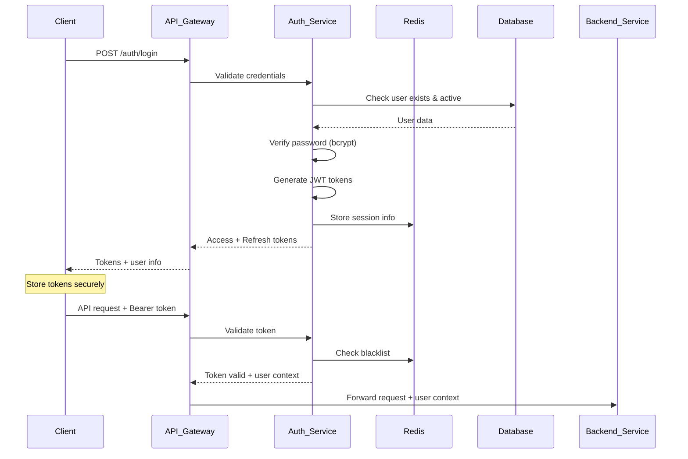
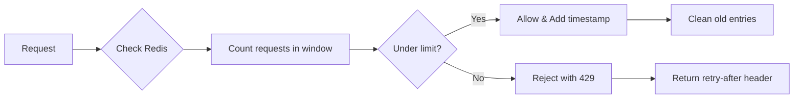

# 🔐 EchoWright Security Architecture & Implementation Guide

A comprehensive guide to understanding, implementing, and maintaining the security architecture of the EchoWright audiobook platform.

---

## 📋 Table of Contents

1. [Security Overview](#-security-overview)
2. [Authentication Architecture](#-authentication-architecture)
3. [Authorization & Access Control](#-authorization--access-control)
4. [Rate Limiting & DDoS Protection](#-rate-limiting--ddos-protection)
5. [Setup & Configuration](#-setup--configuration)
6. [Security Best Practices](#-security-best-practices)
7. [API Security Guide](#-api-security-guide)
8. [Monitoring & Incident Response](#-monitoring--incident-response)
9. [Learning Resources](#-learning-resources)
10. [Troubleshooting](#-troubleshooting)

---

## 🛡️ Security Overview

EchoWright implements a **multi-layered security architecture** following industry best practices:

```
┌─────────────────────────────────────────────────────────┐
│                    Security Layers                      │
├─────────────────────────────────────────────────────────┤
│ 🌐 Network Security (CORS, HTTPS, Network Isolation)   │
│ 🚪 API Gateway Security (Rate Limiting, Input Valid.)  │
│ 🔑 Authentication (JWT, Password Hashing, MFA Ready)   │
│ 👥 Authorization (RBAC, Resource-level permissions)    │
│ 📊 Monitoring (Logging, Metrics, Threat Detection)     │
│ 🗄️ Data Security (Encryption, Secure Storage)          │
└─────────────────────────────────────────────────────────┘
```

### Security Principles
- **Zero Trust**: Never trust, always verify
- **Defense in Depth**: Multiple security layers
- **Principle of Least Privilege**: Minimum required access
- **Fail Secure**: Secure defaults when systems fail
- **Security by Design**: Security built-in, not bolted-on

---

## 🔐 Authentication Architecture

### JWT (JSON Web Token) System

EchoWright uses a **dual-token JWT system** for secure authentication:



### Token Structure

**Access Token (30 minutes)**:
```json
{
  "sub": "user_123",           // User ID
  "email": "user@example.com", // User email
  "role": "user",              // User role (admin, user, guest)
  "exp": 1754464146,           // Expiration timestamp
  "type": "access"             // Token type
}
```

**Refresh Token (7 days)**:
```json
{
  "sub": "user_123",           // User ID
  "email": "user@example.com", // User email
  "role": "user",              // User role
  "exp": 1755067146,           // Expiration timestamp (longer)
  "type": "refresh"            // Token type
}
```

### Password Security

```python
# Password hashing with bcrypt (cost factor 12)
import bcrypt

def hash_password(password: str) -> str:
    """Hash password using bcrypt with salt rounds=12"""
    salt = bcrypt.gensalt(rounds=12)  # Adaptive cost
    return bcrypt.hashpw(password.encode('utf-8'), salt).decode('utf-8')

def verify_password(password: str, hashed: str) -> bool:
    """Verify password against hash"""
    return bcrypt.checkpw(password.encode('utf-8'), hashed.encode('utf-8'))
```

**Security Features**:
- **Salt rounds**: 12 (adaptive, increase over time)
- **Unique salts**: Each password gets unique salt
- **Timing attack protection**: Constant-time comparison
- **Cost scaling**: Increase rounds as hardware improves

---

## 👥 Authorization & Access Control

### Role-Based Access Control (RBAC)

EchoWright implements a **hierarchical RBAC system**:

```
┌─────────────────────────────────────────────────────────┐
│                     Role Hierarchy                      │
├─────────────────────────────────────────────────────────┤
│                                                         │
│  ┌─────────────┐    Full system access, user mgmt      │
│  │    ADMIN    │◄── Can access all endpoints            │
│  └─────────────┘    Can manage other users              │
│         ▲                                               │
│         │                                               │
│  ┌─────────────┐    Authenticated user access          │
│  │    USER     │◄── Can access protected content        │
│  └─────────────┘    Higher rate limits                  │
│         ▲                                               │
│         │                                               │
│  ┌─────────────┐    Anonymous/limited access           │
│  │    GUEST    │◄── Can access public endpoints         │
│  └─────────────┘    Restricted rate limits              │
│                                                         │
└─────────────────────────────────────────────────────────┘
```

### Permission Matrix

| Endpoint | Admin | User | Guest | Description |
|----------|-------|------|-------|-------------|
| `POST /auth/register` | ✅ | ✅ | ✅ | User registration |
| `POST /auth/login` | ✅ | ✅ | ✅ | User login |
| `GET /auth/me` | ✅ | ✅ | ❌ | Current user info |
| `GET /auth/users` | ✅ | ❌ | ❌ | List all users |
| `PUT /auth/users/{id}/role` | ✅ | ❌ | ❌ | Change user roles |
| `POST /books/upload` | ✅ | ❌ | ❌ | Upload content |
| `DELETE /books/{id}` | ✅ | ❌ | ❌ | Delete content |
| `GET /books/list` | ✅ | ✅ | 🔒* | List books |
| `POST /complete` | ✅ | ✅ | 🔒* | AI completion |
| `POST /tts` | ✅ | ✅ | 🔒* | Text-to-speech |

*🔒 = Limited access with strict rate limits*

### Implementation Example

```python
from fastapi import Depends, HTTPException

# Require specific role
@app.post("/admin/users")
async def manage_users(
    current_user: User = Depends(require_role(UserRole.ADMIN))
):
    """Admin-only endpoint"""
    pass

# Optional authentication
@app.get("/books/list")
async def list_books(
    current_user: Optional[User] = Depends(get_optional_user)
):
    """Accessible to all, but different behavior based on auth"""
    if current_user:
        return get_full_book_list()  # More details for auth users
    else:
        return get_public_book_list()  # Limited info for guests

# Role-based rate limiting applied automatically
```

---

## 🚦 Rate Limiting & DDoS Protection

### Multi-Tier Rate Limiting System

EchoWright implements **sophisticated rate limiting** using Redis and sliding window algorithms:

```python
# Rate limit configurations
RATE_LIMITS = {
    # Authentication endpoints
    "auth_register": {"limit": 5, "window": 3600, "burst": 2},
    "auth_login": {"limit": 10, "window": 900, "burst": 3},
    
    # AI endpoints (authenticated users)
    "complete_user": {"limit": 100, "window": 3600, "burst": 20},
    "tts_user": {"limit": 50, "window": 3600, "burst": 10},
    
    # AI endpoints (anonymous users)  
    "complete_anon": {"limit": 10, "window": 3600, "burst": 3},
    "tts_anon": {"limit": 5, "window": 3600, "burst": 1},
    
    # Admin operations
    "upload_admin": {"limit": 20, "window": 3600, "burst": 5},
}
```

### Sliding Window Algorithm



### Protection Features

1. **Per-User Rate Limiting**: Individual limits per authenticated user
2. **IP-Based Limiting**: Anonymous users limited by IP address
3. **Endpoint-Specific Limits**: Different limits for different operations
4. **Burst Protection**: Short-term spike protection
5. **Adaptive Throttling**: Escalating delays for repeat violations
6. **Graceful Degradation**: Continues working if Redis unavailable

---

## ⚙️ Setup & Configuration

### Quick Start Security Setup

1. **Create Environment Configuration**:
```bash
# Copy the security template
cp .env.example .env

# Generate secure JWT secret (32+ characters)
echo "JWT_SECRET_KEY=$(openssl rand -hex 32)" >> .env

# Generate secure database password
echo "POSTGRES_PASSWORD=$(openssl rand -base64 32)" >> .env

# Add your API keys
echo "GEMINI_API_KEY=your-actual-gemini-key" >> .env
```

2. **Configure Redis for Session Management**:
```bash
# Redis is included in docker-compose.yml
# Default: redis://redis:6379/0
# For production, use Redis with AUTH enabled
echo "REDIS_URL=redis://:your-redis-password@redis:6379/0" >> .env
```

3. **Set Security Environment Variables**:
```bash
# Rate limiting configuration
echo "RATE_LIMIT_REQUESTS_PER_MINUTE=60" >> .env
echo "RATE_LIMIT_BURST=10" >> .env

# CORS configuration (restrict in production)
echo "CORS_ORIGINS=https://yourdomain.com,https://app.yourdomain.com" >> .env

# Enable security headers
echo "ENABLE_SECURITY_HEADERS=true" >> .env
```

4. **Start the Secure Platform**:
```bash
# Build and start all services
docker-compose up --build

# Verify security is working
curl -X GET http://localhost:8000/auth/health
```

### Production Security Checklist

- [ ] **Environment Variables**
  - [ ] Strong JWT secret (min 32 chars, cryptographically random)
  - [ ] Secure database passwords
  - [ ] API keys in secure vault (not .env files)
  - [ ] Redis AUTH enabled with strong password

- [ ] **Network Security**
  - [ ] HTTPS enabled with valid SSL certificates
  - [ ] CORS origins restricted to known domains
  - [ ] Trusted host middleware configured
  - [ ] Network segmentation (DMZ for API Gateway)

- [ ] **Authentication**
  - [ ] JWT signing key rotation strategy
  - [ ] Token expiry times appropriate for use case
  - [ ] Refresh token rotation implemented
  - [ ] Account lockout after failed attempts

- [ ] **Authorization**
  - [ ] Role assignments reviewed and minimal
  - [ ] Admin users properly secured (MFA required)
  - [ ] Resource-level permissions implemented
  - [ ] Regular access reviews scheduled

- [ ] **Rate Limiting**
  - [ ] Redis cluster for high availability
  - [ ] Rate limits tuned based on traffic patterns  
  - [ ] DDoS protection (CloudFlare/AWS Shield)
  - [ ] Monitoring and alerting on rate limit violations

---

## 🛡️ Security Best Practices

### Development Security

1. **Secure Coding Practices**:
```python
# ✅ GOOD: Input validation
from pydantic import BaseModel, EmailStr, validator

class UserRegistration(BaseModel):
    email: EmailStr
    username: str
    password: str
    
    @validator('password')
    def validate_password(cls, v):
        if len(v) < 8:
            raise ValueError('Password must be at least 8 characters')
        return v

# ❌ BAD: No input validation
def register_user(email, username, password):
    # Direct database insertion without validation
    pass
```

2. **Secret Management**:
```python
# ✅ GOOD: Environment variables
JWT_SECRET = os.getenv("JWT_SECRET_KEY")
if not JWT_SECRET:
    raise ValueError("JWT_SECRET_KEY must be set")

# ❌ BAD: Hardcoded secrets
JWT_SECRET = "my-secret-key-123"  # Never do this!
```

3. **Error Handling**:
```python
# ✅ GOOD: Generic error messages
@app.post("/auth/login")
def login(credentials: UserLogin):
    user = authenticate_user(credentials.email, credentials.password)
    if not user:
        raise HTTPException(401, "Invalid credentials")  # Generic
    return create_tokens(user)

# ❌ BAD: Information leakage
def login_bad(credentials):
    if not user_exists(credentials.email):
        raise HTTPException(401, "User does not exist")  # Reveals info
    if not verify_password(credentials.password, user.password):
        raise HTTPException(401, "Wrong password")  # Reveals info
```

### Operational Security

1. **Logging Security**:
```python
# ✅ GOOD: Safe logging
logger.info(f"User login attempt for email: {email}")
logger.warning(f"Failed login attempt from IP: {request.client.host}")

# ❌ BAD: Logging sensitive data
logger.info(f"User password attempt: {password}")  # Never log passwords
logger.info(f"JWT token: {jwt_token}")  # Never log tokens
```

2. **Database Security**:
```python
# ✅ GOOD: Parameterized queries (SQLAlchemy)
def get_user_by_email(email: str):
    return db.query(User).filter(User.email == email).first()

# ❌ BAD: SQL injection vulnerability
def get_user_bad(email: str):
    query = f"SELECT * FROM users WHERE email = '{email}'"
    return db.execute(query)  # Vulnerable to injection
```

### Security Monitoring

1. **Security Events to Monitor**:
- Multiple failed login attempts
- Privilege escalation attempts
- Unusual API usage patterns
- Token tampering attempts
- Rate limit violations

2. **Security Metrics**:
```python
# Example security metrics
SECURITY_METRICS = {
    "failed_logins_per_minute": "counter",
    "active_sessions": "gauge", 
    "rate_limit_violations": "counter",
    "admin_actions": "counter",
    "token_validation_failures": "counter"
}
```

---

## 🚀 API Security Guide

### Secure API Usage

1. **Authentication Flow**:
```javascript
// Client-side implementation
class EchoWrightAPI {
    constructor(baseURL) {
        this.baseURL = baseURL;
        this.accessToken = localStorage.getItem('access_token');
        this.refreshToken = localStorage.getItem('refresh_token');
    }
    
    async register(userData) {
        const response = await fetch(`${this.baseURL}/auth/register`, {
            method: 'POST',
            headers: { 'Content-Type': 'application/json' },
            body: JSON.stringify(userData)
        });
        
        if (response.ok) {
            const data = await response.json();
            this.storeTokens(data.tokens);
            return data;
        }
        throw new Error('Registration failed');
    }
    
    async authenticatedRequest(endpoint, options = {}) {
        // Add authorization header
        const headers = {
            'Authorization': `Bearer ${this.accessToken}`,
            'Content-Type': 'application/json',
            ...options.headers
        };
        
        let response = await fetch(`${this.baseURL}${endpoint}`, {
            ...options,
            headers
        });
        
        // Handle token expiration
        if (response.status === 401) {
            await this.refreshAccessToken();
            // Retry with new token
            headers['Authorization'] = `Bearer ${this.accessToken}`;
            response = await fetch(`${this.baseURL}${endpoint}`, {
                ...options,
                headers
            });
        }
        
        return response;
    }
    
    async refreshAccessToken() {
        const response = await fetch(`${this.baseURL}/auth/refresh`, {
            method: 'POST',
            headers: {
                'Authorization': `Bearer ${this.refreshToken}`,
                'Content-Type': 'application/json'
            }
        });
        
        if (response.ok) {
            const data = await response.json();
            this.storeTokens(data);
        } else {
            this.logout(); // Refresh failed, user needs to login again
        }
    }
    
    storeTokens(tokens) {
        // Store securely (consider httpOnly cookies for production)
        localStorage.setItem('access_token', tokens.access_token);
        localStorage.setItem('refresh_token', tokens.refresh_token);
        this.accessToken = tokens.access_token;
        this.refreshToken = tokens.refresh_token;
    }
    
    logout() {
        localStorage.removeItem('access_token');
        localStorage.removeItem('refresh_token');
        this.accessToken = null;
        this.refreshToken = null;
    }
}

// Usage
const api = new EchoWrightAPI('http://localhost:8000');

// Register new user
await api.register({
    email: 'user@example.com',
    username: 'username',
    password: 'securepassword123',
    role: 'user'
});

// Make authenticated requests
const books = await api.authenticatedRequest('/books/list');
const completion = await api.authenticatedRequest('/complete', {
    method: 'POST',
    body: JSON.stringify({
        prompt: 'Explain the themes in this book',
        config: 'default'
    })
});
```

2. **Security Headers**:
```python
# Security middleware for FastAPI
from fastapi import FastAPI
from fastapi.middleware.cors import CORSMiddleware
from fastapi.middleware.trustedhost import TrustedHostMiddleware

app = FastAPI()

# Trusted hosts (production)
if os.getenv("ENVIRONMENT") == "production":
    app.add_middleware(
        TrustedHostMiddleware, 
        allowed_hosts=["api.echowright.com", "*.echowright.com"]
    )

# CORS with security
app.add_middleware(
    CORSMiddleware,
    allow_origins=["https://app.echowright.com"],  # Specific origins
    allow_credentials=True,
    allow_methods=["GET", "POST", "PUT", "DELETE"],
    allow_headers=["*"],
    expose_headers=["X-Rate-Limit-Remaining", "X-Rate-Limit-Reset"]
)

# Security headers middleware
@app.middleware("http")
async def security_headers(request, call_next):
    response = await call_next(request)
    
    # Security headers
    response.headers["X-Content-Type-Options"] = "nosniff"
    response.headers["X-Frame-Options"] = "DENY"
    response.headers["X-XSS-Protection"] = "1; mode=block"
    response.headers["Strict-Transport-Security"] = "max-age=31536000; includeSubDomains"
    response.headers["Referrer-Policy"] = "strict-origin-when-cross-origin"
    
    return response
```

---

## 📊 Monitoring & Incident Response

### Security Monitoring Dashboard

```python
# Security monitoring metrics
import structlog
import prometheus_client

# Structured logging for security events
security_logger = structlog.get_logger("security")

# Prometheus metrics
failed_logins = prometheus_client.Counter('auth_failed_logins_total')
active_sessions = prometheus_client.Gauge('auth_active_sessions')
rate_limit_hits = prometheus_client.Counter('rate_limit_violations_total')

# Security event logging
def log_security_event(event_type, user_id=None, ip_address=None, details=None):
    security_logger.info(
        event_type,
        user_id=user_id,
        ip_address=ip_address,
        details=details,
        timestamp=datetime.utcnow().isoformat()
    )

# Examples
log_security_event("failed_login", ip_address="192.168.1.100", details="invalid_password")
log_security_event("privilege_escalation_attempt", user_id="user_123", ip_address="10.0.0.5")
log_security_event("rate_limit_exceeded", ip_address="203.0.113.1", details="endpoint=/complete")
```

### Incident Response Playbook

1. **Security Incident Detection**:
   - Monitor for unusual patterns in logs
   - Set up alerts for security threshold violations
   - Regular security scans and penetration testing

2. **Incident Response Steps**:
```bash
# 1. Immediate Response
# Block suspicious IP addresses
docker-compose exec redis redis-cli SET "blocked_ip:203.0.113.1" "1" EX 3600

# Invalidate user sessions if compromised
docker-compose exec redis redis-cli FLUSHDB 1  # Session database

# 2. Investigation
# Check security logs
docker-compose logs api_gateway | grep "security"

# Analyze rate limit violations  
docker-compose exec redis redis-cli KEYS "rate_limit:*"

# 3. Recovery
# Rotate JWT secrets (requires user re-authentication)
echo "JWT_SECRET_KEY=$(openssl rand -hex 32)" >> .env
docker-compose restart api_gateway

# Update user passwords if needed
curl -X PUT http://localhost:8000/auth/users/user_123/force-password-reset
```

---

## 📚 Learning Resources

### Essential Security Books

1. **"Web Application Security: Exploitation and Countermeasures for Modern Web Applications"** by Andrew Hoffman
   - Comprehensive coverage of web security vulnerabilities
   - Practical examples and mitigation strategies
   - Highly relevant for API security

2. **"The Web Application Hacker's Handbook"** by Dafydd Stuttard & Marcus Pinto
   - In-depth attack methodologies
   - Understanding attacker mindset
   - Essential for defensive programming

3. **"OAuth 2 in Action"** by Justin Richer & Antonio Sanso
   - Deep dive into OAuth 2.0 and JWT security
   - Real-world implementation scenarios
   - Security considerations and best practices

### Online Courses & Certifications

1. **OWASP WebGoat** (Free)
   - Hands-on web security training
   - Practice identifying and fixing vulnerabilities
   - [https://owasp.org/www-project-webgoat/](https://owasp.org/www-project-webgoat/)

2. **PortSwigger Web Security Academy** (Free)
   - Interactive labs on web vulnerabilities
   - Covers SQL injection, XSS, authentication bypass
   - [https://portswigger.net/web-security](https://portswigger.net/web-security)

3. **JWT.io Debugger & Learning Resources**
   - Understand JWT structure and security
   - [https://jwt.io/](https://jwt.io/)

### API Security Resources

1. **OWASP API Security Top 10**
   - [https://owasp.org/www-project-api-security/](https://owasp.org/www-project-api-security/)
   - Essential reading for API developers

2. **FastAPI Security Documentation**
   - [https://fastapi.tiangolo.com/tutorial/security/](https://fastapi.tiangolo.com/tutorial/security/)
   - Framework-specific security implementations

3. **JWT Security Best Practices**
   - RFC 8725: JWT Best Current Practices
   - [https://datatracker.ietf.org/doc/html/rfc8725](https://datatracker.ietf.org/doc/html/rfc8725)

### Hands-On Labs & Practice

1. **Set up a Local Security Lab**:
```bash
# Clone EchoWright and experiment
git clone <your-repo>
cd echowright

# Try various security scenarios
# - Test rate limiting
# - Attempt JWT manipulation
# - Practice secure coding
```

2. **Security Testing Tools**:
```bash
# Install security testing tools
pip install bandit safety

# Run security scans
bandit -r services/  # Static analysis
safety check  # Dependency vulnerability scan

# API security testing
pip install requests pytest
# Write security test cases
```

3. **Practice Scenarios**:
   - Implement MFA (Multi-Factor Authentication)
   - Add OAuth 2.0 integration
   - Implement API versioning with security
   - Create audit logging system

### Community & News

1. **Security Communities**:
   - Reddit: r/netsec, r/websecurity
   - Discord: InfoSec Community
   - Twitter: Follow @OWASP, @portswigger

2. **Security News & Blogs**:
   - Krebs on Security
   - Schneier on Security  
   - OWASP Blog
   - Google Security Blog

3. **Conferences & Events**:
   - DEF CON (Las Vegas)
   - Black Hat (Global)
   - OWASP Global AppSec
   - Local security meetups

---

## 🔧 Troubleshooting

### Common Security Issues

#### 1. JWT Token Issues

**Problem**: "Invalid token" errors
```bash
# Check token structure
echo "eyJhbGciOiJIUzI1NiIsInR5cCI6IkpXVCJ9..." | base64 -d

# Verify JWT secret
docker-compose exec api_gateway env | grep JWT_SECRET_KEY
```

**Solution**:
```python
# Debug JWT validation
import jwt

try:
    payload = jwt.decode(token, secret_key, algorithms=["HS256"])
    print("Token valid:", payload)
except jwt.ExpiredSignatureError:
    print("Token expired")
except jwt.InvalidTokenError:
    print("Invalid token")
```

#### 2. Rate Limiting Issues

**Problem**: Users getting rate limited unexpectedly
```bash
# Check Redis rate limiting data
docker-compose exec redis redis-cli

# View rate limit keys
KEYS rate_limit:*

# Check specific user's rate limit
GET rate_limit:user:user_123:complete
```

**Solution**:
```python
# Adjust rate limits in rate_limiter.py
RATE_LIMITS = {
    "complete_user": {"limit": 200, "window": 3600, "burst": 40},  # Increased
}
```

#### 3. Authentication Middleware Issues

**Problem**: Some endpoints not properly protected
```python
# Verify endpoint protection
@app.get("/sensitive-data")
async def get_sensitive_data(
    current_user: User = Depends(get_current_user)  # Required auth
):
    pass

@app.get("/public-data") 
async def get_public_data(
    current_user: Optional[User] = Depends(get_optional_user)  # Optional auth
):
    pass
```

#### 4. CORS Issues

**Problem**: Browser blocking API requests
```bash
# Check CORS configuration
curl -H "Origin: https://yourfrontend.com" \
     -H "Access-Control-Request-Method: POST" \
     -X OPTIONS http://localhost:8000/auth/login
```

**Solution**:
```python
# Update CORS settings
app.add_middleware(
    CORSMiddleware,
    allow_origins=["https://yourfrontend.com"],  # Add your domain
    allow_credentials=True,
    allow_methods=["GET", "POST", "PUT", "DELETE"],
    allow_headers=["*"],
)
```

### Security Audit Checklist

- [ ] **Password Security**
  - [ ] Bcrypt with cost factor ≥ 12
  - [ ] Password complexity requirements
  - [ ] No password in logs or error messages

- [ ] **JWT Security**  
  - [ ] Strong secret key (≥ 32 chars)
  - [ ] Appropriate expiry times
  - [ ] Token blacklisting working
  - [ ] No tokens in logs

- [ ] **API Security**
  - [ ] Input validation on all endpoints
  - [ ] Rate limiting configured and working
  - [ ] CORS properly configured
  - [ ] Security headers present

- [ ] **Infrastructure Security**
  - [ ] Environment variables secured
  - [ ] Redis AUTH enabled (production)
  - [ ] Database connections encrypted
  - [ ] Logs don't contain sensitive data

### Performance Monitoring

```bash
# Monitor authentication performance
curl -w "@curl-format.txt" -X POST http://localhost:8000/auth/login

# Rate limiting performance
redis-cli --latency-history -i 1

# Database connection monitoring
docker-compose exec postgres pg_stat_activity
```

---

## 🎯 Next Steps

### Security Roadmap

1. **Immediate (Next Sprint)**:
   - [ ] Implement comprehensive logging
   - [ ] Add security monitoring dashboard
   - [ ] Set up automated security scanning

2. **Short Term (1-2 Months)**:
   - [ ] Multi-Factor Authentication (MFA)
   - [ ] OAuth 2.0 integration (Google, GitHub)
   - [ ] API versioning with security
   - [ ] Advanced threat detection

3. **Long Term (3-6 Months)**:
   - [ ] Zero-trust architecture
   - [ ] Advanced encryption at rest
   - [ ] Security automation & orchestration
   - [ ] Compliance frameworks (SOC2, ISO 27001)

### Security Maturity Model

```
Level 1: Basic Security (Current)
├── ✅ Authentication & Authorization
├── ✅ Rate Limiting
├── ✅ Input Validation
└── ✅ Secure Configuration

Level 2: Enhanced Security (Next)
├── 🔄 Comprehensive Monitoring
├── 🔄 Advanced Threat Detection
├── ⏳ Multi-Factor Authentication
└── ⏳ Security Automation

Level 3: Advanced Security (Future)
├── ⏳ Zero-Trust Architecture
├── ⏳ AI-Powered Security
├── ⏳ Advanced Encryption
└── ⏳ Compliance & Auditing
```

---

## 💬 Support & Community

- **Security Issues**: Create a GitHub issue with the `security` label
- **Questions**: Join our Discord security channel
- **Contributing**: See [CONTRIBUTING.md](CONTRIBUTING.md) for security contributions
- **Security Disclosure**: Email security@echowright.com for vulnerabilities

---

*This guide is a living document. Keep it updated as the security architecture evolves.*

**Last Updated**: August 6, 2025  
**Version**: 1.0.0  
**Reviewed By**: Security Team