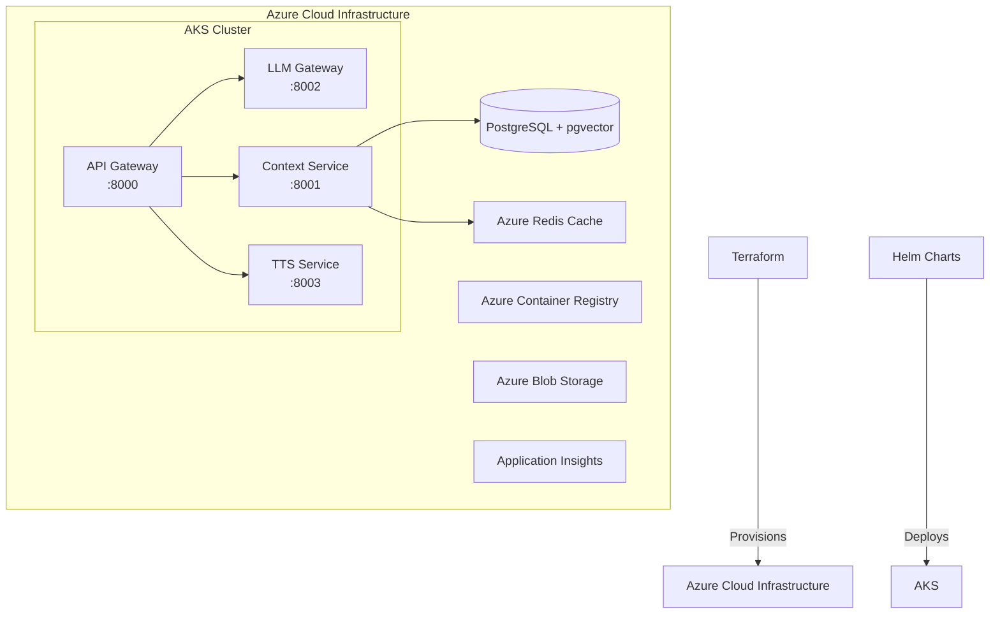

# Infrastructure

This directory contains the Terraform and Helm configurations used to deploy the BetterBooks platform on Azure Kubernetes Service (AKS).

## Architecture Overview



## Directory Structure

```
config/helm/infra/
├── terraform/
│   └── cluster/
│       ├── main.tf         # Azure AKS infrastructure
│       ├── variables.tf    # Configuration variables
│       └── outputs.tf      # Output values
└── helm/
    ├── api_gateway/        # API Gateway Helm chart
    ├── context_service/    # Context Service Helm chart
    ├── llm_gateway/        # LLM Gateway Helm chart
    └── tts_service/        # TTS Service Helm chart
```

## Terraform - Azure Infrastructure

Terraform provisions the Azure resources including:
- **AKS Cluster** with system and application node pools
- **Azure Container Registry** for Docker images
- **PostgreSQL Flexible Server** with pgvector extension
- **Azure Redis Cache** for session management
- **Azure Blob Storage** for audiobook files
- **Application Insights** and Log Analytics for monitoring

### Prerequisites

1. Install required tools:
   ```bash
   # Install Terraform
   brew install terraform
   
   # Install Azure CLI
   brew install azure-cli
   
   # Install kubectl
   brew install kubernetes-cli
   
   # Install Helm
   brew install helm
   ```

2. Login to Azure:
   ```bash
   az login
   az account set --subscription <your-subscription-id>
   ```

### Deployment Steps

1. Navigate to the Terraform directory:
   ```bash
   cd terraform/cluster
   ```

2. Initialize Terraform:
   ```bash
   terraform init
   ```

3. Create a `terraform.tfvars` file with your configuration:
   ```hcl
   resource_group_name = "betterbooks-rg"
   location           = "East US"
   cluster_name       = "betterbooks-aks"
   acr_name          = "betterbooksacr"  # Must be globally unique
   db_admin_password = "YourSecurePassword123!"  # Change this!
   ```

4. Plan and apply the infrastructure:
   ```bash
   terraform plan
   terraform apply
   ```

5. Get AKS credentials:
   ```bash
   az aks get-credentials --resource-group betterbooks-rg --name betterbooks-aks
   ```

## Helm - Application Deployment

Once the Azure infrastructure is provisioned, deploy the BetterBooks services using Helm charts.

### Build and Push Docker Images

First, build and push your Docker images to Azure Container Registry:

```bash
# Login to ACR
az acr login --name betterbooksacr

# Build and push images (from repository root)
az acr build --registry betterbooksacr --image api-gateway:latest services/api_gateway/
az acr build --registry betterbooksacr --image llm-gateway:latest services/llm_gateway/
az acr build --registry betterbooksacr --image context-service:latest services/context_service/
az acr build --registry betterbooksacr --image tts-service:latest services/tts_service/
```

### Deploy Services with Helm

Deploy each service to the AKS cluster:

```bash
# Create namespace if not exists
kubectl create namespace betterbooks

# Deploy services
helm upgrade --install api-gateway ./helm/api_gateway -n betterbooks \
  --set image.repository=betterbooksacr.azurecr.io/api-gateway \
  --set image.tag=latest

helm upgrade --install llm-gateway ./helm/llm_gateway -n betterbooks \
  --set image.repository=betterbooksacr.azurecr.io/llm-gateway \
  --set image.tag=latest

helm upgrade --install context-service ./helm/context_service -n betterbooks \
  --set image.repository=betterbooksacr.azurecr.io/context-service \
  --set image.tag=latest \
  --set postgresql.host=betterbooks-aks-psql.postgres.database.azure.com \
  --set postgresql.password=YourSecurePassword123!

helm upgrade --install tts-service ./helm/tts_service -n betterbooks \
  --set image.repository=betterbooksacr.azurecr.io/tts-service \
  --set image.tag=latest
```

### Custom Values

You can customize deployments using a values file:

```yaml
# custom-values.yaml
image:
  repository: betterbooksacr.azurecr.io/api-gateway
  tag: v1.0.0
  pullPolicy: Always

resources:
  requests:
    memory: "256Mi"
    cpu: "100m"
  limits:
    memory: "512Mi"
    cpu: "500m"

autoscaling:
  enabled: true
  minReplicas: 2
  maxReplicas: 10
```

Then deploy with:
```bash
helm upgrade --install api-gateway ./helm/api_gateway -n betterbooks -f custom-values.yaml
```

## Monitoring and Management

### View Deployment Status

```bash
# Check pods
kubectl get pods -n betterbooks

# Check services
kubectl get services -n betterbooks

# View logs
kubectl logs -n betterbooks deployment/api-gateway

# Get ingress/load balancer IP
kubectl get service api-gateway -n betterbooks
```

### Access Application Insights

1. Go to Azure Portal
2. Navigate to your resource group
3. Open Application Insights resource
4. View metrics, logs, and performance data

### Scaling

```bash
# Manual scaling
kubectl scale deployment api-gateway --replicas=3 -n betterbooks

# Autoscaling (if configured)
kubectl autoscale deployment api-gateway --min=2 --max=10 --cpu-percent=80 -n betterbooks
```

## Cost Optimization

The current configuration is optimized for the Azure $1000 credit:

- **VM Sizes**: Uses B-series burstable VMs (Standard_B2s, Standard_B2ms)
- **Node Pools**: Minimal node count with autoscaling
- **Storage**: Standard tier with LRS replication
- **Database**: Basic tier PostgreSQL
- **Redis**: Basic tier cache

## Cleanup

To destroy all Azure resources:

```bash
cd terraform/cluster
terraform destroy
```

## Troubleshooting

### Common Issues

1. **ACR Access Issues**
   ```bash
   # Ensure AKS has access to ACR
   az aks update -n betterbooks-aks -g betterbooks-rg --attach-acr betterbooksacr
   ```

2. **Database Connection Issues**
   ```bash
   # Check PostgreSQL firewall rules
   az postgres flexible-server firewall-rule create \
     --resource-group betterbooks-rg \
     --name betterbooks-aks-psql \
     --rule-name AllowAKS \
     --start-ip-address 0.0.0.0 \
     --end-ip-address 255.255.255.255
   ```

3. **Pod Crashes**
   ```bash
   # Check pod events and logs
   kubectl describe pod <pod-name> -n betterbooks
   kubectl logs <pod-name> -n betterbooks --previous
   ```

## Next Steps

1. Configure DNS and SSL certificates
2. Set up CI/CD pipeline with GitHub Actions
3. Implement backup and disaster recovery
4. Configure alerts and monitoring dashboards
5. Set up development and staging environments