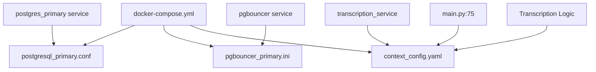

# Local Configuration Files

This directory contains configuration files for local development environment. These files are mounted into Docker containers to configure PostgreSQL, PgBouncer, and transcription services.

## Configuration Files

### Database Configuration

#### `postgresql.conf` / `postgresql_primary.conf`
**Purpose**: PostgreSQL server configuration optimized for BetterBooks with vector embeddings support.

**Used by**: 
- `postgres_primary` service in `docker-compose.yml:29`
- Mounted to `/etc/postgresql/postgresql.conf` in container

**When to modify**:
- Database performance tuning (memory settings, connection limits)
- Logging configuration changes
- Vector extension settings for embeddings
- Development vs production optimizations

**Key settings**:
- `max_connections = 200` - Connection limit (reduced since pgbouncer handles pooling)
- `shared_buffers = 256MB` - Memory allocation for database cache
- `work_mem = 8MB` - Per-operation memory for queries
- `log_min_duration_statement = 1000` - Log slow queries (>1 second)
- Vector/embedding optimizations for BetterBooks context service

**Effect of changes**: Restart PostgreSQL container required

#### `postgresql_replica.conf`
**Purpose**: Read replica configuration optimized for read-only operations.

**Used by**: 
- Currently not used in main `docker-compose.yml` (intended for future HA setup)
- Referenced in `config/docker/docker-compose.yml` for multi-node setup

**When to modify**:
- Setting up read replicas for scaling
- Adjusting read-only query performance
- Hot standby configuration

**Key differences from primary**:
- `default_transaction_read_only = on` - Enforce read-only mode
- `work_mem = 16MB` - More memory for complex read queries
- `max_connections = 150` - Fewer connections for read workload

### Connection Pooling Configuration

#### `pgbouncer.ini`
**Purpose**: Basic PgBouncer configuration for connection pooling.

**Used by**: Legacy/fallback configuration (not actively mounted in docker-compose.yml)

**When to modify**:
- Connection pool size tuning
- Client timeout adjustments
- Admin user configuration

#### `pgbouncer_primary.ini`
**Purpose**: PgBouncer configuration for primary database connection.

**Used by**:
- `pgbouncer` service in `docker-compose.yml:55`
- Mounted to `/etc/pgbouncer/pgbouncer.ini` in container

**When to modify**:
- Adjusting connection pooling parameters
- Database connection settings
- Authentication configuration

**Key settings**:
- Connects to `postgres_primary` service
- Uses `betterbooks` database and user

**🐛 BUG FOUND**: Password mismatch - uses `testpassword123` instead of `betterbooks`

#### `pgbouncer_replica.ini`
**Purpose**: PgBouncer configuration for replica database connections.

**Used by**: Currently not used in main docker-compose.yml (for future HA setup)

**When to modify**:
- Setting up read replica connection pooling
- Load balancing read queries

### Application Configuration

#### `context_config.yaml`
**Purpose**: Configuration for transcription and context extraction services.

**Used by**:
- `transcription_service` in `docker-compose.yml:148`
- Loaded by `platform/backend/services/transcription_service/main.py:75`
- Mounted to `/context_config.yaml` in container

**When to modify**:
- Switching transcription services (Azure Speech, Whisper)
- Adjusting audio processing parameters
- Configuring context extraction settings
- Tuning performance parameters

**Key sections**:
- `context` - Audio context extraction settings
- `transcription.azure` - Azure Speech Service configuration
- `transcription.whisper` - Whisper fallback settings  
- `delivery` - Context delivery parameters
- `storage` - Transcript caching settings
- `processing` - Performance tuning

**Effects of changes**:
- Restart transcription service container
- May affect audio processing quality and performance
- Cache settings impact storage usage

## Service Dependencies

## Common Modifications

### Database Performance Tuning
Edit `postgresql_primary.conf`:
- Increase `shared_buffers` for more RAM
- Adjust `work_mem` for query complexity
- Tune `effective_cache_size` based on system memory

### Connection Pool Scaling  
Edit `pgbouncer_primary.ini`:
- Increase connection limits for high load
- Adjust pool sizes based on application needs

### Transcription Service Changes
Edit `context_config.yaml`:
- Switch from Azure to Whisper: change `transcription.service`
- Adjust audio chunk processing: modify `processing.chunk_size_mb`
- Enable caching: set `storage.cache_transcripts: true`

## Bugs Found

1. **Password Inconsistency** in `pgbouncer_primary.ini:4`:
   - Uses `password=testpassword123` 
   - Should be `password=betterbooks` to match other configs

2. **Unused Replica Configs**: 
   - `postgresql_replica.conf` and `pgbouncer_replica.ini` exist but aren't used in main docker-compose.yml
   - Consider removing or documenting as future HA setup

## File Loading Order

1. **Docker Compose Start**: Mounts config files as read-only volumes
2. **PostgreSQL**: Reads `postgresql_primary.conf` on container start  
3. **PgBouncer**: Reads `pgbouncer_primary.ini` on container start
4. **Transcription Service**: Loads `context_config.yaml` at `main.py:75` during service initialization

## Environment Integration

These files work together with:
- `docker-compose.yml` - Container orchestration and volume mounts
- `config/database/init_primary.sql` - Database initialization
- Environment variables in `.env` file
- Service implementations in `platform/backend/services/`

Changes to these configs require container restarts to take effect.