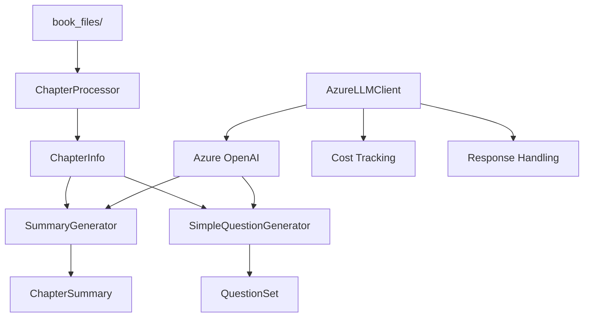

# Core AI Module for BetterBooks

This module provides simplified AI-powered features for pre-chaptered audiobooks using **Azure OpenAI Service**. It replaces the complex chapter detection system with a streamlined approach for books that are already divided into chapters.

## 🏗️ Architecture



## 📁 Files Overview

### Core Components

| File | Purpose | Time to Run | Cost per Call | Services Using |
|------|---------|-------------|---------------|----------------|
| `azure_llm_client.py` | Azure OpenAI integration with cost tracking | ~2-5s per request | $0.001-0.03 | All AI features |
| `chapter_processor.py` | Loads chapters from book_files directory | ~1-3s per book | $0 (local only) | Summary/Question generators |
| `summary_generator.py` | Generates chapter summaries using Azure OpenAI | ~3-8s per chapter | $0.005-0.02 | Manual/API requests |
| `simple_question_generator.py` | Creates educational questions for chapters | ~4-10s per set | $0.008-0.025 | Manual/API requests |

### Support Files

| File | Purpose | Configuration |
|------|---------|---------------|
| `summary_types.py` | Data types and enums | None (legacy compatibility) |
| `__init__.py` | Module exports | None |
| `README.md` | This documentation | None |

## 🔧 Configuration

### Environment Variables

```bash
# Required Azure OpenAI Configuration
AZURE_OPENAI_ENDPOINT=https://your-resource.openai.azure.com/
AZURE_OPENAI_API_KEY=your-api-key-here
AZURE_OPENAI_DEPLOYMENT_NAME=gpt-4
AZURE_OPENAI_API_VERSION=2024-02-15-preview

# Optional Configuration
AZURE_OPENAI_MODEL_NAME=gpt-4  # or gpt-3.5-turbo
AZURE_OPENAI_MAX_TOKENS=1000
AZURE_OPENAI_TEMPERATURE=0.3
AZURE_OPENAI_TIMEOUT=30.0
```

### Cost Estimates by Model

| Model | Input Cost | Output Cost | Typical Chapter Summary | Typical Question Set |
|-------|------------|-------------|------------------------|---------------------|
| GPT-4 | $0.01/1K tokens | $0.03/1K tokens | $0.010-0.020 | $0.015-0.025 |
| GPT-3.5-turbo | $0.0005/1K tokens | $0.0015/1K tokens | $0.002-0.005 | $0.003-0.008 |

## 🚀 Quick Start

### 1. Basic Chapter Processing

```python
from core.ai import load_book, get_available_books

# Discover available books
books = get_available_books()
print("Available books:", books)

# Load a specific book
book_chapters = load_book("The Great Gatsby")
if book_chapters:
    print(f"Loaded {book_chapters.total_chapters} chapters")
    print(f"Total duration: {book_chapters.total_duration_seconds/3600:.1f} hours")
```

### 2. Generate Chapter Summaries

```python
from core.ai import generate_chapter_summary, SummaryStyle
from core.ai.chapter_processor import get_chapter_content

# Get chapter content
chapter_info, chapter_text = get_chapter_content("The Great Gatsby", 1)

if chapter_info:
    # Generate different types of summaries
    brief = await generate_chapter_summary(
        chapter_info, chapter_text, SummaryStyle.BRIEF
    )
    
    detailed = await generate_chapter_summary(
        chapter_info, chapter_text, SummaryStyle.DETAILED
    )
    
    themes = await generate_chapter_summary(
        chapter_info, chapter_text, SummaryStyle.THEMES
    )
    
    print(f"Brief: {brief.summary_text}")
    print(f"Cost: ${brief.cost_estimate:.4f}")
```

### 3. Generate Questions

```python
from core.ai import generate_chapter_questions
from core.ai import QuestionDifficulty, ReadingMode

# Generate questions for a chapter
questions = await generate_chapter_questions(
    chapter_info=chapter_info,
    chapter_text=chapter_text,
    num_questions=5,
    difficulty=QuestionDifficulty.INTERMEDIATE,
    reading_mode=ReadingMode.EDUCATIONAL
)

for i, q in enumerate(questions.questions, 1):
    print(f"Q{i}: {q.question_text}")
    print(f"Type: {q.question_type.value}")
    print(f"Answer: {q.suggested_answer}")
    print()

print(f"Total cost: ${questions.total_cost:.4f}")
```

### 4. Process Entire Book

```python
from core.ai import SummaryGenerator, SimpleQuestionGenerator

async def process_book(book_title: str):
    # Load book
    book_chapters = load_book(book_title)
    if not book_chapters:
        print(f"Book '{book_title}' not found")
        return
    
    # Prepare chapter data
    processor = ChapterProcessor()
    chapters_data = []
    
    for chapter in book_chapters.chapters:
        text = processor.get_chapter_text(chapter)
        chapters_data.append((chapter, text))
    
    # Generate summaries
    summary_gen = SummaryGenerator()
    summaries = await summary_gen.generate_book_summaries(
        book_title, chapters_data, SummaryStyle.DETAILED
    )
    
    # Generate questions
    question_gen = SimpleQuestionGenerator()
    all_questions = []
    
    for chapter, text in chapters_data:
        questions = await question_gen.generate_questions(
            chapter, text, num_questions=3
        )
        all_questions.append(questions)
    
    # Calculate totals
    total_summary_cost = sum(s.cost_estimate for s in summaries)
    total_question_cost = sum(q.total_cost for q in all_questions)
    
    print(f"📊 Processing Results for '{book_title}':")
    print(f"  Chapters processed: {len(summaries)}")
    print(f"  Summary cost: ${total_summary_cost:.4f}")
    print(f"  Question cost: ${total_question_cost:.4f}")
    print(f"  Total cost: ${total_summary_cost + total_question_cost:.4f}")

# Run it
await process_book("The Great Gatsby")
```

## 📊 Performance & Cost Analysis

### Typical Processing Times

| Operation | Time per Chapter | Factors Affecting Speed |
|-----------|------------------|------------------------|
| Load chapter text | 0.1-0.5s | File size, disk speed |
| Generate brief summary | 2-4s | Text length, Azure response time |
| Generate detailed summary | 4-8s | Text length, complexity |
| Generate 5 questions | 6-12s | Question complexity, creativity |
| Full chapter processing | 10-20s | All above combined |

### Cost Optimization Tips

1. **Use GPT-3.5-turbo for simple tasks** - 5x cheaper than GPT-4
2. **Truncate long chapters** - Module automatically limits input
3. **Batch process books** - Reuse client connections
4. **Cache results** - Save to JSON files to avoid re-processing
5. **Monitor usage** - Use built-in cost tracking

### Example Cost Breakdown

For a 10-chapter book using GPT-4:
- **Brief summaries**: 10 × $0.005 = $0.05
- **Detailed summaries**: 10 × $0.015 = $0.15  
- **Question sets (5 each)**: 10 × $0.020 = $0.20
- **Total per book**: ~$0.40

## 🔍 Advanced Usage

### Custom Azure Configuration

```python
from core.ai import AzureLLMClient, LLMConfig

# Create custom configuration
config = LLMConfig(
    endpoint="https://your-custom-endpoint.openai.azure.com/",
    api_key="your-key",
    deployment_name="your-deployment",
    api_version="2024-02-15-preview",
    model_name="gpt-4",
    max_tokens=1500,
    temperature=0.5
)

# Use with client
async with AzureLLMClient(config) as client:
    response = await client.complete("Your prompt here")
    print(f"Response: {response.content}")
    print(f"Cost: ${response.cost_estimate:.4f}")
```

### Saving Results

```python
from core.ai.summary_generator import save_summaries_to_file
from core.ai.simple_question_generator import save_questions_to_file

# Save summaries
save_summaries_to_file(summaries, "summaries_gatsby.json")

# Save questions  
save_questions_to_file(questions, "questions_gatsby_ch1.json")
```

### Error Handling

```python
from core.ai import AzureLLMClient

async with AzureLLMClient() as client:
    response = await client.complete("Your prompt")
    
    if response.success:
        print(f"Success: {response.content}")
        print(f"Tokens used: {response.tokens_used}")
        print(f"Cost: ${response.cost_estimate:.4f}")
    else:
        print(f"Error: {response.error_message}")
        print(f"Response time: {response.response_time:.1f}s")
```

## 🧪 Testing

### Run Basic Tests

```python
# Test Azure connection
from core.ai import generate_text

result = await generate_text("Say hello", max_tokens=10)
print(f"Test result: {result}")

# Test chapter processing
from core.ai import get_available_books
books = get_available_books()
print(f"Found {len(books)} books: {books}")
```

### Validate Configuration

```python
from core.ai import AzureLLMClient

async with AzureLLMClient() as client:
    # Check configuration
    print("Endpoint:", client.config.endpoint)
    print("Model:", client.config.model_name)
    print("Deployment:", client.config.deployment_name)
    
    # Test connection
    response = await client.complete("Test", max_tokens=5)
    if response.success:
        print("✅ Azure OpenAI connection successful")
    else:
        print("❌ Connection failed:", response.error_message)
```

## 🚨 Important Notes

### What Changed from Previous Version

- ❌ **Removed**: Complex chapter detection (765 lines)
- ❌ **Removed**: Audio analysis and boundary detection  
- ❌ **Removed**: Complex LLM gateway integration
- ❌ **Removed**: Database storage for chapters
- ✅ **Added**: Direct Azure OpenAI integration
- ✅ **Added**: Cost tracking and monitoring
- ✅ **Added**: Simplified chapter processing
- ✅ **Added**: Better error handling

### Migration from Old System

If you were using the old system:

```python
# OLD (no longer works)
from core.ai import ChapterDetectionEngine, ChapterSummaryGenerator

# NEW (simplified)
from core.ai import SummaryGenerator, generate_chapter_summary
```

### Security Considerations

- **Never commit API keys** to version control
- **Use environment variables** for configuration
- **Monitor API usage** to prevent unexpected costs
- **Implement rate limiting** in production

### Limitations

- **Requires pre-chaptered books** - No automatic chapter detection
- **Azure OpenAI only** - No fallback to other LLM providers
- **Text-based processing only** - No audio analysis
- **Cost accumulates quickly** - Monitor usage carefully

## 📞 Support

For issues with this module:

1. **Check configuration** - Ensure all environment variables are set
2. **Verify Azure access** - Test connection with simple requests
3. **Monitor costs** - Use built-in usage tracking
4. **Check logs** - Enable logging for detailed error messages

```python
import logging
logging.basicConfig(level=logging.INFO)
```

## 📈 Future Enhancements

Planned improvements:
- Support for other LLM providers (Anthropic, OpenAI direct)
- Caching layer for expensive operations
- Batch processing optimizations
- Integration with transcription service
- Web UI for manual processing