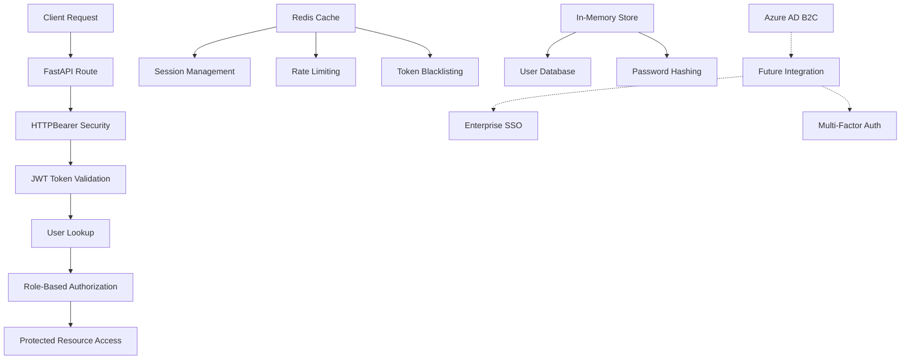

# Core Authentication Module for BetterBooks

This module provides JWT-based authentication and authorization for the BetterBooks audiobook platform. It includes user registration, login, role-based access control (RBAC), and session management.

## 🏗️ Architecture



## 📁 Files Overview

| File | Purpose | Time to Execute | Dependencies | Services Using |
|------|---------|----------------|--------------|----------------|
| `auth.py` | Core authentication logic, JWT handling, user management | ~50-200ms per request | PyJWT, bcrypt, Redis | API Gateway, all protected endpoints |
| `auth_routes.py` | FastAPI routes for auth endpoints (login, register, etc.) | ~100-500ms per request | FastAPI, auth.py | Web interface, mobile app |
| `__init__.py` | Module exports and public interface | ~1ms | None | All services importing auth |

## 🔧 Configuration

### Environment Variables

```bash
# Required Authentication Configuration
JWT_SECRET_KEY=your-super-secret-jwt-key-here
DEFAULT_ADMIN_PASSWORD=YourStrongAdminPassword123!

# Optional Redis Configuration (for sessions and rate limiting)
REDIS_URL=redis://localhost:6379/0

# Future Azure AD B2C Configuration (recommended)
AZURE_AD_B2C_TENANT_ID=your-tenant-id
AZURE_AD_B2C_CLIENT_ID=your-client-id
AZURE_AD_B2C_CLIENT_SECRET=your-client-secret
AZURE_AD_B2C_POLICY_NAME=B2C_1_signin_signup
```

### JWT Settings (in auth.py)

```python
ACCESS_TOKEN_EXPIRE_MINUTES = 30    # Access token lifetime
REFRESH_TOKEN_EXPIRE_DAYS = 7       # Refresh token lifetime
JWT_ALGORITHM = "HS256"             # JWT signing algorithm
```

## 🚀 Quick Start

### 1. Basic User Registration and Login

```python
from fastapi import FastAPI, Depends
from core.auth import auth_router, get_current_user, User

app = FastAPI()
app.include_router(auth_router)

@app.get("/protected")
async def protected_endpoint(current_user: User = Depends(get_current_user)):
    return {"message": f"Hello {current_user.username}!"}
```

### 2. Role-Based Access Control

```python
from core.auth import require_role, require_admin, UserRole

@app.get("/admin-only")
async def admin_endpoint(admin_user: User = Depends(require_admin)):
    return {"message": "Admin access granted"}

@app.get("/user-content")
async def user_endpoint(user: User = Depends(require_role(UserRole.USER))):
    return {"content": "User-specific content"}
```

### 3. Rate Limiting

```python
from core.auth import check_rate_limit

@app.post("/api/expensive-operation")
async def expensive_operation(current_user: User = Depends(get_current_user)):
    # Allow 10 requests per hour
    await check_rate_limit(current_user.id, "expensive_op", limit=10, window=3600)
    return {"result": "Operation completed"}
```

## 🔗 API Endpoints

### Authentication Routes

| Method | Endpoint | Description | Rate Limit | Auth Required |
|--------|----------|-------------|------------|---------------|
| `POST` | `/auth/register` | Register new user account | 5/hour | No |
| `POST` | `/auth/login` | User login with JWT tokens | 10/15min | No |
| `POST` | `/auth/refresh` | Refresh access token | 20/hour | Refresh token |
| `POST` | `/auth/logout` | Logout and blacklist token | No limit | Yes |
| `GET` | `/auth/me` | Get current user info | No limit | Yes |
| `GET` | `/auth/users` | List all users | No limit | Admin only |
| `PUT` | `/auth/users/{id}/role` | Change user role | No limit | Admin only |
| `PUT` | `/auth/users/{id}/status` | Activate/deactivate user | No limit | Admin only |
| `GET` | `/auth/health` | Auth service health check | No limit | No |

### Example Requests

#### Register User
```bash
curl -X POST "http://localhost:8000/auth/register" \
  -H "Content-Type: application/json" \
  -d '{
    "email": "user@example.com",
    "username": "newuser",
    "password": "securepass123",
    "role": "user"
  }'
```

#### Login
```bash
curl -X POST "http://localhost:8000/auth/login" \
  -H "Content-Type: application/json" \
  -d '{
    "email": "user@example.com",
    "password": "securepass123"
  }'
```

#### Access Protected Endpoint
```bash
curl -X GET "http://localhost:8000/auth/me" \
  -H "Authorization: Bearer YOUR_ACCESS_TOKEN"
```

## 🛡️ Security Features

### Current Security Measures

1. **Password Hashing**: bcrypt with salt for secure password storage
2. **JWT Tokens**: Access and refresh token system
3. **Token Blacklisting**: Logout invalidates tokens (requires Redis)
4. **Rate Limiting**: Prevents brute force attacks
5. **Role-Based Access**: Admin, User, Guest roles
6. **Input Validation**: Pydantic models for request validation
7. **Account Management**: User activation/deactivation

### Security Best Practices

```python
# Environment-based admin password
DEFAULT_ADMIN_PASSWORD = os.getenv('DEFAULT_ADMIN_PASSWORD', 'TempPass123!')

# Strong JWT secret (generate with: openssl rand -hex 32)
JWT_SECRET_KEY = os.getenv('JWT_SECRET_KEY')

# Rate limiting configuration
await check_rate_limit(user_id, endpoint, limit=60, window=60)
```

## 🐛 Known Issues & Fixes

### 🚨 Critical Issues (FIXED)

1. **~~Brand Inconsistency~~** ✅ FIXED
   - ~~Problem: Referenced "EchoWright" instead of "BetterBooks"~~
   - **Status**: Fixed in all files

2. **~~Import Error~~** ✅ FIXED
   - ~~Problem: Wrong import `from auth import get_user_by_id` in auth_routes.py:134~~
   - **Status**: Fixed to `from .auth import get_user_by_id`

3. **~~Hardcoded Admin Password~~** ✅ IMPROVED
   - ~~Problem: Default password "admin123"~~
   - **Status**: Now uses environment variable with stronger default

### ⚠️ Production Concerns (NEED ADDRESSING)

4. **In-Memory User Storage** 🔄 REQUIRES MIGRATION
   - **Problem**: Users stored in `USERS_DB: Dict` (lost on restart)
   - **Impact**: Data loss, no scalability
   - **Solution**: Migrate to PostgreSQL or Azure Cosmos DB
   - **Priority**: HIGH

5. **No Azure Integration** 🔄 ENHANCEMENT NEEDED
   - **Problem**: Missing Azure AD B2C integration
   - **Impact**: No enterprise features (SSO, MFA)
   - **Solution**: Implement Azure AD B2C (see recommendations below)
   - **Priority**: MEDIUM

## 🔮 Azure Integration Recommendations

### Phase 1: Azure AD B2C Integration

```python
# Recommended Azure AD B2C integration
from azure.identity import DefaultAzureCredential
from msal import ConfidentialClientApplication

class AzureAuthProvider:
    def __init__(self):
        self.app = ConfidentialClientApplication(
            client_id=os.getenv('AZURE_AD_B2C_CLIENT_ID'),
            client_credential=os.getenv('AZURE_AD_B2C_CLIENT_SECRET'),
            authority=f"https://{tenant}.b2clogin.com/{tenant}.onmicrosoft.com/{policy}"
        )
    
    async def authenticate_user(self, auth_code: str) -> User:
        # Implement Azure AD B2C token exchange
        pass
    
    async def validate_azure_token(self, token: str) -> Dict:
        # Validate Azure AD B2C tokens
        pass
```

### Phase 2: Database Migration

```python
# Recommended database schema (PostgreSQL)
CREATE TABLE users (
    id UUID PRIMARY KEY DEFAULT gen_random_uuid(),
    email VARCHAR(255) UNIQUE NOT NULL,
    username VARCHAR(100) UNIQUE NOT NULL,
    hashed_password VARCHAR(255),
    azure_user_id VARCHAR(255), -- For Azure AD users
    role VARCHAR(50) NOT NULL,
    is_active BOOLEAN DEFAULT true,
    created_at TIMESTAMP WITH TIME ZONE DEFAULT NOW(),
    updated_at TIMESTAMP WITH TIME ZONE DEFAULT NOW()
);

CREATE INDEX idx_users_email ON users(email);
CREATE INDEX idx_users_azure_id ON users(azure_user_id);
```

### Phase 3: Enhanced Security

1. **Multi-Factor Authentication (MFA)**
   - Azure AD B2C provides built-in MFA
   - TOTP, SMS, Email verification

2. **Single Sign-On (SSO)**
   - Integration with Microsoft 365
   - SAML and OAuth 2.0 support

3. **Advanced Monitoring**
   - Azure Application Insights integration
   - Security event logging

## 📊 Performance & Cost Analysis

### Current Performance

| Operation | Average Time | Dependencies | Bottlenecks |
|-----------|-------------|--------------|-------------|
| User registration | 50-100ms | bcrypt hashing | Password hashing |
| Login authentication | 30-80ms | bcrypt verification | Password verification |
| Token validation | 5-15ms | JWT decode | None |
| Rate limit check | 2-10ms | Redis lookup | Redis connection |
| User role check | 1-5ms | In-memory lookup | None |

### Azure Integration Costs (Estimated)

- **Azure AD B2C**: $0.00325 per MAU (Monthly Active User)
- **Azure Cosmos DB**: ~$24/month for 400 RU/s (small deployment)
- **Azure Application Insights**: ~$2-5/month for basic monitoring

### Scalability Considerations

1. **Current Limits**:
   - In-memory storage: Single instance only
   - No horizontal scaling
   - Session data lost on restart

2. **With Azure Integration**:
   - Multi-region deployment
   - Auto-scaling user database
   - Persistent session management

## 🧪 Testing

### Run Basic Tests

```python
import pytest
from fastapi.testclient import TestClient
from core.auth import auth_router

def test_user_registration():
    with TestClient(auth_router) as client:
        response = client.post("/auth/register", json={
            "email": "test@example.com",
            "username": "testuser",
            "password": "testpass123",
            "role": "user"
        })
        assert response.status_code == 200

def test_user_login():
    # Test login functionality
    pass

def test_protected_endpoint():
    # Test JWT protection
    pass
```

### Manual Testing

```bash
# Test registration
curl -X POST "http://localhost:8000/auth/register" \
  -H "Content-Type: application/json" \
  -d '{"email": "test@test.com", "username": "test", "password": "pass123"}'

# Test login
curl -X POST "http://localhost:8000/auth/login" \
  -H "Content-Type: application/json" \
  -d '{"email": "test@test.com", "password": "pass123"}'
```

## 🚨 Production Deployment Checklist

### Security
- [ ] Change default admin password via `DEFAULT_ADMIN_PASSWORD` env var
- [ ] Generate strong JWT secret key (32+ chars)
- [ ] Enable HTTPS/TLS encryption
- [ ] Configure Redis for production (password, SSL)
- [ ] Set up proper CORS policies
- [ ] Enable request logging and monitoring

### Database Migration
- [ ] Set up PostgreSQL or Azure Cosmos DB
- [ ] Migrate user storage from in-memory to database
- [ ] Implement proper indexing
- [ ] Set up database backups

### Azure Integration (Recommended)
- [ ] Set up Azure AD B2C tenant
- [ ] Configure sign-up/sign-in policies
- [ ] Implement Azure token validation
- [ ] Set up SSO integrations
- [ ] Enable MFA for admin accounts

### Monitoring
- [ ] Set up Azure Application Insights
- [ ] Configure security event logging
- [ ] Set up alerting for failed logins
- [ ] Monitor rate limiting effectiveness

## 📞 Support

### Common Issues

1. **"Token has expired"**: Normal - users need to refresh tokens every 30 minutes
2. **"Rate limit exceeded"**: Increase limits in production or implement backoff
3. **Redis connection failed**: Sessions become stateless, rate limiting disabled
4. **Admin user not created**: Check environment variables and startup logs

### Debug Commands

```bash
# Check admin user creation
curl http://localhost:8000/auth/health

# Verify JWT token
python -c "import jwt; print(jwt.decode('TOKEN', verify=False))"

# Test Redis connection
redis-cli ping
```

## 🔄 Migration Path to Production

### Phase 1: Immediate Fixes (1-2 days)
1. ✅ Fix branding inconsistencies
2. ✅ Fix import errors
3. ✅ Improve admin password security
4. 🔄 Add comprehensive testing

### Phase 2: Database Migration (1-2 weeks)
1. Set up PostgreSQL database
2. Create user tables and indexes
3. Migrate in-memory storage to DB
4. Add user data persistence

### Phase 3: Azure Integration (2-4 weeks)
1. Set up Azure AD B2C tenant
2. Implement OAuth 2.0 flows
3. Add SSO capabilities
4. Enable MFA and advanced security

### Phase 4: Production Hardening (1 week)
1. Security audit and penetration testing
2. Performance optimization
3. Monitoring and alerting setup
4. Documentation and training

## 📈 Future Enhancements

- **Social Login**: Google, GitHub, Microsoft OAuth
- **API Key Management**: Service-to-service authentication
- **Audit Logging**: Complete security audit trail
- **Advanced RBAC**: Fine-grained permissions
- **Session Management**: Advanced session controls
- **Compliance**: GDPR, SOC 2 compliance features