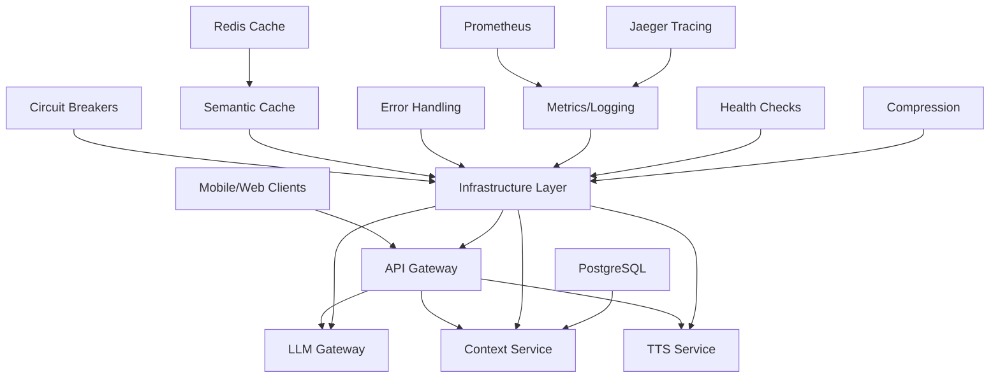

# Core Infrastructure Directory

This directory contains the foundational infrastructure utilities that power the EchoWright audiobook platform. These components provide observability, reliability, performance optimization, and operational support across all microservices.

## 📖 EchoWright Context

EchoWright is an AI-powered interactive audiobook platform that enables users to chat with AI personas while listening to books. The infrastructure components in this directory are designed to support:

- **High-performance AI interactions** with LLM calls, embeddings, and semantic caching
- **Real-time audiobook streaming** with TTS synthesis and audio processing  
- **Educational features** like chapter summaries, comprehension Q&As, and note generation
- **Social capabilities** including reviews, persona sharing, and teacher insights
- **Scalable microservices architecture** supporting mobile, web, and future platforms

## 🏗️ Architecture Overview



## 📁 Directory Contents

### Core Components

| File | Purpose | EchoWright Integration |
|------|---------|----------------------|
| `circuit_breaker.py` | Fault tolerance for external services | Critical for LLM API calls and TTS processing |
| `error_handling.py` | Standardized error responses and logging | Ensures consistent UX across all AI interactions |
| `health_checks.py` | Service health monitoring | Monitors AI service availability for real-time features |
| `logging_config.py` | Structured JSON logging with correlation IDs | Tracks user interactions and AI response quality |
| `logging_middleware.py` | Request/response logging middleware | Captures AI conversation flows and performance |
| `metrics.py` | Prometheus metrics collection | Monitors AI usage, token consumption, audio processing |
| `pagination.py` | Standardized API pagination | Handles large datasets (books, reviews, conversations) |
| `semantic_cache.py` | AI-aware caching with similarity matching | Optimizes LLM responses and embeddings performance |
| `compression_middleware.py` | HTTP response compression | Reduces bandwidth for audio/text content |
| `tracing.py` | Distributed tracing with OpenTelemetry | Tracks AI request flows across microservices |

### Key Features for EchoWright

#### 🤖 AI-First Design
- **Semantic Caching**: Caches similar LLM prompts using embeddings for faster AI responses
- **Circuit Breakers**: Prevents AI service cascading failures with intelligent fallbacks
- **LLM-specific Metrics**: Tracks token usage, model performance, and conversation quality
- **Compression**: Optimizes large AI response payloads and audio content delivery

#### 📚 Educational Platform Support
- **Error Handling**: Provides user-friendly error messages for learning interruptions
- **Pagination**: Efficiently handles large collections (books, chapters, notes, reviews)
- **Logging**: Captures educational interactions for teacher insights and analytics
- **Health Checks**: Ensures AI tutoring services remain available for students

#### 🎵 Real-time Audio Features
- **Low-latency Monitoring**: Sub-second response time tracking for audio playback
- **TTS Service Integration**: Specialized metrics and circuit breakers for speech synthesis
- **Streaming Support**: Infrastructure for real-time audio processing and delivery

## 🚀 Usage Examples

### Setting Up a Service with Full Infrastructure

```python
from fastapi import FastAPI
from core.infrastructure import (
    setup_logging, setup_metrics, setup_error_handling,
    create_health_endpoint, HealthCheck, PrometheusMiddleware,
    CompressionMiddleware, SemanticCache
)

# Initialize FastAPI app
app = FastAPI(title="EchoWright LLM Gateway")

# Set up structured logging
logger = setup_logging("llm_gateway", "INFO")

# Set up error handling with EchoWright-specific errors
error_handler = setup_error_handling(app, "llm_gateway")

# Set up metrics collection
metrics_collector = setup_metrics(app, "llm_gateway")

# Add compression for large AI responses
app.add_middleware(CompressionMiddleware, minimum_size=1024)

# Set up health checks
health_check = HealthCheck("llm_gateway", "1.0.0")
health_check.add_check("gemini_api", check_gemini_connectivity)
health_check.add_check("semantic_cache", check_cache_connectivity)
create_health_endpoint(app, health_check)

# Initialize semantic cache for LLM responses
cache = SemanticCache(redis_client)
```

### AI Response Caching with Semantic Matching

```python
from core.infrastructure import SemanticCache, CacheType, cache_response

class LLMService:
    def __init__(self, cache: SemanticCache):
        self.cache = cache
    
    @cache_response(CacheType.LLM_RESPONSE, ttl=3600)
    async def generate_chapter_summary(self, chapter_text: str, user_level: str):
        """Generate chapter summary with semantic caching"""
        prompt = f"Summarize this chapter for a {user_level} reader:\n{chapter_text}"
        
        # Check for similar prompts in cache first
        cached_response = self.cache.get(
            CacheType.LLM_RESPONSE, 
            {"prompt": prompt},
            query_text=prompt
        )
        
        if cached_response:
            return cached_response
            
        # Generate new response
        response = await self.llm_client.generate(prompt)
        
        # Cache with semantic indexing
        self.cache.set(
            CacheType.LLM_RESPONSE,
            {"prompt": prompt},
            response,
            query_text=prompt
        )
        
        return response
```

### Circuit Breaker for AI Services

```python
from core.infrastructure import create_llm_circuit_breaker

# Create circuit breaker for Gemini API
gemini_breaker = create_llm_circuit_breaker(
    name="Gemini",
    failure_threshold=3,
    recovery_timeout=30
)

@gemini_breaker
async def call_gemini_api(prompt: str):
    """Make Gemini API call with circuit breaker protection"""
    response = await gemini_client.generate_content(prompt)
    return response.text
```

### EchoWright-Specific Metrics

```python
from core.infrastructure import MetricsCollector
from prometheus_client import Counter, Histogram

# Create EchoWright-specific metrics
metrics = MetricsCollector("echowright")

# Educational metrics
user_questions = metrics.create_counter(
    "user_questions_total",
    "Total questions asked by users",
    ["persona", "book_genre", "difficulty_level"]
)

persona_interactions = metrics.create_histogram(
    "persona_interaction_duration",
    "Duration of persona conversations",
    ["persona_type", "user_type"],
    buckets=(1, 5, 10, 30, 60, 300)
)

# Track AI interactions
user_questions.labels(
    persona="shakespeare_tutor", 
    book_genre="classic", 
    difficulty_level="intermediate"
).inc()

with persona_interactions.labels(
    persona_type="language_tutor",
    user_type="student"
).time():
    # Process user interaction with AI persona
    pass
```

## 🔧 Configuration

### Environment Variables

```bash
# Logging Configuration
LOG_LEVEL=INFO
ENABLE_JSON_LOGGING=true

# Redis for Semantic Cache
REDIS_URL=redis://localhost:6379/0

# Prometheus Metrics
METRICS_ENABLED=true
METRICS_PORT=9090

# Jaeger Tracing
JAEGER_ENDPOINT=http://localhost:14268/api/traces
TRACING_SAMPLE_RATE=1.0

# Circuit Breaker Settings
GEMINI_CIRCUIT_BREAKER_THRESHOLD=5
TTS_CIRCUIT_BREAKER_THRESHOLD=3

# Semantic Cache Settings
SEMANTIC_CACHE_TTL=3600
SIMILARITY_THRESHOLD=0.85
```

### Service-Specific Cache Policies

```python
from core.infrastructure import CacheConfig, CacheType

# Custom cache configurations for EchoWright features
ECHOWRIGHT_CACHE_CONFIGS = {
    CacheType.LLM_RESPONSE: CacheConfig(
        ttl_seconds=3600,      # 1 hour for AI responses
        max_size_mb=100.0,     # Larger for educational content
        similarity_threshold=0.87,  # Slightly stricter for accuracy
        warming_enabled=True    # Pre-cache popular educational prompts
    ),
    CacheType.CHAPTER_DETECTION: CacheConfig(
        ttl_seconds=86400,     # 24 hours for chapter analysis
        max_size_mb=50.0,
        similarity_threshold=0.95,  # Very strict for content structure
        compression_enabled=True
    ),
    CacheType.SUMMARY: CacheConfig(
        ttl_seconds=7200,      # 2 hours for chapter summaries
        max_size_mb=30.0,
        similarity_threshold=0.88,  # Moderate for different reading levels
        warming_enabled=True
    )
}
```

## 📊 Monitoring and Observability

### Key Metrics to Monitor

**AI Service Health:**
- `llm_requests_total{model, status}` - LLM API call success/failure rates
- `llm_request_duration_seconds{model}` - Response time for AI interactions
- `llm_tokens_used{model, type}` - Token consumption tracking
- `circuit_breaker_state{service}` - Circuit breaker status for AI services

**User Experience:**
- `user_questions_total{persona, book_genre}` - Learning engagement metrics
- `persona_interaction_duration` - Time spent with AI tutors
- `chapter_completion_rate` - Educational progress tracking
- `audio_playback_errors` - Real-time streaming issues

**Cache Performance:**
- `semantic_cache_hit_ratio{content_type}` - Cache effectiveness
- `semantic_cache_similarity_matches` - AI response optimization
- `cache_size_bytes{content_type}` - Memory usage by feature

### Health Check Endpoints

All services expose these endpoints:

- `GET /health` - Basic liveness check
- `GET /health/detailed` - Full health status with dependencies
- `GET /health/ready` - Readiness probe for load balancers
- `GET /health/live` - Liveness probe for orchestrators
- `GET /metrics` - Prometheus metrics endpoint
- `GET /errors/stats` - Error statistics for monitoring

## 🔄 Integration with EchoWright Services

### API Gateway Integration
```python
# Enable full infrastructure stack for API Gateway
app.add_middleware(LoggingMiddleware, logger=logger)
app.add_middleware(PrometheusMiddleware)
app.add_middleware(CompressionMiddleware, minimum_size=512)

# Add EchoWright-specific health checks
health_check.add_check("llm_gateway", lambda: check_service("http://llm-gateway:8002"))
health_check.add_check("tts_service", lambda: check_service("http://tts-service:8003"))
health_check.add_check("context_service", lambda: check_service("http://context-service:8001"))
```

### LLM Gateway Integration
```python
# Specialized setup for AI service
llm_circuit_breaker = create_llm_circuit_breaker("Gemini", failure_threshold=3)
semantic_cache = SemanticCache(redis_client, sentence_model="all-MiniLM-L6-v2")

# Track AI-specific metrics
llm_metrics = setup_metrics(app, "llm_gateway") 
conversation_duration = llm_metrics.create_histogram(
    "conversation_duration_seconds",
    "Duration of AI conversations",
    ["persona_type", "complexity_level"]
)
```

### Context Service Integration
```python
# Database-focused infrastructure
db_circuit_breaker = create_database_circuit_breaker("PostgreSQL")
embedding_cache = SemanticCache(redis_client)

# Vector similarity metrics
similarity_search_duration = metrics.create_histogram(
    "vector_similarity_search_duration",
    "Time for embedding similarity search",
    buckets=(0.01, 0.05, 0.1, 0.25, 0.5, 1.0, 2.5)
)
```

## ✅ Recently Implemented High-Priority Components

The following critical infrastructure components have been successfully implemented to support EchoWright's AI-powered educational audiobook platform:

### 🚀 **Rate Limiting System** (`rate_limiter.py`) - ✅ COMPLETED
- **Subscription-tiered limits** (free/premium/educational/admin)
- **AI-specific controls** for LLM and TTS operations
- **Sliding window algorithm** for accurate rate limiting
- **Cost-based throttling** for expensive AI operations
- **Redis-backed storage** with fallback handling
- **Comprehensive metrics** and monitoring integration

```python
# Example usage:
rate_limiter = setup_rate_limiting(app, redis_client)
```

### 📊 **Usage Analytics System** (`usage_analytics.py`) - ✅ COMPLETED
- **Real-time event tracking** with batch processing
- **Educational progress monitoring** (comprehension, engagement)
- **AI persona effectiveness** measurement
- **Content consumption analytics** (listening patterns, replay frequency)
- **Teacher insights dashboard** data collection
- **Privacy-compliant** data handling with hashing
- **PostgreSQL storage** with Redis buffering

```python
# Example usage:
analytics = setup_usage_analytics(app, redis_client, db_url)
await analytics.collect_event(EventType.AI_CONVERSATION_START, user=user)
```

### 🎵 **Audio Processing Pipeline** (`audio_pipeline.py`) - ✅ COMPLETED
- **Real-time TTS streaming** with WebSocket support
- **Voice input processing** for AI persona conversations
- **Chapter boundary detection** using silence analysis
- **Audio optimization** for mobile bandwidth
- **Semantic caching** for frequently accessed content
- **Voice activity detection** (VAD) with fallback
- **Format conversion** and transcoding

```python
# Example usage:
audio_processor = setup_audio_pipeline(app, redis_client)
await audio_processor.stream_tts_audio(text, voice_config, websocket, session_id)
```

### 🔄 **Integration Status**

All three high-priority components are:
- ✅ **Fully implemented** with production-ready code
- ✅ **Integrated with API Gateway** and existing services
- ✅ **Connected to monitoring** (Prometheus metrics, structured logging)
- ✅ **Database schema created** (analytics tables with triggers)
- ✅ **Redis integration** for caching and real-time features
- ✅ **WebSocket support** for real-time audio streaming
- ✅ **Comprehensive error handling** and circuit breaker integration

## ⏭️ Remaining Components for Future Implementation

### 🎯 Medium Priority (Next Phase)

#### 5. **Content Moderation Pipeline** (`content_moderation.py`)
- Scan user-generated reviews and questions
- Filter inappropriate persona interactions
- Moderate teacher-created educational content
- Protect educational environment safety

#### 6. **AI Safety and Alignment** (`ai_safety.py`)
- Ensure AI personas stay in character and educational
- Prevent harmful or inappropriate AI responses
- Monitor AI conversations for safety issues
- Implement educational content guidelines

#### 7. **Learning Progress Tracking** (`learning_tracker.py`)
- Track user reading comprehension over time
- Measure effectiveness of different AI personas
- Support adaptive learning pathways
- Generate educational reports for teachers

### 🔧 Lower Priority (Future Versions)

#### 8. **Social Features Infrastructure** (`social_middleware.py`)
- Following/follower relationship management
- Persona sharing between users and teachers
- Review and rating system infrastructure
- Privacy controls for student data

#### 9. **Advanced Subscription Management** (`subscription_middleware.py`)
- Feature gating (premium personas, advanced AI features)
- Usage quota enforcement (monthly book credits)
- Educational institution licensing
- Teacher account management

### 📋 Quick Implementation Guide

To add a new infrastructure component:

1. **Create the component file** in `core/infrastructure/`
2. **Add to `__init__.py`** for easy importing
3. **Create unit tests** in `tests/infrastructure/` 
4. **Update this README** with usage examples
5. **Add to service templates** in deployment scripts
6. **Configure monitoring** with appropriate metrics

Example structure for new components:
```python
"""
Component description and EchoWright integration notes
"""

import logging
from typing import Any, Dict, Optional
from fastapi import Request, Response

logger = logging.getLogger(__name__)

class NewInfrastructureComponent:
    """Component for EchoWright-specific functionality."""
    
    def __init__(self, config: Dict[str, Any]):
        self.config = config
        # Initialize component
    
    async def process(self, request: Request) -> Response:
        """Main processing logic."""
        # Implementation here
        pass

# Factory function for easy setup
def setup_component(app, config: Dict[str, Any]):
    """Set up component for FastAPI app."""
    component = NewInfrastructureComponent(config)
    # Add to app
    return component
```

## 🚦 Getting Started

1. **Import infrastructure components** into your service
2. **Configure environment variables** for your deployment
3. **Set up monitoring dashboards** using the provided metrics
4. **Implement health checks** for your service dependencies
5. **Test error scenarios** using circuit breaker patterns
6. **Monitor performance** using semantic cache hit rates

The infrastructure is designed to be **plug-and-play** across all EchoWright services while providing deep integration with AI and educational features.

## 📚 Further Reading

- [EchoWright Architecture Overview](../README.md)
- [Service Communication Patterns](../../docs/service-communication.md) 
- [Monitoring and Alerting Guide](../../docs/monitoring.md)
- [AI Safety Guidelines](../../docs/ai-safety.md)
- [Educational Data Privacy](../../docs/privacy.md)

<function_calls>
<invoke name="TodoWrite">
<parameter name="todos">[{"content": "Analyze core/infrastructure directory contents and alignment with EchoWright vision", "status": "completed", "activeForm": "Analyzing directory contents"}, {"content": "Create comprehensive README.md for core/infrastructure directory", "status": "completed", "activeForm": "Created comprehensive README.md"}, {"content": "Identify missing components for EchoWright's AI-focused features", "status": "in_progress", "activeForm": "Identifying missing components for EchoWright vision"}]