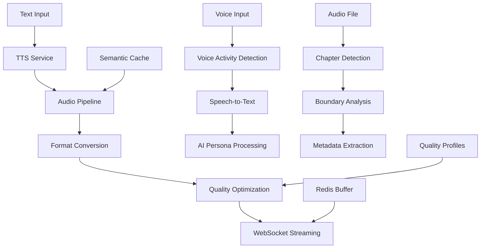

# Audio Processing Pipeline

## Overview

The audio processing pipeline provides real-time audio streaming, TTS synthesis, voice input processing, and chapter boundary detection for the EchoWright platform. It supports WebSocket streaming, voice conversations with AI personas, and intelligent audio optimization.

## Architecture



## Key Features

### Real-Time TTS Streaming
- WebSocket-based audio streaming
- Multiple voice profiles and languages
- Quality-adaptive streaming based on connection
- Semantic caching for frequently requested content

### Voice Input Processing  
- Voice Activity Detection (VAD)
- Speech-to-Text conversion with fallback providers
- Real-time conversation with AI personas
- Noise reduction and audio enhancement

### Chapter Boundary Detection
- Silence-based chapter detection
- Speaker change detection
- Metadata-driven chapter marking
- Automatic bookmark generation

### Audio Optimization
- Dynamic quality adjustment
- Bandwidth-optimized formats
- Mobile-specific optimizations
- Progressive audio loading

## Usage

### Basic Setup
```python
from core.infrastructure import setup_audio_pipeline

# Initialize audio pipeline
audio_processor = setup_audio_pipeline(
    app, redis_client, cache=semantic_cache, config=audio_config
)
```

### TTS Streaming
```python
from core.infrastructure import AudioProcessor, AudioFormat, StreamingQuality

# Stream TTS audio via WebSocket
@app.websocket("/audio/stream/{session_id}")
async def stream_audio(websocket: WebSocket, session_id: str):
    await websocket.accept()
    
    voice_config = {
        "voice_id": "neural_sarah",
        "speed": 1.0,
        "pitch": 0.0,
        "language": "en-US"
    }
    
    # Stream text-to-speech audio
    await audio_processor.stream_tts_audio(
        text="Hello from EchoWright!",
        voice_config=voice_config,
        websocket=websocket,
        session_id=session_id
    )
```

### Voice Input Processing
```python
# Process voice input from user
@app.websocket("/audio/voice-chat/{persona_id}")
async def voice_chat(websocket: WebSocket, persona_id: str):
    await websocket.accept()
    
    async for audio_chunk in websocket.iter_bytes():
        # Process voice input
        voice_activity = await audio_processor.detect_voice_activity(
            audio_chunk, session_id=f"voice_{persona_id}"
        )
        
        if voice_activity.is_speech:
            # Convert speech to text
            transcript = await audio_processor.speech_to_text(
                audio_chunk, language="en-US"
            )
            
            # Send to AI persona for response
            ai_response = await process_with_persona(transcript, persona_id)
            
            # Convert response back to audio and stream
            await audio_processor.stream_tts_audio(
                text=ai_response,
                voice_config=get_persona_voice(persona_id),
                websocket=websocket,
                session_id=f"response_{persona_id}"
            )
```

### Chapter Detection
```python
# Detect chapter boundaries in audiobook
chapter_markers = await audio_processor.detect_chapters(
    audio_file_path="/path/to/audiobook.mp3",
    detection_method="silence_and_speaker",
    min_chapter_length=300,  # 5 minutes minimum
    silence_threshold=-40    # dB
)

for marker in chapter_markers:
    print(f"Chapter {marker.chapter_number}: {marker.start_time}s - {marker.end_time}s")
    print(f"Title: {marker.title}")
    print(f"Confidence: {marker.confidence}")
```

## Audio Formats & Quality

### Supported Formats
- **MP3**: Universal compatibility, good compression
- **OPUS**: Best quality-to-size ratio, WebRTC standard  
- **AAC**: Apple ecosystem optimization
- **WAV**: Uncompressed, development/testing
- **FLAC**: Lossless compression for premium tiers

### Quality Profiles
```python
from core.infrastructure import StreamingQuality

quality_profiles = {
    StreamingQuality.LOW: {
        "bitrate": 64,    # kbps
        "sample_rate": 22050,  # Hz
        "format": "opus"
    },
    StreamingQuality.MEDIUM: {
        "bitrate": 128,
        "sample_rate": 44100,
        "format": "opus"
    },
    StreamingQuality.HIGH: {
        "bitrate": 256,
        "sample_rate": 48000,
        "format": "opus"
    }
}
```

### Adaptive Quality
The pipeline automatically adjusts quality based on:
- Network connection speed
- Device capabilities
- Battery level (mobile)
- User subscription tier
- Content type (voice vs. music)

## Configuration

### Environment Variables
```bash
# Audio processing settings
AUDIO_PIPELINE_REDIS_URL=redis://localhost:6379/3
AUDIO_PIPELINE_ENABLED=true
AUDIO_PIPELINE_TTS_CACHE_TTL=3600

# TTS service configuration  
TTS_SERVICE_URL=http://localhost:8003
TTS_DEFAULT_VOICE=neural_sarah
TTS_SUPPORTED_LANGUAGES=en-US,es-ES,fr-FR,de-DE

# Voice processing
VOICE_ACTIVITY_DETECTION=webrtcvad
SPEECH_TO_TEXT_PROVIDER=whisper
STT_MODEL_SIZE=base

# Audio quality settings
AUDIO_DEFAULT_QUALITY=medium
AUDIO_ADAPTIVE_QUALITY=true
AUDIO_MAX_CHUNK_SIZE=8192
```

### Audio Config
```python
from core.infrastructure import AudioConfig, AudioFormat, ProcessingMode

config = AudioConfig(
    default_format=AudioFormat.OPUS,
    default_quality=StreamingQuality.MEDIUM,
    enable_adaptive_quality=True,
    chunk_size=8192,
    buffer_size=32768,
    enable_caching=True,
    cache_ttl=3600,
    max_concurrent_streams=100,
    voice_detection_sensitivity=0.7,
    processing_mode=ProcessingMode.REALTIME
)
```

## Voice Activity Detection

### VAD Providers
- **WebRTC VAD**: Fast, lightweight, good for real-time
- **Silero VAD**: ML-based, higher accuracy
- **Picovoice Cobra**: Commercial solution with very low latency

### Configuration
```python
# Configure VAD sensitivity
vad_config = {
    "provider": "webrtcvad",
    "sensitivity": 0.7,     # 0.0-1.0
    "frame_duration": 30,   # ms
    "padding_duration": 300 # ms
}

voice_activity = await audio_processor.detect_voice_activity(
    audio_chunk, config=vad_config
)
```

## Semantic Caching

### TTS Response Caching
```python
# Cache TTS audio for reuse
cache_key = audio_processor.generate_cache_key(
    text="Welcome to EchoWright!",
    voice_config={"voice_id": "neural_sarah", "speed": 1.0},
    quality=StreamingQuality.MEDIUM
)

# Check cache first
cached_audio = await audio_processor.get_cached_audio(cache_key)
if not cached_audio:
    # Generate and cache new audio
    audio_data = await audio_processor.synthesize_speech(text, voice_config)
    await audio_processor.cache_audio(cache_key, audio_data, ttl=3600)
```

### Chapter Detection Caching
```python
# Cache chapter detection results
book_hash = audio_processor.calculate_audio_hash(audio_file_path)
cached_chapters = await audio_processor.get_cached_chapters(book_hash)

if not cached_chapters:
    chapters = await audio_processor.detect_chapters(audio_file_path)
    await audio_processor.cache_chapters(book_hash, chapters)
```

## WebSocket Protocol

### TTS Streaming Protocol
```json
{
  "type": "audio_chunk",
  "session_id": "session_123",
  "chunk_id": 42,
  "format": "opus",
  "sample_rate": 48000,
  "data": "base64_encoded_audio",
  "metadata": {
    "text": "Current sentence being spoken",
    "timestamp": 1234567890,
    "total_chunks": 150,
    "is_final": false
  }
}
```

### Voice Chat Protocol  
```json
{
  "type": "voice_input",
  "session_id": "voice_123", 
  "audio_data": "base64_encoded_audio",
  "format": "webm",
  "sample_rate": 16000,
  "metadata": {
    "is_final": false,
    "voice_activity_detected": true
  }
}
```

## Performance Monitoring

### Prometheus Metrics
- `audio_streams_active` - Current active streams
- `audio_tts_requests_total{voice, language}` - TTS generation requests  
- `audio_processing_duration{operation}` - Processing latency
- `audio_cache_hit_ratio{content_type}` - Cache effectiveness
- `audio_websocket_connections{status}` - WebSocket connection stats
- `voice_activity_detection_accuracy` - VAD accuracy metrics

### Performance Optimization
- Audio chunk pre-buffering
- Connection pooling for TTS service
- Redis pipeline operations
- Async audio processing
- GPU acceleration for ML models

## Testing

### Unit Tests
```bash
python -m pytest tests/infrastructure/test_audio_pipeline.py -v
```

### Integration Tests
```bash
python -m pytest tests/integration/test_audio_streaming.py
```

### Performance Tests
```bash
# Test streaming performance under load
python scripts/test_audio_streaming_load.py --concurrent=50 --duration=60s
```

### Audio Quality Tests
```bash
# Test audio quality metrics
python scripts/test_audio_quality.py --input=test_audio.wav --formats=opus,mp3,aac
```

## Troubleshooting

### Common Issues

1. **Audio streaming drops or glitches**
   - Check WebSocket connection stability  
   - Verify buffer sizes and chunk timing
   - Monitor Redis memory and latency
   - Review network bandwidth usage

2. **Poor voice recognition accuracy**
   - Adjust VAD sensitivity settings
   - Check audio input quality and noise levels
   - Verify speech-to-text model performance
   - Consider using higher quality audio format

3. **High CPU usage during processing**
   - Enable GPU acceleration if available
   - Optimize audio processing algorithms
   - Implement better caching strategies
   - Scale TTS service horizontally

### Debug Commands
```bash
# Check audio pipeline status
curl "http://localhost:8000/admin/audio/status"

# Test TTS generation
curl -X POST "http://localhost:8000/admin/audio/test-tts" \
  -H "Content-Type: application/json" \
  -d '{"text": "Test message", "voice": "neural_sarah"}'

# Check active audio streams
curl "http://localhost:8000/admin/audio/streams/active"

# Verify cache performance
curl "http://localhost:8000/admin/audio/cache/stats"
```

## Security Considerations

- Audio data encryption in transit
- Voice biometric privacy protection
- Secure WebSocket authentication
- Rate limiting for audio generation
- Content moderation for TTS requests

## Future Enhancements

- Real-time audio effects and filters
- Multi-language voice synthesis
- AI-powered audio enhancement
- Spatial audio support for immersive experiences
- Voice cloning for personalized narration