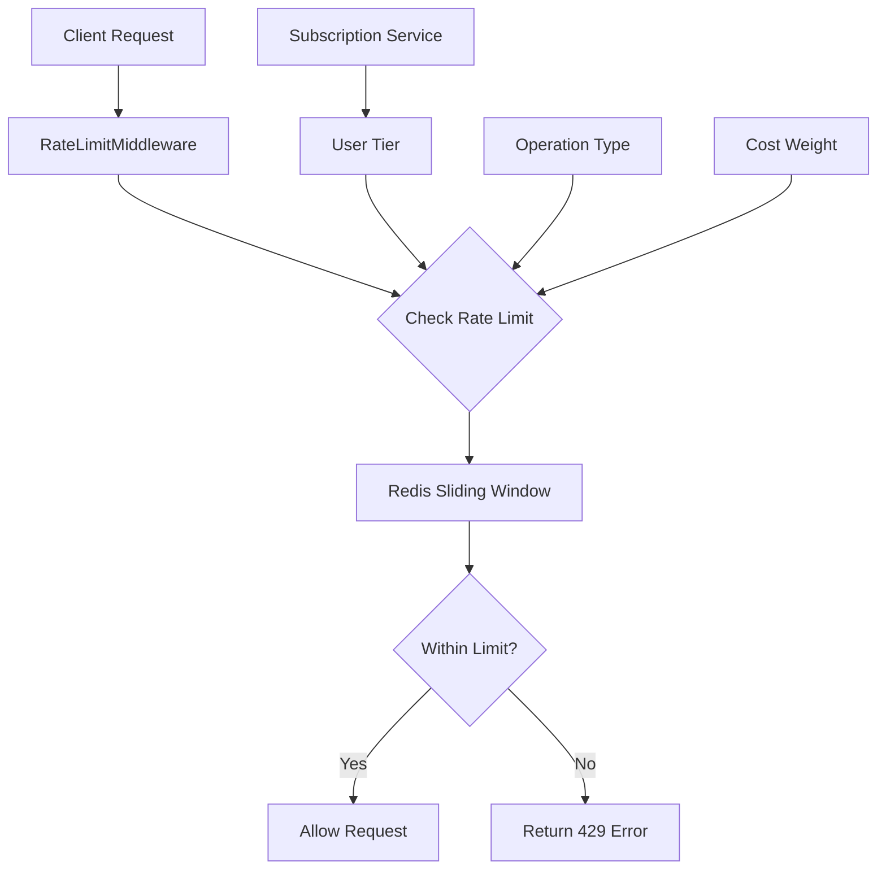

# Rate Limiting System

## Overview

The rate limiting system provides subscription-tiered request throttling for the EchoWright platform. It prevents abuse while ensuring different user tiers receive appropriate access levels to AI services.

## Architecture



## Key Features

### Subscription Tiers
- **FREE**: Basic limits for trial users
- **PREMIUM**: Higher limits for paying customers  
- **EDUCATIONAL**: Special rates for students and teachers
- **ADMIN**: Unrestricted access for platform administration

### Operation Types
- **LLM_INTERACTION**: Chat with AI personas
- **TTS_GENERATION**: Text-to-speech conversion
- **EMBEDDING_GENERATION**: Vector embedding creation
- **AUDIO_STREAMING**: Real-time audio processing
- **GENERAL_API**: Standard API operations

### Cost-Based Throttling
Different operations have different "costs" - expensive AI operations consume more of a user's rate limit budget.

## Usage

### Basic Setup
```python
from core.infrastructure import setup_rate_limiting

# Initialize with Redis client
rate_limiter = setup_rate_limiting(app, redis_client)
```

### Manual Rate Limiting
```python
from core.infrastructure import RateLimiter, OperationType, SubscriptionTier

rate_limiter = RateLimiter(redis_client)

# Check if user can perform operation
allowed = await rate_limiter.check_rate_limit(
    user_id="user123",
    operation_type=OperationType.LLM_INTERACTION,
    subscription_tier=SubscriptionTier.PREMIUM,
    cost=1.5  # Operation cost multiplier
)

if not allowed:
    raise RateLimitError("Rate limit exceeded")
```

### Decorator Usage
```python
from core.infrastructure import rate_limit_decorator, OperationType

@rate_limit_decorator(OperationType.LLM_INTERACTION, cost=2.0)
async def expensive_ai_operation(user_id: str, request_data: dict):
    # This endpoint will be rate limited
    return await process_ai_request(request_data)
```

## Configuration

### Environment Variables
```bash
# Rate limiting settings
RATE_LIMITER_REDIS_URL=redis://localhost:6379/2
RATE_LIMITER_ENABLED=true
RATE_LIMITER_DEFAULT_TIER=FREE

# Custom rate limits (JSON format)
RATE_LIMITER_CUSTOM_LIMITS='{"OperationType.LLM_INTERACTION": {"SubscriptionTier.PREMIUM": {"requests": 500, "window_seconds": 3600}}}'
```

### Default Rate Limits
| Operation | FREE | PREMIUM | EDUCATIONAL | ADMIN |
|-----------|------|---------|-------------|-------|
| LLM Interaction | 20/hour | 200/hour | 100/hour | Unlimited |
| TTS Generation | 50/hour | 500/hour | 200/hour | Unlimited |
| Embedding | 100/hour | 1000/hour | 500/hour | Unlimited |
| Audio Streaming | 10/hour | 100/hour | 50/hour | Unlimited |

## Monitoring

### Prometheus Metrics
- `rate_limit_requests_total{operation_type, tier, status}` - Total rate limit checks
- `rate_limit_exceeded_total{operation_type, tier}` - Rate limit violations
- `rate_limit_current_usage{operation_type, tier}` - Current usage levels
- `rate_limit_window_resets_total` - Window reset events

### Health Checks
The rate limiter includes health monitoring:
```python
# Check rate limiter health
health_status = await rate_limiter.health_check()
```

## Redis Integration

### Database Usage
- **Database 2**: Rate limiting counters and metadata
- **Key Pattern**: `rate_limit:{user_id}:{operation_type}:{window_start}`
- **Expiration**: Automatic cleanup of old windows

### Data Structure
```json
{
  "count": 15,
  "cost_total": 22.5,
  "first_request": "2025-01-25T10:00:00Z",
  "last_request": "2025-01-25T10:45:32Z"
}
```

## Error Handling

### Rate Limit Exceeded
```python
from core.infrastructure import RateLimitError

try:
    await perform_operation()
except RateLimitError as e:
    # e.retry_after contains seconds until limit resets
    return {"error": "Rate limit exceeded", "retry_after": e.retry_after}
```

### Fallback Behavior
- Redis unavailable: Allow requests (fail-open)
- Invalid configuration: Use default limits
- Network errors: Log and allow request

## Testing

### Unit Tests
```bash
python -m pytest tests/infrastructure/test_rate_limiter.py -v
```

### Load Testing
```bash
# Test rate limiter under load
python -m pytest tests/infrastructure/test_rate_limiter_load.py
```

### Integration Testing
```bash
# Test with API Gateway integration
python -m pytest tests/integration/test_rate_limiting.py
```

## Troubleshooting

### Common Issues

1. **Rate limits too restrictive**
   - Adjust limits in environment variables
   - Check user subscription tier mapping
   - Review operation cost weights

2. **Redis connection issues**
   - Verify RATE_LIMITER_REDIS_URL
   - Check Redis database availability
   - Monitor Redis memory usage

3. **Performance problems**
   - Monitor Redis latency
   - Consider Redis clustering for high traffic
   - Review sliding window algorithm efficiency

### Debug Commands
```bash
# Check current rate limit status for user
curl "http://localhost:8000/admin/rate-limit-status?user_id=user123"

# Reset rate limits for testing
curl -X POST "http://localhost:8000/admin/rate-limit-reset?user_id=user123"

# View rate limit metrics
curl "http://localhost:8000/metrics" | grep rate_limit
```

## Security Considerations

- User IDs are hashed before storage for privacy
- IP-based fallback for anonymous users
- Rate limits enforced server-side only
- Admin overrides logged for audit trail

## Future Enhancements

- Geographic rate limiting for compliance
- Burst allowance for occasional spikes
- Dynamic rate adjustment based on system load
- Machine learning-based anomaly detection