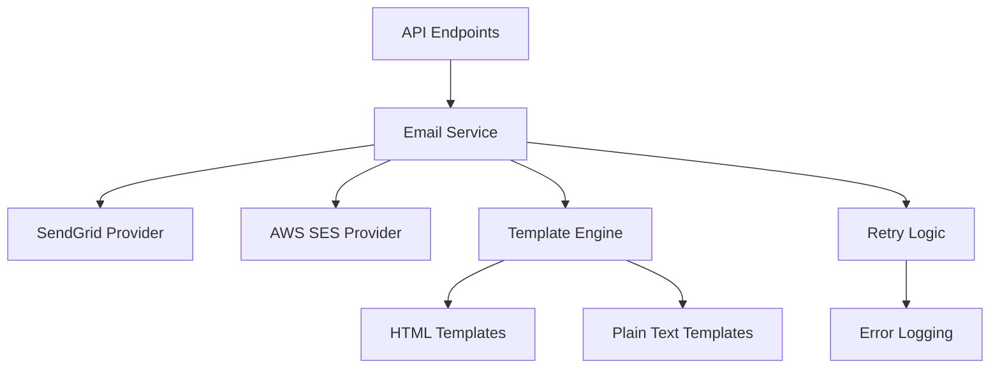

# Core Services

This directory contains the core business services that power the EchoWright platform. These services are designed to be reusable across different parts of the application and handle critical functionality like email communication, file management, and external integrations.

## Services Overview

### Email Service (`email_service.py`)

Handles all email communication including user verification, password resets, and welcome emails.

**Key Features:**
- Multi-provider support (SendGrid primary, AWS SES fallback)
- Automatic retry logic with exponential backoff
- Template-based email generation
- Rate limiting and error handling
- Comprehensive logging and monitoring

**Usage:**
```python
from core.services.email_service import EmailService

# Initialize service
email_service = EmailService()

# Send verification email
await email_service.send_verification_email(
    email="user@example.com",
    verification_token="abc123",
    user_name="John Doe"
)

# Send welcome email
await email_service.send_welcome_email(
    email="user@example.com",
    user_name="John Doe",
    subscription_plan="premium"
)
```

**Configuration:**
- `SENDGRID_API_KEY`: SendGrid API key for primary email provider
- `AWS_SES_*`: AWS SES configuration for fallback provider
- `EMAIL_FROM_ADDRESS`: Default sender address
- `EMAIL_FROM_NAME`: Default sender name
- `FRONTEND_BASE_URL`: Base URL for email verification links

**Templates:**
Email templates are stored in `templates/email/` and support:
- Dynamic content insertion
- Multi-language support (future enhancement)
- HTML and plain text formats
- Responsive design for mobile devices

## Service Architecture



## Adding New Services

To add a new core service:

1. **Create Service File:** Add `new_service.py` in this directory
2. **Define Service Class:** Follow the pattern established by `EmailService`
3. **Add Configuration:** Update environment variables and settings
4. **Create Tests:** Add unit tests in `tests/services/`
5. **Update Documentation:** Add service documentation to this README

### Service Template

```python
"""
new_service.py - Description of what this service does

Key responsibilities:
- Primary function 1
- Primary function 2
- Integration with external systems
"""

from typing import Optional, Dict, Any
from core.config import settings
import logging

logger = logging.getLogger(__name__)

class NewService:
    """Service for handling specific functionality"""
    
    def __init__(self):
        self.config = self._load_config()
    
    def _load_config(self) -> Dict[str, Any]:
        """Load service configuration"""
        return {
            'api_key': settings.NEW_SERVICE_API_KEY,
            'timeout': settings.NEW_SERVICE_TIMEOUT,
        }
    
    async def primary_method(self, param: str) -> bool:
        """Main service method"""
        try:
            # Service implementation
            result = await self._perform_operation(param)
            logger.info(f"Service operation completed: {result}")
            return True
        except Exception as e:
            logger.error(f"Service operation failed: {e}")
            return False
    
    async def _perform_operation(self, param: str) -> Any:
        """Private method for actual operation"""
        pass
```

## Testing Services

All services should include comprehensive tests:

```python
import pytest
from unittest.mock import AsyncMock, patch
from core.services.new_service import NewService

@pytest.mark.asyncio
async def test_new_service_success():
    service = NewService()
    
    with patch('core.services.new_service.external_api') as mock_api:
        mock_api.return_value = {"status": "success"}
        
        result = await service.primary_method("test_param")
        assert result is True
        mock_api.assert_called_once_with("test_param")

@pytest.mark.asyncio
async def test_new_service_failure():
    service = NewService()
    
    with patch('core.services.new_service.external_api') as mock_api:
        mock_api.side_effect = Exception("API Error")
        
        result = await service.primary_method("test_param")
        assert result is False
```

## Error Handling

All services follow standardized error handling:

1. **Graceful Degradation:** Services should fail gracefully
2. **Retry Logic:** Implement exponential backoff for transient failures  
3. **Logging:** Comprehensive error logging with context
4. **Monitoring:** Integration with application monitoring systems
5. **Fallbacks:** Backup providers or alternative methods where possible

## Configuration Management

Services use centralized configuration:

- **Environment Variables:** For sensitive data (API keys, credentials)
- **Settings Classes:** For application configuration
- **Default Values:** Sensible defaults for optional settings
- **Validation:** Configuration validation on startup

## Development Guidelines

1. **Async/Await:** Use async patterns for I/O operations
2. **Type Hints:** Include comprehensive type annotations
3. **Documentation:** Detailed docstrings for all public methods
4. **Error Handling:** Explicit exception handling
5. **Logging:** Structured logging with appropriate levels
6. **Testing:** Unit tests with >90% coverage
7. **Security:** Secure handling of sensitive data

## Dependencies

- `aiohttp`: For async HTTP requests
- `jinja2`: For email template rendering
- `pydantic`: For data validation and settings
- `sendgrid`: For SendGrid email provider
- `boto3`: For AWS SES integration

## Monitoring and Alerting

Services support monitoring through:

- **Health Checks:** Service-specific health endpoints
- **Metrics:** Custom metrics for service operations
- **Alerts:** Error rate and performance alerts
- **Dashboards:** Grafana dashboards for service monitoring