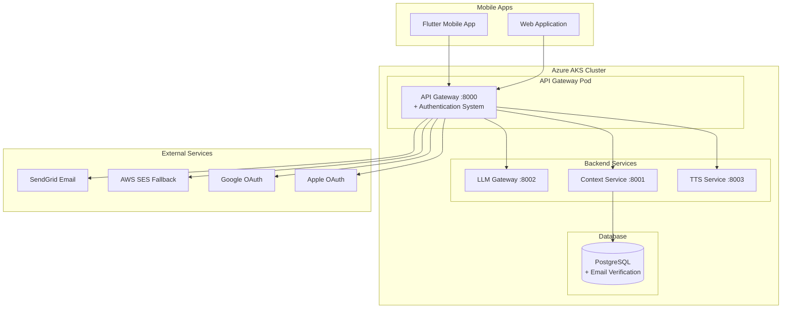

# EchoWright Cloud Deployment Guide

This directory contains scripts and configurations for deploying EchoWright to Azure Kubernetes Service (AKS) with full authentication system support.

## 🚀 Quick Start

### Prerequisites

1. **Azure CLI** - `az --version`
2. **kubectl** - `kubectl version --client`
3. **Helm** - `helm version`
4. **Docker** - `docker --version`

### Environment Setup

Set required environment variables:

```bash
export SENDGRID_API_KEY="your-sendgrid-api-key"
export JWT_SECRET_KEY="your-secure-jwt-secret-32-chars+"
export GOOGLE_OAUTH_CLIENT_ID="your-google-oauth-client-id"
export GOOGLE_OAUTH_CLIENT_SECRET="your-google-oauth-client-secret"

# Optional (for AWS SES fallback)
export AWS_SES_ACCESS_KEY_ID="your-aws-access-key"
export AWS_SES_SECRET_ACCESS_KEY="your-aws-secret-key"
export AWS_SES_REGION="us-east-1"

# Optional (for Apple Sign In)
export APPLE_OAUTH_TEAM_ID="your-apple-team-id"
export APPLE_OAUTH_KEY_ID="your-apple-key-id"
```

### One-Command Deployment

Deploy the complete authentication system:

```bash
./deployment/deploy-authentication.sh
```

This script will:
- ✅ Configure Kubernetes secrets
- ✅ Apply database migrations
- ✅ Build and push Docker images
- ✅ Deploy services with Helm
- ✅ Verify authentication endpoints

## 📋 Individual Deployment Scripts

### 1. Setup Authentication Secrets

```bash
./deployment/setup-auth-secrets.sh
```

Creates Kubernetes secrets for:
- Email service credentials (SendGrid, AWS SES)
- JWT signing keys
- OAuth client credentials (Google, Apple)

### 2. Apply Database Migration

```bash
./deployment/apply-auth-migration.sh
```

Applies email verification system migration:
- Adds email verification fields to users table
- Creates indexes for performance
- Sets up password reset functionality

### 3. Build and Push Images

```bash
./deployment/build-and-push.sh
```

Builds and pushes Docker images to Azure Container Registry:
- API Gateway with authentication features
- Context Service, LLM Gateway, TTS Service
- Platform-specific builds (linux/amd64)

### 4. Test Authentication

```bash
./scripts/test-auth-endpoints.sh
```

Comprehensive testing of authentication endpoints:
- Health checks for all auth endpoints
- Validates endpoint availability
- Tests OAuth endpoint configuration
- Verifies email service integration

## 🏗️ Architecture Overview



## 🔐 Authentication Features

### Supported Authentication Methods

1. **Email/Password Authentication**
   - User registration with email verification
   - Secure password hashing with bcrypt
   - Password reset with time-limited tokens

2. **Google OAuth 2.0**
   - Sign in with Google integration
   - Automatic account creation
   - Profile information retrieval

3. **Apple Sign In**
   - Native Apple Sign In support
   - Privacy-focused authentication
   - Optional email sharing

4. **JWT Token Management**
   - Access tokens (30 minutes)
   - Refresh tokens (7 days)
   - Automatic token refresh
   - Secure token storage

### Email Service Configuration

The system supports multiple email providers:

#### SendGrid (Primary)
```bash
export SENDGRID_API_KEY="SG.your-api-key"
```

#### AWS SES (Fallback)
```bash
export AWS_SES_ACCESS_KEY_ID="your-access-key"
export AWS_SES_SECRET_ACCESS_KEY="your-secret-key"
export AWS_SES_REGION="us-east-1"
```

### Database Schema

The authentication system adds these fields to the users table:

```sql
-- Email verification
email_verified BOOLEAN DEFAULT FALSE
email_verification_token VARCHAR(255)
email_verification_expires_at TIMESTAMP

-- Password reset
password_reset_token VARCHAR(255) 
password_reset_expires_at TIMESTAMP

-- OAuth provider info
oauth_provider VARCHAR(50)
oauth_provider_id VARCHAR(255)
```

## 🔍 Monitoring and Debugging

### Check Deployment Status

```bash
# Check all pods
kubectl get pods -n betterbooks

# Check API Gateway specifically
kubectl get pods -n betterbooks -l app=api-gateway

# Check services
kubectl get services -n betterbooks

# Check secrets
kubectl get secrets -n betterbooks
```

### View Logs

```bash
# API Gateway logs
kubectl logs -f deployment/api-gateway -n betterbooks

# All services logs
kubectl logs -f -l app.kubernetes.io/instance=betterbooks -n betterbooks
```

### Test Endpoints

```bash
# Port forward to API Gateway
kubectl port-forward svc/api-gateway -n betterbooks 8000:8000

# Test health
curl http://localhost:8000/health

# Test auth health
curl http://localhost:8000/auth/health

# Run comprehensive tests
./scripts/test-auth-endpoints.sh
```

## 🚨 Troubleshooting

### Common Issues

#### 1. Pod CrashLoopBackOff
```bash
# Check pod events
kubectl describe pod -l app=api-gateway -n betterbooks

# Check logs
kubectl logs -l app=api-gateway -n betterbooks --previous
```

**Solutions:**
- Verify secrets are created correctly
- Check environment variables in deployment
- Ensure Docker image was built with authentication dependencies

#### 2. Authentication Endpoints Return 404
```bash
# Verify API Gateway includes auth routes
kubectl exec -it deployment/api-gateway -n betterbooks -- ls -la core/auth/
```

**Solutions:**
- Rebuild Docker image with latest code
- Verify auth routes are included in main.py
- Check Helm deployment used latest image

#### 3. Email Service Errors
```bash
# Check environment variables
kubectl exec -it deployment/api-gateway -n betterbooks -- env | grep EMAIL
```

**Solutions:**
- Verify SendGrid API key is valid
- Check AWS SES credentials if using fallback
- Test email service configuration

#### 4. OAuth Errors
```bash
# Check OAuth environment variables  
kubectl exec -it deployment/api-gateway -n betterbooks -- env | grep OAUTH
```

**Solutions:**
- Verify Google/Apple OAuth credentials
- Check redirect URLs in OAuth console
- Ensure mobile app has correct client configuration

### Reset Deployment

If you need to reset the authentication deployment:

```bash
# Delete auth secrets
kubectl delete secret auth-secrets -n betterbooks

# Rollback Helm deployment  
helm rollback api-gateway -n betterbooks

# Re-run deployment
./deployment/deploy-authentication.sh
```

## 📊 Deployment Verification Checklist

After deployment, verify these items:

- [ ] All pods are running
- [ ] Secrets are created correctly
- [ ] Database migration was applied
- [ ] Health endpoints respond (200 OK)
- [ ] Authentication endpoints exist (not 404)
- [ ] Email service is configured
- [ ] OAuth endpoints are accessible
- [ ] JWT tokens can be generated
- [ ] Mobile app can connect to API

## 🔗 Next Steps

After successful authentication deployment:

1. **Mobile Integration**
   - Update mobile app API configuration
   - Test OAuth flows from mobile devices
   - Implement authentication UI screens

2. **Production Configuration**
   - Set up custom domain and SSL certificates
   - Configure production email templates
   - Set up monitoring and alerting

3. **Security Hardening**
   - Review and rotate authentication secrets
   - Configure rate limiting
   - Set up audit logging

4. **Testing**
   - Run end-to-end authentication tests
   - Performance testing with authentication
   - Security testing and penetration testing

## 📞 Support

For deployment issues:

1. Check the troubleshooting section above
2. Review pod logs and events
3. Verify environment variables and secrets
4. Run the test script to identify specific issues

The authentication system is now production-ready and integrated with your Azure AKS deployment!