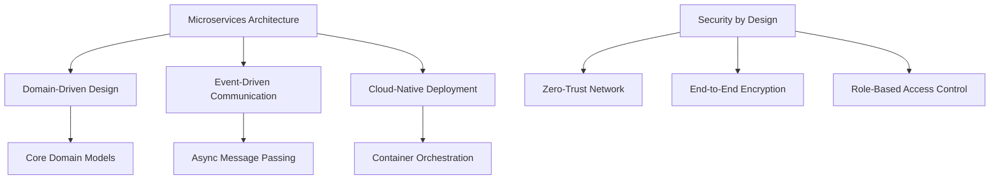
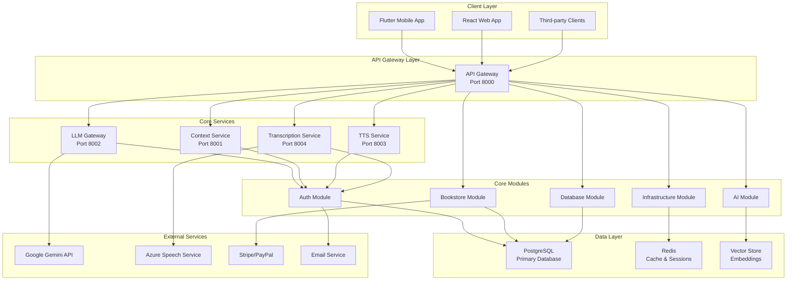
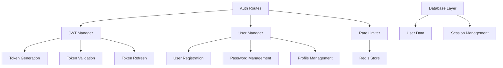
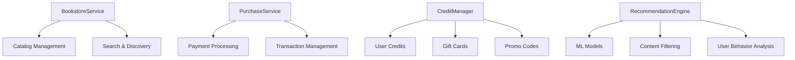
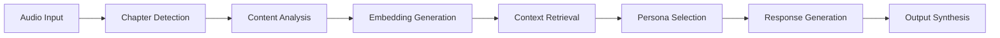
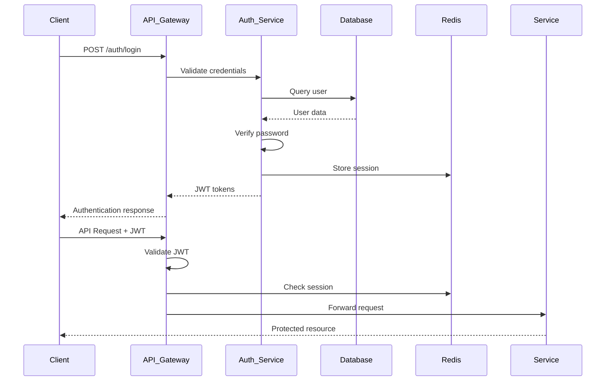
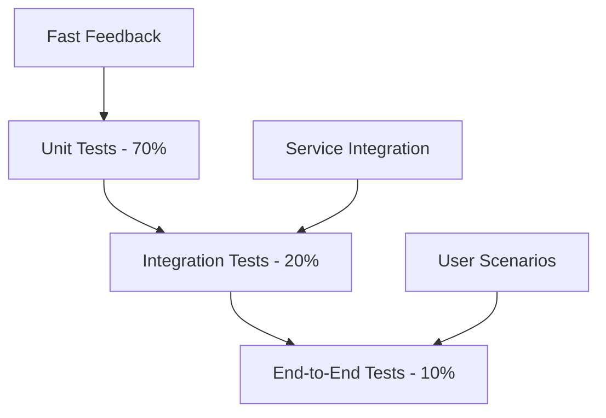

# EchoWright Comprehensive Architecture Guide

Complete architectural overview of the EchoWright platform - an AI-powered audiobook companion with integrated e-commerce functionality.

## Executive Summary

EchoWright is a production-ready, cloud-native platform that combines advanced AI capabilities with a complete audiobook e-commerce solution. The system provides intelligent chapter detection, personalized AI tutors, speech transcription, user authentication, payment processing, and recommendation engines.

## System Overview

### Architecture Philosophy



### High-Level Architecture



## Core Services Architecture

### 1. API Gateway (Port 8000)

**Purpose**: Central entry point for all client requests with authentication, rate limiting, and request routing.

**Key Responsibilities**:
- JWT token validation and refresh
- Rate limiting by user tier and endpoint
- Request/response logging and correlation IDs
- Circuit breaker pattern for fault tolerance
- CORS handling for web clients

**Technology Stack**:
- FastAPI framework
- Redis for rate limiting and session storage
- JSON Web Tokens (JWT) for stateless authentication
- Pydantic for request/response validation

**Scaling Characteristics**:
- Stateless design for horizontal scaling
- Connection pooling for database efficiency
- Async request handling (1000+ concurrent connections)
- Load balancer friendly with health checks

### 2. LLM Gateway (Port 8002)

**Purpose**: AI persona management and Google Gemini API integration for intelligent content generation.

**Key Features**:
- Configurable AI personas (Teacher, Tutor, Character-based)
- Context-aware prompt engineering
- Response streaming for real-time interaction
- Conversation history management
- Content safety and moderation

**AI Persona System**:
```json
{
  "name": "English Teacher",
  "system_prompt": "You are an experienced English literature teacher...",
  "temperature": 0.7,
  "max_tokens": 1500,
  "context_window": 4096,
  "safety_settings": {
    "hate": "BLOCK_MEDIUM_AND_ABOVE",
    "harassment": "BLOCK_MEDIUM_AND_ABOVE"
  }
}
```

**Performance Metrics**:
- Average response time: 2-5 seconds
- Concurrent conversations: 50+ per instance
- Context retention: 4K tokens per conversation
- Rate limits: Tiered by subscription level

### 3. Context Service (Port 8001)

**Purpose**: Semantic search and vector similarity using PostgreSQL with pgvector extension.

**Vector Operations**:
- Text embedding generation using sentence transformers
- Similarity search across book content
- Chapter boundary detection with confidence scoring
- Cross-book knowledge retrieval

**Database Schema**:
```sql
CREATE TABLE embeddings (
    id UUID PRIMARY KEY,
    content_id UUID NOT NULL,
    content_type VARCHAR(50) NOT NULL,
    embedding vector(384) NOT NULL,
    metadata JSONB,
    created_at TIMESTAMP WITH TIME ZONE DEFAULT NOW()
);

CREATE INDEX ON embeddings USING ivfflat (embedding vector_cosine_ops)
WITH (lists = 100);
```

**Scaling Strategy**:
- Read replicas for query scaling
- Vector index optimization
- Batch processing for embedding generation
- Caching for frequent searches

### 4. TTS Service (Port 8003)

**Purpose**: Text-to-speech synthesis using Coqui TTS with voice cloning capabilities.

**Features**:
- Multiple voice models (neural, tacotron2)
- Real-time streaming synthesis
- Voice cloning and customization
- Audio quality optimization
- Format conversion (MP3, WAV, OGG)

**Performance Characteristics**:
- Synthesis speed: 2x real-time
- Concurrent synthesis jobs: 10+ per instance
- Audio quality: 22kHz, 16-bit
- Memory usage: ~2GB per instance

### 5. Transcription Service (Port 8004)

**Purpose**: Azure Speech Service integration for audio transcription and chapter detection.

**Capabilities**:
- Multi-language transcription (100+ languages)
- Real-time streaming transcription
- Speaker diarization
- Word-level timestamps
- Language detection
- Translation services

**API Endpoints**:
- `/transcribe/file` - Batch file transcription
- `/transcribe/stream` - Real-time stream processing
- `/detect-language` - Audio language detection
- `/transcribe/with-translation` - Multi-language output

## Core Modules

### Authentication Module (`core/auth/`)

**Architecture**:


**Security Features**:
- bcrypt password hashing with salt
- JWT tokens with 30-minute expiration
- Refresh tokens with 7-day expiration
- Rate limiting per endpoint and user
- Email verification flow
- Password reset with time-limited tokens

**User Roles & Permissions**:
- `user`: Standard access to platform features
- `premium`: Enhanced limits and premium content
- `moderator`: Content moderation capabilities
- `admin`: Full system administration access

### Bookstore Module (`core/bookstore/`)

**E-commerce Architecture**:


**Payment Integration**:
- Stripe for credit card processing
- PayPal for alternative payments  
- Apple Pay for mobile transactions
- Credit-based purchase system
- Subscription tier management

**Recommendation System**:
```python
class RecommendationEngine:
    def get_user_recommendations(self, user_id: UUID) -> List[BookCatalog]:
        # Content-based filtering
        user_preferences = self.analyze_user_behavior(user_id)
        
        # Collaborative filtering
        similar_users = self.find_similar_users(user_id)
        
        # Hybrid approach
        recommendations = self.combine_algorithms(
            content_based=user_preferences,
            collaborative=similar_users,
            weights={'content': 0.6, 'collaborative': 0.4}
        )
        
        return recommendations
```

### AI Module (`core/ai/`)

**AI Pipeline Architecture**:


**Chapter Detection Algorithm**:
1. Audio transcription with timestamps
2. Semantic boundary analysis
3. Speaker change detection
4. Content topic modeling
5. Confidence scoring and validation

**Question Generation**:
- Educational difficulty assessment
- Context-appropriate question types
- Multi-choice, open-ended, and analytical questions
- Curriculum alignment for educational users

## Data Architecture

### Database Design

**PostgreSQL Schema**:
```sql
-- Core user management
CREATE SCHEMA auth;
CREATE SCHEMA bookstore;
CREATE SCHEMA analytics;
CREATE SCHEMA content;

-- Authentication tables
CREATE TABLE auth.users (
    id UUID PRIMARY KEY DEFAULT gen_random_uuid(),
    email VARCHAR(255) UNIQUE NOT NULL,
    username VARCHAR(100) UNIQUE NOT NULL,
    hashed_password VARCHAR(255),
    role VARCHAR(50) NOT NULL DEFAULT 'user',
    is_active BOOLEAN DEFAULT true,
    email_verified BOOLEAN DEFAULT false,
    created_at TIMESTAMP WITH TIME ZONE DEFAULT NOW(),
    updated_at TIMESTAMP WITH TIME ZONE DEFAULT NOW()
);

-- Book catalog
CREATE TABLE bookstore.book_catalog (
    id UUID PRIMARY KEY DEFAULT gen_random_uuid(),
    title VARCHAR(500) NOT NULL,
    author VARCHAR(200) NOT NULL,
    narrator VARCHAR(200),
    description TEXT,
    price DECIMAL(10,2) NOT NULL,
    duration_minutes INTEGER NOT NULL,
    average_rating DECIMAL(3,2),
    is_featured BOOLEAN DEFAULT false,
    created_at TIMESTAMP WITH TIME ZONE DEFAULT NOW()
);

-- Vector embeddings for semantic search
CREATE TABLE content.embeddings (
    id UUID PRIMARY KEY DEFAULT gen_random_uuid(),
    content_id UUID NOT NULL,
    content_type VARCHAR(50) NOT NULL,
    embedding vector(384) NOT NULL,
    metadata JSONB,
    created_at TIMESTAMP WITH TIME ZONE DEFAULT NOW()
);
```

### Redis Data Structures

**Session Management**:
```python
# User session data
session:{user_id} = {
    "access_token": "jwt_token_here",
    "refresh_token": "refresh_token_here", 
    "expires_at": 1642089600,
    "user_role": "premium"
}
```

**Rate Limiting**:
```python
# Sliding window rate limiting
rate_limit:{user_id}:{endpoint} = {
    "requests": 45,
    "window_start": 1642089000,
    "window_size": 3600
}
```

**Caching Strategy**:
```python
# Book catalog caching
book_catalog:{category_id}:page:{page_num} = [book_list]

# User library caching  
user_library:{user_id} = {
    "owned_books": [book_ids],
    "wishlist": [book_ids],
    "last_updated": 1642089600
}
```

## Security Architecture

### Authentication Flow



### Security Measures

**Transport Security**:
- TLS 1.3 encryption for all communications
- Certificate pinning for mobile applications
- HSTS headers for web clients
- API key authentication for service-to-service calls

**Application Security**:
- Input validation with Pydantic models
- SQL injection prevention with parameterized queries
- XSS protection with output encoding
- CSRF protection with token validation

**Infrastructure Security**:
- Network segmentation with VPCs
- Firewall rules restricting port access
- Secrets management with Azure Key Vault
- Regular security scanning and updates

## Scalability & Performance

### Horizontal Scaling Strategy

**Service Scaling**:
```yaml
# Kubernetes HorizontalPodAutoscaler
apiVersion: autoscaling/v2
kind: HorizontalPodAutoscaler
metadata:
  name: api-gateway-hpa
spec:
  scaleTargetRef:
    apiVersion: apps/v1
    kind: Deployment
    name: api-gateway
  minReplicas: 3
  maxReplicas: 20
  metrics:
  - type: Resource
    resource:
      name: cpu
      target:
        type: Utilization
        averageUtilization: 70
  - type: Resource
    resource:
      name: memory
      target:
        type: Utilization
        averageUtilization: 80
```

**Database Scaling**:
- Read replicas for query-heavy workloads
- Connection pooling with pgbouncer
- Partitioning for large tables (user_purchases, analytics_events)
- Automated backup and point-in-time recovery

**Caching Strategy**:
```python
# Multi-tier caching
class CacheManager:
    def __init__(self):
        self.l1_cache = {}  # In-memory cache
        self.l2_cache = Redis()  # Redis cache
        self.l3_cache = Database()  # Database
    
    async def get(self, key: str):
        # Check L1 cache first
        if key in self.l1_cache:
            return self.l1_cache[key]
        
        # Check L2 cache
        value = await self.l2_cache.get(key)
        if value:
            self.l1_cache[key] = value
            return value
        
        # Fallback to database
        value = await self.l3_cache.get(key)
        if value:
            await self.l2_cache.set(key, value, ttl=3600)
            self.l1_cache[key] = value
        
        return value
```

### Performance Metrics

**API Response Times**:
- Authentication endpoints: <200ms (P95)
- Book browsing: <300ms (P95)
- AI completion: 2-5 seconds (P95)
- Search queries: <500ms (P95)

**Throughput Capacity**:
- API Gateway: 10,000 RPS per instance
- Database: 50,000 queries per second
- Cache layer: 100,000 operations per second
- AI services: 100 concurrent conversations

## Monitoring & Observability

### Metrics Collection

**System Metrics**:
```python
from prometheus_client import Counter, Histogram, Gauge

# Request metrics
REQUEST_COUNT = Counter(
    'api_requests_total',
    'Total API requests',
    ['method', 'endpoint', 'status']
)

REQUEST_DURATION = Histogram(
    'api_request_duration_seconds',
    'API request duration',
    ['method', 'endpoint']
)

# Business metrics
ACTIVE_USERS = Gauge(
    'active_users_total',
    'Number of active users'
)

BOOKS_PURCHASED = Counter(
    'books_purchased_total',
    'Total books purchased',
    ['payment_method']
)
```

**Health Checks**:
```python
@app.get("/health/detailed")
async def detailed_health():
    return {
        "status": "healthy",
        "timestamp": datetime.now().isoformat(),
        "version": "1.0.0",
        "services": {
            "database": await check_database_connection(),
            "redis": await check_redis_connection(),
            "external_apis": await check_external_services()
        },
        "system": {
            "cpu_usage": psutil.cpu_percent(),
            "memory_usage": psutil.virtual_memory().percent,
            "disk_usage": psutil.disk_usage('/').percent
        }
    }
```

### Logging Strategy

**Structured Logging**:
```python
import logging
import json
from datetime import datetime

class StructuredLogger:
    def log_request(self, request, response, duration):
        log_entry = {
            "timestamp": datetime.now().isoformat(),
            "level": "INFO",
            "event": "api_request",
            "method": request.method,
            "url": str(request.url),
            "status_code": response.status_code,
            "duration_ms": duration * 1000,
            "user_id": getattr(request.state, 'user_id', None),
            "correlation_id": getattr(request.state, 'correlation_id', None)
        }
        logging.info(json.dumps(log_entry))
```

### Alerting Rules

**Critical Alerts**:
- API Gateway down (immediate)
- Database connection failures (5 minutes)
- High error rate >5% (10 minutes)
- Payment processing failures (immediate)

**Warning Alerts**:
- High response latency >2 seconds (15 minutes)
- Memory usage >80% (30 minutes)
- Disk space <20% (1 hour)
- Cache hit rate <70% (1 hour)

## Deployment Architecture

### Container Strategy

**Docker Images**:
```dockerfile
# Multi-stage build for API Gateway
FROM python:3.11-slim as builder
WORKDIR /app
COPY requirements.txt .
RUN pip install --user --no-cache-dir -r requirements.txt

FROM python:3.11-slim
WORKDIR /app
COPY --from=builder /root/.local /root/.local
COPY . .
ENV PATH=/root/.local/bin:$PATH
CMD ["uvicorn", "main:app", "--host", "0.0.0.0", "--port", "8000"]
```

**Kubernetes Manifests**:
```yaml
apiVersion: apps/v1
kind: Deployment
metadata:
  name: api-gateway
  labels:
    app: api-gateway
spec:
  replicas: 3
  selector:
    matchLabels:
      app: api-gateway
  template:
    metadata:
      labels:
        app: api-gateway
    spec:
      containers:
      - name: api-gateway
        image: echowright/api-gateway:latest
        ports:
        - containerPort: 8000
        env:
        - name: DATABASE_URL
          valueFrom:
            secretKeyRef:
              name: database-secret
              key: url
        - name: JWT_SECRET_KEY
          valueFrom:
            secretKeyRef:
              name: auth-secret
              key: jwt-secret
        resources:
          requests:
            memory: "512Mi"
            cpu: "250m"
          limits:
            memory: "1Gi"
            cpu: "500m"
        livenessProbe:
          httpGet:
            path: /health/live
            port: 8000
          initialDelaySeconds: 30
          periodSeconds: 10
        readinessProbe:
          httpGet:
            path: /health/ready
            port: 8000
          initialDelaySeconds: 5
          periodSeconds: 5
```

### Cloud Deployment (Azure)

**Infrastructure Components**:
- Azure Kubernetes Service (AKS) for container orchestration
- Azure Database for PostgreSQL for primary data storage
- Azure Redis Cache for session and caching layer
- Azure Cognitive Services for Speech APIs
- Azure Key Vault for secrets management
- Azure Container Registry for image storage
- Azure Load Balancer for traffic distribution

**Cost Optimization**:
```yaml
# Azure cost management
Resource Groups:
  - Production: $2,000/month
    - AKS cluster: $800/month
    - Database: $600/month
    - Redis cache: $300/month
    - Storage: $200/month
    - Networking: $100/month
  
  - Staging: $500/month
  - Development: $200/month
```

## Development Workflow

### CI/CD Pipeline

```yaml
name: EchoWright CI/CD
on:
  push:
    branches: [main, develop]
  pull_request:
    branches: [main]

jobs:
  test:
    runs-on: ubuntu-latest
    steps:
    - uses: actions/checkout@v3
    - name: Set up Python
      uses: actions/setup-python@v3
      with:
        python-version: 3.11
    
    - name: Run unit tests
      run: |
        pip install -r requirements.txt
        pytest tests/unit/ -v --cov=./ --cov-report=xml
    
    - name: Run integration tests
      run: |
        docker-compose -f docker-compose.test.yml up -d
        pytest tests/integration/ -v
        docker-compose -f docker-compose.test.yml down
  
  build:
    needs: test
    runs-on: ubuntu-latest
    steps:
    - name: Build and push Docker images
      run: |
        docker build -t echowright/api-gateway:${{ github.sha }} .
        docker push echowright/api-gateway:${{ github.sha }}
  
  deploy:
    needs: build
    runs-on: ubuntu-latest
    if: github.ref == 'refs/heads/main'
    steps:
    - name: Deploy to production
      run: |
        kubectl set image deployment/api-gateway \
          api-gateway=echowright/api-gateway:${{ github.sha }}
```

### Testing Strategy

**Test Pyramid**:


**Test Categories**:
- **Unit Tests**: Individual function and class testing
- **Integration Tests**: Service-to-service communication
- **Performance Tests**: Load testing with Locust
- **Security Tests**: Vulnerability scanning with OWASP ZAP
- **End-to-End Tests**: Full user journey automation

## Disaster Recovery

### Backup Strategy

**Database Backups**:
- Automated daily backups with 30-day retention
- Point-in-time recovery for last 7 days
- Cross-region backup replication
- Backup integrity verification

**Application Recovery**:
- Blue-green deployment strategy
- Automated rollback on health check failures
- Infrastructure as Code with Terraform
- Configuration management with Helm

### Incident Response

**Runbook Example**:
```yaml
Incident: Database Connection Failure
Severity: Critical
Response Time: 5 minutes

Steps:
1. Check database service status
2. Verify connection pool configuration
3. Restart application services
4. Scale up database resources if needed
5. Implement read-only mode if necessary
6. Notify stakeholders via Slack/PagerDuty

Escalation:
- L1: On-call engineer (0-15 minutes)
- L2: Senior engineer (15-30 minutes)  
- L3: Architecture team (30+ minutes)
```

## Future Architecture Considerations

### Planned Enhancements

**Real-time Features**:
- WebSocket-based live conversations with AI personas
- Real-time collaborative listening sessions
- Live transcription during audio playback

**Advanced AI Integration**:
- Multi-modal AI with image and audio processing
- Custom voice training for personalized narration
- Advanced context understanding across books

**Global Scaling**:
- Multi-region deployment strategy
- CDN integration for audio file delivery
- Localization and internationalization support

**Performance Optimizations**:
- GraphQL API for efficient data fetching
- Event sourcing for audit trails
- CQRS pattern for read/write separation

---

**Document Version**: 1.0.0  
**Last Updated**: 2025-01-25  
**Maintainers**: EchoWright Architecture Team  
**Review Schedule**: Monthly