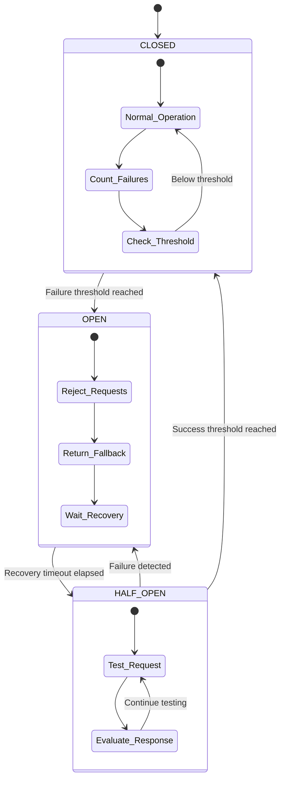

# Circuit Breaker Pattern Implementation

## Overview

The circuit breaker pattern is a critical resilience mechanism implemented in the EchoWright platform to prevent cascading failures when external services become unavailable. This pattern helps maintain system stability by preventing repeated calls to failing services and providing graceful degradation.

## Architecture

### States

The circuit breaker operates in three states:

1. **CLOSED** (Normal Operation)
   - All requests pass through to the service
   - Failures are counted
   - Transitions to OPEN after reaching failure threshold

2. **OPEN** (Service Protection)
   - Requests are immediately rejected without calling the service
   - Returns fallback responses or errors
   - After recovery timeout, transitions to HALF_OPEN

3. **HALF_OPEN** (Recovery Testing)
   - Limited requests are allowed through to test service recovery
   - Success leads back to CLOSED state
   - Failure returns to OPEN state

### State Transitions



```
CLOSED --[failures >= threshold]--> OPEN
OPEN --[timeout elapsed]--> HALF_OPEN
HALF_OPEN --[success >= threshold]--> CLOSED
HALF_OPEN --[any failure]--> OPEN
```

## Implementation Details

### Core Components

#### CircuitBreaker Class
Located in `core/infrastructure/circuit_breaker.py`

Key parameters:
- `failure_threshold`: Number of failures before opening (default: 5)
- `recovery_timeout`: Seconds to wait before testing recovery (default: 60)
- `success_threshold`: Successes needed in HALF_OPEN to close (default: 2)
- `expected_exception`: Exception types to catch
- `fallback_function`: Optional fallback when circuit is open

#### ExponentialBackoff Class
Provides retry logic with exponential delays:
- `max_retries`: Maximum retry attempts (default: 3)
- `base_delay`: Initial delay in seconds (default: 1.0)
- `max_delay`: Maximum delay cap (default: 60.0)

### Service Integration

#### API Gateway Integration
The API Gateway uses circuit breakers for all external service calls:

```python
# Circuit breaker configuration
llm_circuit_breaker = create_llm_circuit_breaker(
    name="LLM_Gateway",
    failure_threshold=3,
    recovery_timeout=30
)

# Usage with retry logic
resp = await retry_backoff.retry(
    llm_circuit_breaker.call,
    make_llm_request
)
```

#### Service-Specific Configurations

1. **LLM Gateway**
   - Failure threshold: 3
   - Recovery timeout: 30s
   - Includes fallback response

2. **TTS Service**
   - Failure threshold: 3
   - Recovery timeout: 20s

3. **Context Service**
   - Failure threshold: 5
   - Recovery timeout: 15s

4. **Transcription Service**
   - Failure threshold: 3
   - Recovery timeout: 30s

## Monitoring

### Circuit Breaker Status Endpoint
```
GET /circuit-breakers/status
```

Returns real-time status of all circuit breakers:
```json
{
  "circuit_breakers": {
    "llm_gateway": {
      "name": "LLM_Gateway",
      "state": "closed",
      "failure_count": 0,
      "stats": {
        "total_calls": 150,
        "successful_calls": 148,
        "failed_calls": 2,
        "rejected_calls": 0,
        "success_rate": 0.987
      }
    }
  },
  "timestamp": "2024-01-15T10:30:00Z"
}
```

### Manual Reset Endpoint
```
POST /circuit-breakers/{service}/reset
```

Allows administrators to manually reset a circuit breaker.

### Metrics Integration

Circuit breaker events are tracked in Prometheus metrics:
- `circuit_breaker_state_changes_total`: State transition counter
- `circuit_breaker_calls_total`: Total calls by state and result
- `circuit_breaker_rejected_calls_total`: Rejected calls counter

## Usage Patterns

### As a Decorator
```python
@circuit_breaker
async def external_api_call():
    return await external_service.request()
```

### Direct Call
```python
result = await circuit_breaker.call(
    external_api_call,
    param1,
    param2
)
```

### With Fallback
```python
async def fallback_response(*args, **kwargs):
    return {"message": "Service temporarily unavailable", "cached": True}

breaker = CircuitBreaker(
    fallback_function=fallback_response
)
```

## Error Handling

### CircuitBreakerError
Raised when the circuit is open and no fallback is available:
```python
try:
    result = await breaker.call(service_call)
except CircuitBreakerError as e:
    # Handle circuit open scenario
    return {"error": "Service unavailable", "retry_after": 30}
```

### Graceful Degradation
When circuit is open:
1. Check for fallback function
2. Return cached/default response if available
3. Return 503 Service Unavailable with retry information

## Best Practices

### Configuration Guidelines

1. **Failure Threshold**
   - Critical services: 3-5 failures
   - Non-critical services: 5-10 failures
   - Consider service SLA and importance

2. **Recovery Timeout**
   - Fast services: 10-30 seconds
   - Slow services: 30-60 seconds
   - External APIs: 60+ seconds

3. **Success Threshold**
   - Conservative: 3-5 successes
   - Aggressive: 1-2 successes
   - Based on service reliability

### Implementation Tips

1. **Always provide fallbacks** for user-facing services
2. **Log state transitions** for debugging
3. **Monitor circuit breaker metrics** in production
4. **Test circuit breaker behavior** in staging
5. **Document recovery procedures** for operations team

## Testing

### Unit Tests
Located in `tests/unit/test_circuit_breaker.py`

Test coverage includes:
- State transitions
- Failure counting
- Recovery behavior
- Fallback execution
- Decorator functionality
- Statistics tracking

### Integration Testing
Test circuit breakers with actual service failures:
```python
# Simulate service failure
mock_service.fail_next_n_requests(5)

# Verify circuit opens
assert circuit_breaker.state == CircuitState.OPEN

# Verify fallback is used
result = await make_request()
assert result["fallback"] == True
```

## Future Enhancements

1. **Adaptive Thresholds**: Automatically adjust based on service performance
2. **Circuit Breaker Coordination**: Share state across service instances
3. **Advanced Fallbacks**: Implement tiered fallback strategies
4. **Predictive Opening**: Use ML to predict failures before they occur
5. **Custom Health Checks**: Service-specific recovery validation

## Related Documentation

- [Health Checks](../LOGGING_AND_MONITORING.md)
- [Error Handling](../ERROR_HANDLING.md)
- [Service Architecture](../ARCHITECTURE.md)
- [Metrics and Monitoring](../METRICS.md)