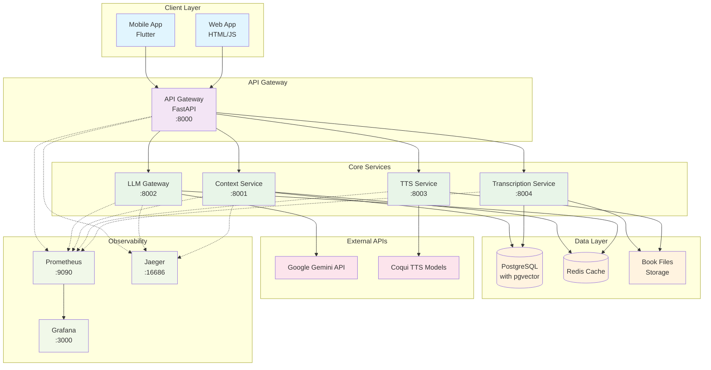
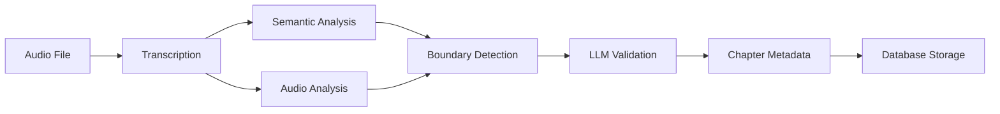

# EchoWright System Architecture

## Overview

EchoWright is a microservices-based audiobook platform designed for intelligent audiobook interaction using AI-powered features. The system follows a distributed architecture pattern with clear separation of concerns across multiple services.

## Architecture Diagram

## Core Components

### API Gateway (`platform/backend/services/api_gateway/`)
- **Purpose**: Central entry point for all client requests
- **Port**: 8000
- **Technology**: FastAPI
- **Key Features**:
  - Request routing to backend services
  - Authentication and authorization
  - Rate limiting
  - Request/response logging
  - Health check aggregation

### LLM Gateway (`platform/backend/services/llm_gateway/`)
- **Purpose**: Wrapper for language model APIs with persona management
- **Port**: 8002
- **Technology**: FastAPI, Google Gemini API
- **Key Features**:
  - Configurable AI personas from `config/production/llm_configs/`
  - Response caching and optimization
  - Circuit breaker patterns for external API calls
  - Token usage monitoring

### Context Service (`platform/backend/services/context_service/`)
- **Purpose**: Vector embeddings storage and similarity search
- **Port**: 8001
- **Technology**: FastAPI, PostgreSQL with pgvector
- **Key Features**:
  - Semantic search capabilities
  - Vector similarity matching
  - Hybrid search (semantic + keyword)
  - Embedding caching with Redis

### TTS Service (`platform/backend/services/tts_service/`)
- **Purpose**: Text-to-speech synthesis
- **Port**: 8003
- **Technology**: FastAPI, Coqui TTS
- **Key Features**:
  - High-quality speech synthesis
  - Multiple voice models
  - Audio caching and optimization
  - Batch processing capabilities

### Transcription Service (`platform/backend/services/transcription_service/`)
- **Purpose**: AI-powered chapter detection and content analysis
- **Port**: 8004
- **Technology**: FastAPI, librosa, TF-IDF analysis
- **Key Features**:
  - Intelligent chapter boundary detection
  - Multi-style chapter summaries
  - Question generation for educational use
  - Audio feature analysis

## Data Architecture

### PostgreSQL Database
- **Primary database** with pgvector extension for vector storage
- **Connection pooling** via pgbouncer for performance
- **Read replicas** for scaling read operations
- **Comprehensive indexing** strategy including HNSW for vector similarity

### Redis Cache
- **Distributed caching** across all services
- **Semantic caching** with similarity matching
- **Session management** and temporary data storage
- **Performance metrics** and cache hit/miss tracking

### File Storage
- **Local storage** for audiobook files during development
- **Azure Blob Storage** planned for production deployment
- **CDN integration** for global content delivery

## Service Communication

### HTTP REST APIs
- All inter-service communication uses HTTP REST
- Standardized error responses across services
- Request correlation IDs for distributed tracing
- Comprehensive API documentation with OpenAPI specs

### Authentication & Authorization
- JWT-based authentication through API Gateway
- Role-based access control (RBAC)
- API key management for external services
- Rate limiting per user/service

## Monitoring & Observability

### Structured Logging
- JSON-formatted logs with correlation IDs
- Centralized logging across all services
- Log level configuration per service
- Request/response middleware logging

### Metrics Collection
- **Prometheus** for metrics scraping and storage
- **Grafana** dashboards for visualization
- Standard HTTP metrics (requests, duration, errors)
- Business metrics (LLM usage, chapter detection, user engagement)

### Distributed Tracing
- **Jaeger** for trace visualization and analysis
- OpenTelemetry instrumentation
- B3 format for cross-service trace propagation
- Automatic instrumentation for FastAPI, database, and HTTP calls

### Health Checks
- Multi-level health checks: `/health`, `/health/detailed`, `/health/ready`, `/health/live`
- Dependency health monitoring
- System resource metrics (CPU, memory, disk)
- Circuit breaker status monitoring

## Deployment Architecture

### Container Strategy
- Each service packaged as Docker container
- Multi-stage builds for optimization
- Kubernetes deployment with Helm charts
- Environment-specific configurations

### Scaling Strategy
- Horizontal scaling for stateless services
- Database read replicas for read-heavy workloads
- Redis cluster for cache scaling
- Load balancing through Kubernetes services

### Security
- Network policies for service isolation
- Secrets management through Kubernetes secrets
- TLS encryption for all service communication
- Regular security scanning and updates

## AI Features Architecture

### Chapter Detection Pipeline

### Context Management
- Vector embeddings for semantic similarity
- Chapter-aware context windows
- Cross-reference between chapters and summaries
- Intelligent context pruning for performance

### AI Pipeline Integration
- Asynchronous processing for long-running AI tasks
- Result caching to minimize API calls
- Fallback mechanisms for AI service failures
- Confidence scoring for all AI-generated content

## Performance Considerations

### Caching Strategy
- **L1**: In-memory caching per service
- **L2**: Redis distributed cache
- **L3**: Database query result caching
- **Semantic caching**: Similar query result reuse

### Database Optimization
- Comprehensive indexing strategy (60+ indexes)
- Connection pooling and read replicas
- Query optimization and slow query monitoring
- Database partitioning for large tables

### API Performance
- Request/response compression (gzip, brotli)
- Pagination for large result sets
- Async processing for heavy operations
- Circuit breakers for external dependencies

## Future Architecture Considerations

### Scalability
- Multi-region deployment strategy
- Edge computing for global performance
- Auto-scaling based on demand metrics
- Database sharding for massive scale

### AI Evolution
- Multi-model LLM routing
- Real-time streaming AI responses
- Advanced context management (1M+ tokens)
- Multi-agent persona systems

### Integration
- Mobile app offline capabilities
- Third-party service integrations
- Advanced analytics and reporting
- Cross-platform synchronization

---

For detailed implementation guides, see:
- [Deployment Guide](../setup/AZURE_DEPLOYMENT_GUIDE.md)
- [Logging & Monitoring](LOGGING_AND_MONITORING.md)
- [Security Setup](../setup/SECURITY_SETUP.md)
- [API Documentation](../api/README.md)