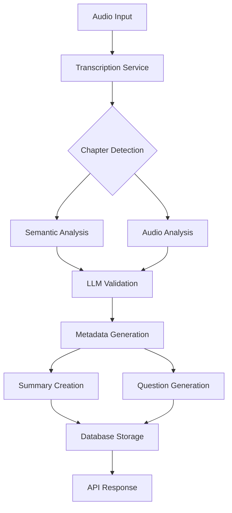

# EchoWright AI Features

## Overview

EchoWright leverages advanced AI capabilities to enhance the audiobook listening experience through intelligent content analysis, personalized interactions, and educational features.

## Core AI Features

### 🧠 AI-Powered Chapter Detection

Our audiobook platform includes a sophisticated AI system that automatically segments audiobooks into meaningful chapters with rich metadata.

**Key Capabilities:**
- **Multi-Modal Analysis**: Combines semantic content analysis, audio signal processing, and AI validation
- **Intelligent Boundary Detection**: Uses TF-IDF analysis to identify topic transitions in transcript content
- **Audio Feature Analysis**: Detects silence periods, energy changes, and spectral transitions using librosa
- **LLM-Generated Metadata**: Creates chapter titles, summaries, and topic extraction using Gemini API

**Technical Implementation:**
- Minimum/maximum chapter duration enforcement (5-60 minutes)
- Confidence scoring for all detected boundaries (0-1 scale)
- Multi-feature boundary detection (semantic + silence + energy + spectral)
- Database integration with PostgreSQL and optimized indexes

**API Endpoints:**
- `POST /detect-chapters` - Main chapter detection endpoint
- `POST /analyze-book` - Full book analysis with summaries
- `GET /chapters/{book_id}` - Chapter retrieval
- `GET /stats` - Service statistics and cache metrics

### 📚 Smart Chapter Summaries

AI-powered summarization system that creates multiple styles of chapter summaries tailored to different reading contexts.

**Summary Styles:**
1. **Brief** - 1-2 sentence overview for quick reference
2. **Detailed** - Comprehensive summary with key plot points
3. **Themes** - Literary analysis focusing on themes and symbols
4. **Key Points** - Bullet-format highlighting important events
5. **Question-Based** - Q&A format for educational engagement

**Features:**
- **AI-Powered Generation**: Uses Gemini API with confidence scoring
- **Smart Content Analysis**: Automatic extraction of key points, themes, and character mentions
- **Character Recognition**: Identifies and tracks mentioned characters
- **Theme Analysis**: AI-powered identification of literary themes and symbols
- **Fallback Systems**: Graceful degradation when AI generation fails

**API Endpoints:**
- `POST /generate-summaries` - Generate summaries for multiple chapters
- `POST /summarize-chapter` - Generate summary for specific chapter
- `GET /summary-styles` - List available summary styles with descriptions

### 🤔 Personalized Question Generation

Intelligent question generation system that creates educational questions tailored to the reader's context and goals.

**Question Types:**
- **Comprehension** - Basic understanding and recall
- **Analysis** - Critical thinking and interpretation
- **Discussion** - Open-ended conversation starters
- **Creative** - Imaginative and creative thinking
- **Vocabulary** - Word usage and definition
- **Prediction** - Future plot developments
- **Connection** - Links to other works or experiences

**Personalization Features:**
- **3 Difficulty Levels**: Beginner, Intermediate, Advanced (plus Adaptive)
- **5 Reading Modes**: Educational, Casual, Child, Professional, Language Learning
- **Context Integration**: Uses chapter text, summaries, and position for relevance
- **Educational Support**: Includes answer guidelines and follow-up questions

**API Endpoints:**
- `POST /generate-questions` - Generate personalized questions for a chapter
- `GET /question-types` - List available question types with examples
- `GET /reading-modes` - List available reading modes with descriptions

## AI Personas & LLM Integration

### 🎭 Configurable AI Personas

The LLM Gateway supports multiple AI personas stored as JSON configurations in `config/production/llm_configs/`.

**Available Personas:**
- **English Teacher** - Educational focus with literary analysis
- **Language Tutor** - Language learning and vocabulary building  
- **Nick Carraway** - Character-based interaction for specific books
- **Omniscient Helper** - General-purpose audiobook assistance

**Persona Features:**
- Custom personality traits and response styles
- Book-specific knowledge and context
- Educational vs. casual interaction modes
- Consistent character voice and behavior

### 🧮 Context Management

Advanced context-aware system that maintains conversation continuity and book understanding.

**Context Features:**
- **Vector Embeddings**: Semantic similarity search using pgvector
- **Hybrid Search**: Combines semantic and keyword search
- **Chapter Awareness**: Understands position within book structure
- **Cross-Chapter References**: Links related content across chapters

**Current Limitations:**
- Context window limited by underlying LLM (Gemini)
- No persistent conversation memory across sessions
- Limited cross-book knowledge connections

## Performance & Caching

### 🚀 Intelligent Caching

Multi-layer caching system optimized for AI operations:

**Semantic Caching:**
- Uses SentenceTransformers for intelligent cache matching
- Similar queries return cached results even with different wording
- Compression with zlib for storage efficiency
- TTL management per content type

**Cache Types:**
- **LLM Responses** - Cached by semantic similarity
- **Embeddings** - Vector representations cached with compression
- **Chapter Detection** - Results cached to avoid re-processing
- **Database Queries** - Frequently accessed data cached

**Performance Metrics:**
- Hit/miss ratios tracked per cache type
- Response time monitoring
- Cache effectiveness scoring
- Automatic cache warming for common queries

### ⚡ Circuit Breaker Patterns

Resilience patterns implemented for all external AI API calls:

**Features:**
- **Exponential Backoff** - Smart retry logic for failed requests
- **Fallback Responses** - Graceful degradation when AI services fail
- **Monitoring Endpoints** - Circuit breaker status available via API
- **Configurable Thresholds** - Customizable failure rate limits

## AI Pipeline Architecture

### 🔄 Processing Flow



### 🎯 Quality Assurance

**Confidence Scoring:**
- All AI-generated content includes confidence scores (0-1 scale)
- Low-confidence results trigger fallback mechanisms
- Quality thresholds configurable per content type

**Validation Systems:**
- Multi-modal validation for chapter boundaries
- Content consistency checks across summaries
- Educational appropriateness for question generation

## Future AI Enhancements

### Planned Features

**Advanced Context Management:**
- Conversation history compression
- Sliding window context management
- Cross-book intelligence and connections
- Long-context model integration (1M+ tokens)

**Enhanced Personalization:**
- User behavior analysis and adaptation
- Reading pattern recognition
- Adaptive difficulty progression
- Learning outcome tracking

**Multi-Modal Capabilities:**
- Voice-based question answering
- Real-time audio processing
- Advanced speech-to-text integration
- Character voice cloning

### Research Areas

**Multi-Agent Systems:**
- Character-specific AI agents
- Educational vs. entertainment personas
- Agent orchestration and communication
- Advanced memory systems

**Advanced RAG:**
- Sophisticated retrieval strategies
- Query expansion and refinement
- Cross-document analysis
- Narrative continuity tracking

## Configuration & Customization

### LLM Configuration

Personas are configured through JSON files in `config/production/llm_configs/`:

```json
{
  "name": "English Teacher",
  "model": "gemini-1.5-pro",
  "temperature": 0.7,
  "max_tokens": 2048,
  "system_prompt": "You are an experienced English teacher...",
  "personality_traits": ["helpful", "patient", "educational"],
  "response_style": "formal_educational"
}
```

### AI Parameters

Key configuration options:

- **Chapter Detection Thresholds**: Minimum/maximum chapter duration
- **Confidence Scoring**: Thresholds for content acceptance
- **Cache Settings**: TTL and similarity thresholds
- **API Limits**: Rate limiting and timeout configurations

### Monitoring AI Performance

**Metrics Tracked:**
- LLM API request rates and latencies
- Chapter detection accuracy and performance
- Summary generation success rates
- Question generation quality scores
- Cache hit rates and effectiveness

**Dashboards Available:**
- Grafana dashboards for AI service monitoring
- Prometheus metrics for performance tracking
- Jaeger traces for request flow analysis
- Health check endpoints for service status

---

## Related Documentation

- [Chapter Detection Implementation](CHAPTER_DETECTION_IMPLEMENTATION.md) - Technical details
- [System Architecture](../architecture/SYSTEM_ARCHITECTURE.md) - Overall system design
- [API Documentation](../api/README.md) - API endpoint details
- [Future Features](../future_work_beta_features/README.md) - Planned enhancements