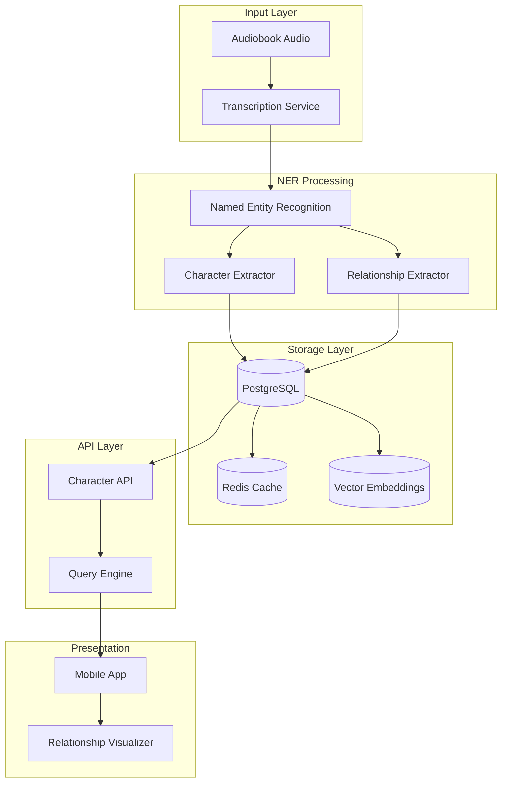
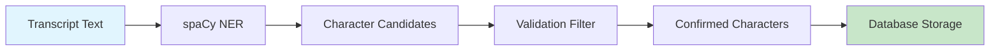
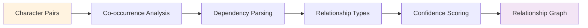
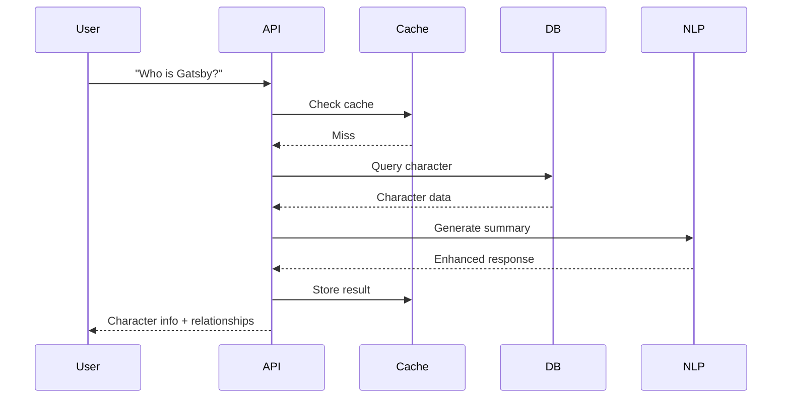
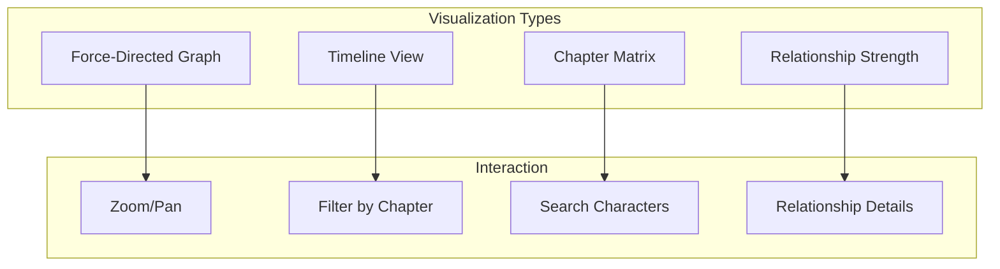
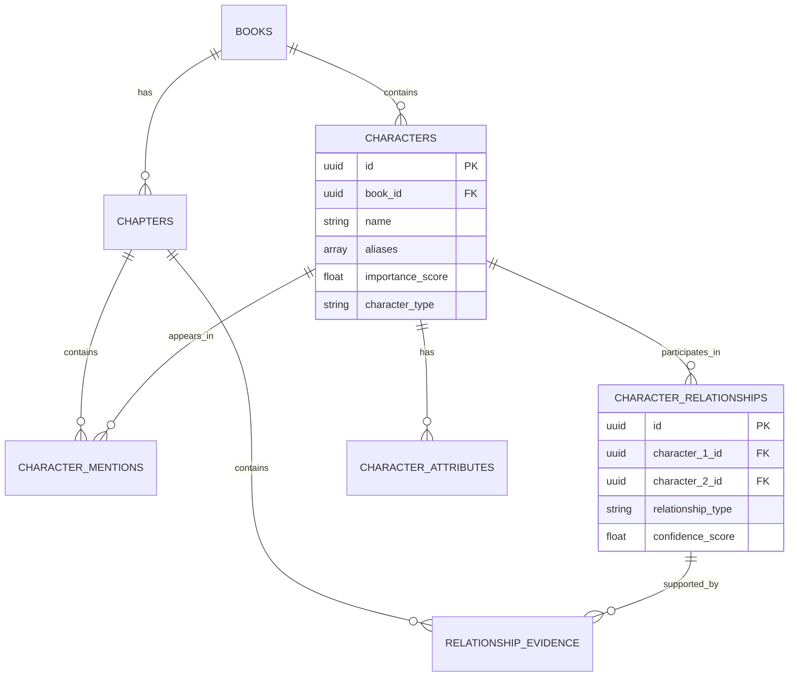

# Character Relationship Mapping Implementation Plan

## Overview
Character Relationship Mapping is an AI-powered feature that automatically identifies characters in audiobooks, tracks their relationships, and provides intelligent lookup and visualization capabilities. This feature addresses the common problem of losing track of characters in complex narratives, especially when listening to audiobooks over extended periods.

## Table of Contents
1. [Architecture Overview](#architecture-overview)
2. [Technical Approach](#technical-approach)
3. [Implementation Phases](#implementation-phases)
4. [Database Design](#database-design)
5. [API Design](#api-design)
6. [NER Strategy](#ner-strategy)
7. [Relationship Extraction](#relationship-extraction)
8. [Visualization Strategy](#visualization-strategy)
9. [Performance Considerations](#performance-considerations)
10. [Testing Strategy](#testing-strategy)

## Architecture Overview



## Technical Approach

### Core Technologies
- **NER Model**: spaCy with custom fine-tuning for literary characters
- **Relationship Extraction**: Dependency parsing + co-occurrence analysis
- **Graph Storage**: PostgreSQL with recursive CTEs for relationship queries
- **Caching**: Redis for frequent character lookups
- **Visualization**: D3.js-based force-directed graphs in Flutter WebView

### Key Innovations
1. **Context-Aware NER**: Consider narrative context when identifying characters
2. **Temporal Tracking**: Track character appearances over time/chapters
3. **Relationship Confidence**: Score relationships based on textual evidence
4. **Alias Resolution**: Handle multiple names/titles for same character

## Implementation Phases

### Phase 1: Character Detection (Week 1-2)


**Tasks:**
- [ ] Install and configure spaCy with literary models
- [ ] Create character extraction pipeline
- [ ] Implement character validation rules
- [ ] Design character storage schema
- [ ] Build character CRUD operations

### Phase 2: Relationship Extraction (Week 3-4)


**Tasks:**
- [ ] Implement co-occurrence detection within windows
- [ ] Parse syntactic dependencies for relationship verbs
- [ ] Classify relationship types (family, friend, enemy, etc.)
- [ ] Calculate relationship confidence scores
- [ ] Store relationship graph in database

### Phase 3: Query System (Week 5)


**Tasks:**
- [ ] Design RESTful API endpoints
- [ ] Implement natural language query parsing
- [ ] Build efficient graph traversal queries
- [ ] Create response generation system
- [ ] Implement caching strategy

### Phase 4: Visualization (Week 6)


**Tasks:**
- [ ] Design visualization components
- [ ] Implement D3.js graph rendering
- [ ] Create Flutter WebView integration
- [ ] Build interactive controls
- [ ] Add export/sharing features

## Database Design

### Core Tables

```sql
-- Characters table
CREATE TABLE characters (
    id UUID PRIMARY KEY DEFAULT gen_random_uuid(),
    book_id UUID REFERENCES books(id),
    name VARCHAR(255) NOT NULL,
    aliases TEXT[], -- Array of alternative names
    first_appearance_chapter INT,
    last_appearance_chapter INT,
    appearance_count INT DEFAULT 0,
    importance_score FLOAT, -- 0.0 to 1.0
    description TEXT,
    character_type VARCHAR(50), -- protagonist, antagonist, supporting, minor
    metadata JSONB,
    created_at TIMESTAMP DEFAULT NOW(),
    updated_at TIMESTAMP DEFAULT NOW()
);

-- Character mentions table
CREATE TABLE character_mentions (
    id UUID PRIMARY KEY DEFAULT gen_random_uuid(),
    character_id UUID REFERENCES characters(id),
    book_id UUID REFERENCES books(id),
    chapter_id UUID REFERENCES book_chapters(id),
    sentence_number INT,
    mention_text TEXT,
    context_before TEXT,
    context_after TEXT,
    timestamp_seconds FLOAT,
    confidence_score FLOAT,
    mention_type VARCHAR(50), -- name, pronoun, description
    created_at TIMESTAMP DEFAULT NOW()
);

-- Character relationships table
CREATE TABLE character_relationships (
    id UUID PRIMARY KEY DEFAULT gen_random_uuid(),
    book_id UUID REFERENCES books(id),
    character_1_id UUID REFERENCES characters(id),
    character_2_id UUID REFERENCES characters(id),
    relationship_type VARCHAR(100), -- family, friend, enemy, romantic, professional
    relationship_subtype VARCHAR(100), -- parent, sibling, spouse, colleague, etc.
    confidence_score FLOAT,
    evidence_count INT,
    first_mention_chapter INT,
    last_mention_chapter INT,
    bidirectional BOOLEAN DEFAULT true,
    metadata JSONB,
    created_at TIMESTAMP DEFAULT NOW(),
    updated_at TIMESTAMP DEFAULT NOW(),
    CONSTRAINT unique_relationship UNIQUE (book_id, character_1_id, character_2_id)
);

-- Relationship evidence table
CREATE TABLE relationship_evidence (
    id UUID PRIMARY KEY DEFAULT gen_random_uuid(),
    relationship_id UUID REFERENCES character_relationships(id),
    chapter_id UUID REFERENCES book_chapters(id),
    evidence_text TEXT,
    evidence_type VARCHAR(50), -- dialogue, narration, action
    confidence_score FLOAT,
    timestamp_seconds FLOAT,
    created_at TIMESTAMP DEFAULT NOW()
);

-- Character attributes table
CREATE TABLE character_attributes (
    id UUID PRIMARY KEY DEFAULT gen_random_uuid(),
    character_id UUID REFERENCES characters(id),
    attribute_type VARCHAR(100), -- occupation, age, physical, personality
    attribute_value TEXT,
    confidence_score FLOAT,
    source_chapter_id UUID REFERENCES book_chapters(id),
    extracted_text TEXT,
    created_at TIMESTAMP DEFAULT NOW()
);

-- Create indexes for performance
CREATE INDEX idx_characters_book_id ON characters(book_id);
CREATE INDEX idx_characters_name ON characters(name);
CREATE INDEX idx_characters_importance ON characters(importance_score DESC);
CREATE INDEX idx_mentions_character ON character_mentions(character_id);
CREATE INDEX idx_mentions_chapter ON character_mentions(chapter_id);
CREATE INDEX idx_relationships_characters ON character_relationships(character_1_id, character_2_id);
CREATE INDEX idx_relationships_book ON character_relationships(book_id);
CREATE INDEX idx_relationships_type ON character_relationships(relationship_type);
```

### Data Model Relationships



## API Design

### Endpoints

#### Character Detection
```yaml
POST /api/v1/characters/extract
Request:
  book_id: string
  chapter_id: string (optional)
  text: string
  
Response:
  characters: [
    {
      name: string
      confidence: float
      aliases: string[]
      mentions: int
    }
  ]
```

#### Character Query
```yaml
GET /api/v1/characters/lookup
Query Parameters:
  book_id: string
  query: string (e.g., "Who is Gatsby?")
  
Response:
  character: {
    name: string
    description: string
    first_appearance: string
    importance: float
    relationships: [
      {
        character: string
        type: string
        strength: float
      }
    ]
    attributes: {
      occupation: string
      personality: string[]
    }
  }
```

#### Relationship Graph
```yaml
GET /api/v1/characters/graph
Query Parameters:
  book_id: string
  chapter_id: string (optional)
  min_importance: float (optional)
  
Response:
  nodes: [
    {
      id: string
      name: string
      importance: float
      type: string
    }
  ]
  edges: [
    {
      source: string
      target: string
      type: string
      weight: float
    }
  ]
```

#### Character Timeline
```yaml
GET /api/v1/characters/{character_id}/timeline
Response:
  timeline: [
    {
      chapter: int
      chapter_title: string
      events: string[]
      relationships_formed: string[]
      relationships_changed: string[]
    }
  ]
```

## NER Strategy

### Multi-Stage Character Detection Pipeline

```python
class CharacterDetectionPipeline:
    def __init__(self):
        self.nlp = spacy.load("en_core_web_lg")
        self.custom_ner = self.load_custom_model()
        self.name_validator = NameValidator()
        
    def extract_characters(self, text: str) -> List[Character]:
        # Stage 1: spaCy NER for PERSON entities
        doc = self.nlp(text)
        candidates = [ent for ent in doc.ents if ent.label_ == "PERSON"]
        
        # Stage 2: Custom literary NER model
        literary_entities = self.custom_ner.predict(text)
        candidates.extend(literary_entities)
        
        # Stage 3: Pattern matching for titles + names
        patterns = self.extract_title_patterns(text)
        candidates.extend(patterns)
        
        # Stage 4: Validation and filtering
        validated = []
        for candidate in candidates:
            if self.name_validator.is_valid_character(candidate):
                validated.append(candidate)
        
        # Stage 5: Alias resolution
        characters = self.resolve_aliases(validated)
        
        # Stage 6: Importance scoring
        return self.score_importance(characters)
```

### Character Validation Rules

```python
class NameValidator:
    def __init__(self):
        self.common_words = load_common_words()
        self.name_database = load_name_database()
        
    def is_valid_character(self, candidate: str) -> bool:
        # Rule 1: Minimum length
        if len(candidate) < 2:
            return False
            
        # Rule 2: Not a common word
        if candidate.lower() in self.common_words:
            return False
            
        # Rule 3: Contains at least one capital letter
        if not any(c.isupper() for c in candidate):
            return False
            
        # Rule 4: Appears multiple times (importance threshold)
        if self.appearance_count(candidate) < 2:
            return False
            
        # Rule 5: Context validation (appears with character verbs)
        if not self.has_character_context(candidate):
            return False
            
        return True
```

## Relationship Extraction

### Co-occurrence Analysis

```python
class RelationshipExtractor:
    def __init__(self, window_size: int = 50):
        self.window_size = window_size
        self.relationship_patterns = self.load_patterns()
        
    def extract_relationships(self, text: str, characters: List[Character]):
        relationships = []
        sentences = nltk.sent_tokenize(text)
        
        for i, sentence in enumerate(sentences):
            # Find character mentions in sentence
            mentioned = self.find_mentions(sentence, characters)
            
            if len(mentioned) >= 2:
                # Direct relationship in same sentence
                for char1, char2 in combinations(mentioned, 2):
                    rel_type = self.classify_relationship(sentence, char1, char2)
                    relationships.append({
                        'char1': char1,
                        'char2': char2,
                        'type': rel_type,
                        'confidence': 0.9,
                        'evidence': sentence
                    })
            
            # Check window for indirect relationships
            window = sentences[max(0, i-2):min(len(sentences), i+3)]
            window_text = ' '.join(window)
            self.extract_window_relationships(window_text, characters, relationships)
            
        return self.aggregate_relationships(relationships)
```

### Relationship Classification

```python
RELATIONSHIP_PATTERNS = {
    'family': [
        r'{char1}.*?(father|mother|son|daughter|brother|sister|parent|child).*?{char2}',
        r'{char1}\'s (father|mother|son|daughter)',
    ],
    'romantic': [
        r'{char1}.*?(loves|loved|kiss|kissed|marry|married|wife|husband).*?{char2}',
        r'{char1} and {char2}.*?(wedding|romance|affair)',
    ],
    'friend': [
        r'{char1}.*?(friend|companion|ally).*?{char2}',
        r'{char1} and {char2}.*?(together|helped|supported)',
    ],
    'enemy': [
        r'{char1}.*?(enemy|rival|fought|killed|betrayed).*?{char2}',
        r'{char1} versus {char2}',
    ],
    'professional': [
        r'{char1}.*?(boss|employee|colleague|partner).*?{char2}',
        r'{char1} works with {char2}',
    ]
}
```

## Visualization Strategy

### Force-Directed Graph Component

```javascript
// D3.js visualization for character relationships
class CharacterGraph {
    constructor(container, data) {
        this.width = container.clientWidth;
        this.height = container.clientHeight;
        this.svg = d3.select(container).append('svg')
            .attr('width', this.width)
            .attr('height', this.height);
            
        this.simulation = d3.forceSimulation()
            .force('link', d3.forceLink().id(d => d.id))
            .force('charge', d3.forceManyBody().strength(-300))
            .force('center', d3.forceCenter(this.width / 2, this.height / 2));
            
        this.render(data);
    }
    
    render(data) {
        // Render links (relationships)
        const links = this.svg.selectAll('.link')
            .data(data.edges)
            .enter().append('line')
            .attr('class', d => `link ${d.type}`)
            .attr('stroke-width', d => Math.sqrt(d.weight) * 2);
            
        // Render nodes (characters)
        const nodes = this.svg.selectAll('.node')
            .data(data.nodes)
            .enter().append('g')
            .attr('class', 'node')
            .call(d3.drag()
                .on('start', this.dragStarted)
                .on('drag', this.dragged)
                .on('end', this.dragEnded));
                
        nodes.append('circle')
            .attr('r', d => d.importance * 20 + 5)
            .attr('fill', d => this.getColorByType(d.type));
            
        nodes.append('text')
            .text(d => d.name)
            .attr('dx', 12)
            .attr('dy', 4);
            
        this.simulation
            .nodes(data.nodes)
            .on('tick', () => this.tick(links, nodes));
            
        this.simulation.force('link')
            .links(data.edges);
    }
}
```

### Flutter Integration

```dart
class CharacterGraphWidget extends StatefulWidget {
  final String bookId;
  final String? chapterId;
  
  @override
  _CharacterGraphWidgetState createState() => _CharacterGraphWidgetState();
}

class _CharacterGraphWidgetState extends State<CharacterGraphWidget> {
  late WebViewController _controller;
  CharacterGraphData? _graphData;
  
  @override
  void initState() {
    super.initState();
    _loadCharacterData();
  }
  
  Future<void> _loadCharacterData() async {
    final response = await apiService.getCharacterGraph(
      bookId: widget.bookId,
      chapterId: widget.chapterId,
    );
    
    setState(() {
      _graphData = response;
    });
    
    _renderGraph();
  }
  
  void _renderGraph() {
    if (_graphData != null) {
      final html = '''
        <!DOCTYPE html>
        <html>
        <head>
          <script src="https://d3js.org/d3.v7.min.js"></script>
          <style>
            .link { stroke: #999; stroke-opacity: 0.6; }
            .link.family { stroke: #ff6b6b; }
            .link.friend { stroke: #4ecdc4; }
            .link.enemy { stroke: #45b7d1; }
            .node { cursor: pointer; }
          </style>
        </head>
        <body>
          <div id="graph"></div>
          <script>
            const data = ${jsonEncode(_graphData.toJson())};
            new CharacterGraph(document.getElementById('graph'), data);
          </script>
        </body>
        </html>
      ''';
      
      _controller.loadHtmlString(html);
    }
  }
  
  @override
  Widget build(BuildContext context) {
    return Scaffold(
      appBar: AppBar(
        title: Text('Character Relationships'),
        actions: [
          IconButton(
            icon: Icon(Icons.filter_list),
            onPressed: _showFilterOptions,
          ),
          IconButton(
            icon: Icon(Icons.search),
            onPressed: _showCharacterSearch,
          ),
        ],
      ),
      body: _graphData == null
        ? Center(child: CircularProgressIndicator())
        : WebView(
            onWebViewCreated: (controller) {
              _controller = controller;
            },
            javascriptMode: JavascriptMode.unrestricted,
          ),
    );
  }
}
```

## Performance Considerations

### Optimization Strategies

1. **Batch Processing**
   - Process chapters in parallel
   - Cache NER results per chapter
   - Incremental relationship updates

2. **Caching Strategy**
   ```python
   CACHE_KEYS = {
       'character_list': 'chars:{book_id}',
       'character_detail': 'char:{book_id}:{char_id}',
       'relationships': 'rels:{book_id}:{chapter_id}',
       'graph_data': 'graph:{book_id}:{filter_hash}'
   }
   
   CACHE_TTL = {
       'character_list': 3600,  # 1 hour
       'character_detail': 1800,  # 30 minutes
       'relationships': 3600,
       'graph_data': 300  # 5 minutes
   }
   ```

3. **Database Optimization**
   - Materialized views for frequent queries
   - Partial indexes for active books
   - JSONB indexes for metadata queries

4. **Query Optimization**
   ```sql
   -- Efficient character lookup with relationships
   WITH character_data AS (
       SELECT c.*, 
              COUNT(DISTINCT cm.chapter_id) as chapter_count,
              ARRAY_AGG(DISTINCT c2.name) as related_characters
       FROM characters c
       LEFT JOIN character_mentions cm ON c.id = cm.character_id
       LEFT JOIN character_relationships cr ON c.id = cr.character_1_id
       LEFT JOIN characters c2 ON cr.character_2_id = c2.id
       WHERE c.book_id = $1 AND c.name ILIKE $2
       GROUP BY c.id
   )
   SELECT * FROM character_data;
   ```

## Testing Strategy

### Unit Tests

```python
# tests/unit/test_character_extraction.py
class TestCharacterExtraction:
    def test_extract_simple_characters(self):
        text = "Harry Potter met Hermione Granger in the library."
        characters = extractor.extract_characters(text)
        assert len(characters) == 2
        assert "Harry Potter" in [c.name for c in characters]
        assert "Hermione Granger" in [c.name for c in characters]
    
    def test_alias_resolution(self):
        text = "Mr. Darcy spoke. Later, Fitzwilliam Darcy left."
        characters = extractor.extract_characters(text)
        assert len(characters) == 1
        assert characters[0].aliases == ["Mr. Darcy", "Fitzwilliam Darcy"]
    
    def test_importance_scoring(self):
        text = "Alice appeared once. The Queen appeared ten times."
        characters = extractor.extract_characters(text)
        queen = next(c for c in characters if "Queen" in c.name)
        alice = next(c for c in characters if "Alice" in c.name)
        assert queen.importance_score > alice.importance_score
```

### Integration Tests

```python
# tests/integration/test_character_api.py
class TestCharacterAPI:
    async def test_character_extraction_endpoint(self, client):
        response = await client.post("/api/v1/characters/extract", json={
            "book_id": "test-book",
            "text": "Elizabeth Bennet and Mr. Darcy danced."
        })
        assert response.status_code == 200
        data = response.json()
        assert len(data["characters"]) == 2
    
    async def test_character_lookup(self, client):
        response = await client.get("/api/v1/characters/lookup", params={
            "book_id": "pride-prejudice",
            "query": "Who is Darcy?"
        })
        assert response.status_code == 200
        data = response.json()
        assert "Darcy" in data["character"]["name"]
        assert len(data["character"]["relationships"]) > 0
```

### Performance Tests

```python
# tests/performance/test_character_performance.py
def test_large_book_processing():
    # Load War and Peace (>500k words)
    with open("test_data/war_and_peace.txt") as f:
        text = f.read()
    
    start_time = time.time()
    characters = extractor.extract_characters(text)
    processing_time = time.time() - start_time
    
    assert processing_time < 60  # Should process in under 1 minute
    assert len(characters) > 50  # Should find many characters
    assert characters[0].importance_score > 0.8  # Main character
```

## Migration Plan

### Database Migration
```sql
-- migrations/V005_20250115_add_character_tracking.sql
BEGIN;

-- Create character tracking tables
CREATE TABLE characters (...);
CREATE TABLE character_mentions (...);
CREATE TABLE character_relationships (...);
CREATE TABLE relationship_evidence (...);
CREATE TABLE character_attributes (...);

-- Create indexes
CREATE INDEX idx_characters_book_id ON characters(book_id);
-- ... (other indexes)

-- Create materialized view for quick lookups
CREATE MATERIALIZED VIEW character_summary AS
SELECT 
    c.id,
    c.name,
    c.book_id,
    COUNT(DISTINCT cm.chapter_id) as chapter_appearances,
    COUNT(DISTINCT cr.character_2_id) as relationship_count,
    AVG(cm.confidence_score) as avg_confidence
FROM characters c
LEFT JOIN character_mentions cm ON c.id = cm.character_id
LEFT JOIN character_relationships cr ON c.id = cr.character_1_id
GROUP BY c.id, c.name, c.book_id;

CREATE UNIQUE INDEX ON character_summary(id);

COMMIT;
```

## Success Metrics

### Technical Metrics
- **NER Accuracy**: >90% precision for character identification
- **Processing Speed**: <30 seconds per chapter
- **Query Response**: <200ms for character lookups
- **Graph Rendering**: <1 second for 50 characters

### User Metrics
- **Usage Rate**: 60% of users access character features
- **Query Success**: 85% of "Who is X?" queries answered correctly
- **Engagement**: 5+ minutes average time on relationship graph
- **Retention**: 20% increase in reading completion

## Risk Mitigation

### Technical Risks
1. **NER Accuracy Issues**
   - Mitigation: Manual correction interface
   - Fallback: User-reported character additions

2. **Performance at Scale**
   - Mitigation: Incremental processing
   - Fallback: Limit to main characters only

3. **Complex Narratives**
   - Mitigation: Confidence thresholds
   - Fallback: Focus on clear relationships only

### Privacy Considerations
- No personal data in character analysis
- All processing done on user's content only
- Opt-in feature with clear data usage

## Future Enhancements

### Phase 2 Features
1. **Character Evolution Tracking**
   - Track character development over time
   - Sentiment analysis of character arcs

2. **Cross-Book Connections**
   - Link characters across series
   - Author universe mapping

3. **AI Character Chat**
   - Chat with characters using their personality
   - Character perspective summaries

4. **Social Features**
   - Share character insights
   - Community character wikis

## Conclusion

Character Relationship Mapping will transform how users engage with complex narratives in audiobooks. By combining NER, relationship extraction, and intuitive visualization, we create a powerful tool for understanding and remembering story characters. The phased implementation approach ensures we can deliver value incrementally while building toward a comprehensive character intelligence system.