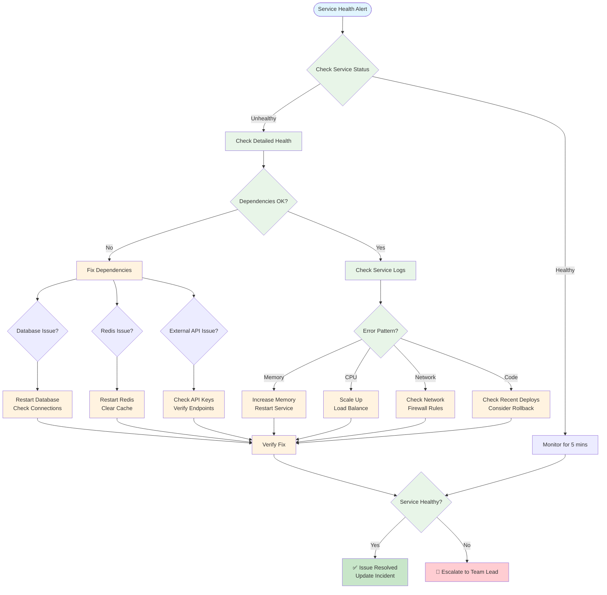

# Runbook: Service Health Issues

## Overview
This runbook provides step-by-step procedures for diagnosing and resolving service health issues in the BetterBooks platform.



## Symptoms
- Service health check returning unhealthy status
- HTTP 503 Service Unavailable errors
- Degraded performance metrics
- Increased error rates in logs

## Initial Assessment

### 1. Check Service Status
```bash
# Check all service health endpoints
curl http://localhost:8000/health  # API Gateway
curl http://localhost:8001/health  # Context Service
curl http://localhost:8002/health  # LLM Gateway
curl http://localhost:8003/health  # Transcription Service
curl http://localhost:8004/health  # TTS Service

# Check detailed health with dependencies
curl http://localhost:8000/health/detailed
```

### 2. Check Docker Container Status
```bash
# List all containers and their status
docker-compose ps

# Check container logs for errors
docker-compose logs --tail=100 api_gateway
docker-compose logs --tail=100 context_service
docker-compose logs --tail=100 llm_gateway

# Check container resource usage
docker stats --no-stream
```

### 3. Check System Resources
```bash
# Check CPU and memory usage
top -n 1

# Check disk space
df -h

# Check network connectivity
ping -c 3 postgres_primary
ping -c 3 redis
```

## Common Issues and Solutions

### Issue 1: Service Won't Start

#### Symptoms
- Container exits immediately after starting
- Health check never becomes healthy
- Port binding errors

#### Resolution Steps
1. **Check logs for startup errors:**
   ```bash
   docker-compose logs service_name | grep -i error
   ```

2. **Verify environment variables:**
   ```bash
   docker-compose exec service_name env | grep -E 'API_KEY|DATABASE_URL|REDIS_URL'
   ```

3. **Check port conflicts:**
   ```bash
   netstat -tulpn | grep -E '8000|8001|8002|8003|8004'
   ```

4. **Rebuild and restart:**
   ```bash
   docker-compose down
   docker-compose build --no-cache service_name
   docker-compose up -d service_name
   ```

### Issue 2: Database Connection Failures

#### Symptoms
- "connection refused" errors in logs
- Timeout errors when accessing endpoints
- PgBouncer connection pool exhausted

#### Resolution Steps
1. **Check PostgreSQL status:**
   ```bash
   docker-compose exec postgres_primary pg_isready
   ```

2. **Check PgBouncer connections:**
   ```bash
   docker-compose exec pgbouncer psql -h localhost -p 6432 -U betterbooks -d pgbouncer -c "SHOW POOLS;"
   ```

3. **Reset connections if needed:**
   ```bash
   docker-compose restart pgbouncer
   docker-compose restart postgres_primary
   ```

4. **Check database disk space:**
   ```bash
   docker-compose exec postgres_primary df -h /var/lib/postgresql/data
   ```

### Issue 3: High Memory Usage

#### Symptoms
- Service OOM (Out of Memory) kills
- Slow response times
- Docker container restarts

#### Resolution Steps
1. **Identify memory-hungry services:**
   ```bash
   docker stats --no-stream --format "table {{.Container}}\t{{.MemUsage}}\t{{.MemPerc}}"
   ```

2. **Check for memory leaks:**
   ```bash
   # Monitor memory over time
   watch -n 5 'docker stats --no-stream api_gateway'
   ```

3. **Increase memory limits if needed:**
   ```yaml
   # In docker-compose.yml
   services:
     service_name:
       deploy:
         resources:
           limits:
             memory: 2G
   ```

4. **Restart affected service:**
   ```bash
   docker-compose restart service_name
   ```

### Issue 4: Redis Connection Issues

#### Symptoms
- Cache misses increase dramatically
- Session management failures
- Rate limiting not working

#### Resolution Steps
1. **Check Redis status:**
   ```bash
   docker-compose exec redis redis-cli ping
   ```

2. **Check Redis memory:**
   ```bash
   docker-compose exec redis redis-cli INFO memory
   ```

3. **Flush cache if corrupted:**
   ```bash
   # WARNING: This will clear all cached data
   docker-compose exec redis redis-cli FLUSHALL
   ```

4. **Restart Redis:**
   ```bash
   docker-compose restart redis
   ```

### Issue 5: External API Failures (Gemini, OpenAI)

#### Symptoms
- LLM completion requests failing
- Circuit breaker open state
- 502 Bad Gateway errors

#### Resolution Steps
1. **Check API key validity:**
   ```bash
   docker-compose exec llm_gateway env | grep GEMINI_API_KEY
   ```

2. **Check circuit breaker status:**
   ```bash
   curl http://localhost:8002/circuit-breaker/status
   ```

3. **Reset circuit breaker if needed:**
   ```bash
   curl -X POST http://localhost:8002/circuit-breaker/reset
   ```

4. **Test API directly:**
   ```bash
   # Test Gemini API
   curl -X POST https://generativelanguage.googleapis.com/v1/models/gemini-pro:generateContent \
     -H "x-goog-api-key: YOUR_API_KEY" \
     -H "Content-Type: application/json" \
     -d '{"contents":[{"parts":[{"text":"Hello"}]}]}'
   ```

## Monitoring Commands

### Real-time Logs
```bash
# Follow all service logs
docker-compose logs -f

# Follow specific service with filters
docker-compose logs -f api_gateway | grep -E 'ERROR|WARNING'

# JSON log parsing
docker-compose logs api_gateway | jq '.level == "ERROR"'
```

### Performance Metrics
```bash
# Check Prometheus metrics
curl http://localhost:8000/metrics | grep http_requests_total

# Check response times
curl -w "@curl-format.txt" -o /dev/null -s http://localhost:8000/health

# Load test endpoint
ab -n 100 -c 10 http://localhost:8000/health
```

## Recovery Procedures

### Full Service Restart
```bash
# Stop all services
docker-compose down

# Clean up volumes (WARNING: data loss)
docker-compose down -v

# Rebuild and start
docker-compose build --no-cache
docker-compose up -d

# Wait for health checks
sleep 30
docker-compose ps
```

### Database Recovery
```bash
# Backup current database
docker-compose exec postgres_primary pg_dump -U betterbooks betterbooks > backup.sql

# Restore from backup
docker-compose exec -T postgres_primary psql -U betterbooks betterbooks < backup.sql

# Reindex for performance
docker-compose exec postgres_primary psql -U betterbooks -d betterbooks -c "REINDEX DATABASE betterbooks;"
```

### Cache Rebuild
```bash
# Clear Redis cache
docker-compose exec redis redis-cli FLUSHALL

# Warm cache with common queries
python scripts/warm_cache.py
```

## Escalation Path

1. **Level 1**: Follow this runbook procedures
2. **Level 2**: Check service-specific logs and metrics
3. **Level 3**: Review recent code changes and deployments
4. **Level 4**: Contact service owner or on-call engineer

## Prevention

- Regular health check monitoring
- Set up alerts for degraded services
- Implement proper resource limits
- Regular backup procedures
- Load testing before deployments

## Related Documents
- [Database Performance Runbook](database-performance.md)
- [High CPU Usage Runbook](high-cpu-usage.md)
- [Deployment Rollback Runbook](deployment-rollback.md)