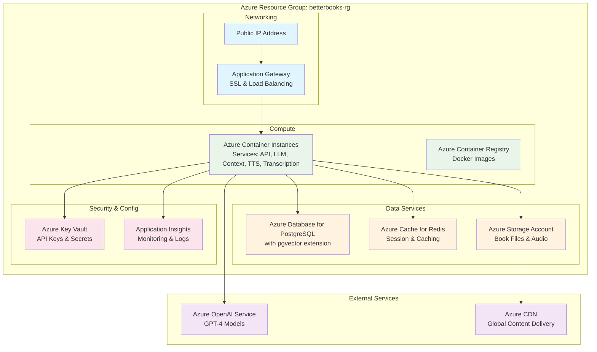

# Azure Deployment Guide for BetterBooks

## Prerequisites Checklist

### ✅ Required Before Starting
- [ ] Azure account with active credits
- [ ] Azure CLI installed (`brew install azure-cli`)
- [ ] Docker installed and running
- [ ] Azure OpenAI Service access approved
- [ ] Git repository ready

### 🔧 Install Azure CLI
```bash
# macOS
brew install azure-cli

# Verify installation
az --version

# Login to Azure
az login
```

## Step 1: Request Azure OpenAI Access

### ⚠️ IMPORTANT: Azure OpenAI requires approval (can take 1-10 days)

1. Go to: https://aka.ms/oai/access
2. Fill out the application form
3. Wait for approval email
4. Once approved, you can create Azure OpenAI resource

### Alternative: Use Azure AI Services (Immediate Access)
If you don't have Azure OpenAI access yet, you can use Azure AI Services with models like:
- Azure Cognitive Services
- Azure Machine Learning endpoints
- Or continue using Gemini API initially

## Step 2: Set Up Azure Resources

### Azure Architecture Overview



### Run the Setup Script
```bash
# Make script executable
chmod +x scripts/deployment/azure-setup.sh

# Run setup (will create all resources)
./scripts/deployment/azure-setup.sh
```

### What Gets Created:
- Resource Group: `betterbooks-rg`
- PostgreSQL with pgvector
- Redis Cache
- Container Registry
- Storage Account
- Key Vault
- Application Insights

## Step 3: Create Azure OpenAI Resource (After Approval)

```bash
# Create Azure OpenAI resource
az cognitiveservices account create \
    --name betterbooks-openai \
    --resource-group betterbooks-rg \
    --kind OpenAI \
    --sku S0 \
    --location eastus \
    --yes

# Deploy a model (GPT-4 or GPT-3.5-Turbo)
az cognitiveservices account deployment create \
    --name betterbooks-openai \
    --resource-group betterbooks-rg \
    --deployment-name gpt-4 \
    --model-name gpt-4 \
    --model-version "0613" \
    --model-format OpenAI \
    --scale-settings-scale-type "Standard"

# Get the endpoint and key
OPENAI_ENDPOINT=$(az cognitiveservices account show \
    --name betterbooks-openai \
    --resource-group betterbooks-rg \
    --query properties.endpoint \
    --output tsv)

OPENAI_KEY=$(az cognitiveservices account keys list \
    --name betterbooks-openai \
    --resource-group betterbooks-rg \
    --query key1 \
    --output tsv)

# Store in Key Vault
az keyvault secret set \
    --vault-name betterbooks-kv \
    --name azure-openai-key \
    --value $OPENAI_KEY

az keyvault secret set \
    --vault-name betterbooks-kv \
    --name azure-openai-endpoint \
    --value $OPENAI_ENDPOINT
```

## Step 4: Update Code for Azure OpenAI

### Create New Azure OpenAI Gateway Service

Create `platform/backend/services/llm_gateway/azure_openai_client.py`:

```python
"""Azure OpenAI client for LLM Gateway."""

import os
from typing import Dict, Any, Optional
from openai import AzureOpenAI
import logging

logger = logging.getLogger(__name__)

class AzureOpenAIClient:
    """Client for Azure OpenAI Service."""
    
    def __init__(self):
        self.endpoint = os.getenv("AZURE_OPENAI_ENDPOINT")
        self.api_key = os.getenv("AZURE_OPENAI_KEY")
        self.deployment_name = os.getenv("AZURE_OPENAI_DEPLOYMENT", "gpt-4")
        self.api_version = "2024-02-15-preview"
        
        if not self.endpoint or not self.api_key:
            raise ValueError("Azure OpenAI endpoint and key are required")
        
        self.client = AzureOpenAI(
            azure_endpoint=self.endpoint,
            api_key=self.api_key,
            api_version=self.api_version
        )
        
        logger.info(f"Azure OpenAI client initialized", 
                   endpoint=self.endpoint,
                   deployment=self.deployment_name)
    
    def complete(self, 
                prompt: str, 
                max_tokens: int = 4000,
                temperature: float = 0.7,
                config: Optional[Dict[str, Any]] = None) -> str:
        """Generate completion using Azure OpenAI."""
        
        try:
            # Convert Gemini-style prompt to OpenAI messages
            messages = [
                {"role": "system", "content": config.get("system_prompt", "") if config else ""},
                {"role": "user", "content": prompt}
            ]
            
            response = self.client.chat.completions.create(
                model=self.deployment_name,
                messages=messages,
                max_tokens=max_tokens,
                temperature=temperature,
                top_p=0.95,
                frequency_penalty=0,
                presence_penalty=0,
                stop=None
            )
            
            return response.choices[0].message.content
            
        except Exception as e:
            logger.error(f"Azure OpenAI completion failed: {e}")
            raise

class GeminiToAzureAdapter:
    """Adapter to make Azure OpenAI compatible with existing Gemini code."""
    
    def __init__(self):
        self.client = AzureOpenAIClient()
    
    def generate_content(self, prompt: str, generation_config: Optional[Dict] = None) -> Any:
        """Gemini-compatible interface for Azure OpenAI."""
        max_tokens = generation_config.get("max_output_tokens", 4000) if generation_config else 4000
        temperature = generation_config.get("temperature", 0.7) if generation_config else 0.7
        
        response_text = self.client.complete(
            prompt=prompt,
            max_tokens=max_tokens,
            temperature=temperature
        )
        
        # Return Gemini-like response structure
        class MockResponse:
            def __init__(self, text):
                self.text = text
                self.candidates = [type('obj', (object,), {'content': {'parts': [{'text': text}]}})()]
        
        return MockResponse(response_text)
```

### Update Environment Variables

Create `.env.azure`:
```bash
# Azure OpenAI Configuration
AZURE_OPENAI_ENDPOINT=https://betterbooks-openai.openai.azure.com/
AZURE_OPENAI_KEY=your-key-from-keyvault
AZURE_OPENAI_DEPLOYMENT=gpt-4

# Keep Gemini as fallback
GEMINI_API_KEY=your-gemini-key-as-backup

# Azure Resources (from setup script)
AZURE_RESOURCE_GROUP=betterbooks-rg
DATABASE_HOST=betterbooks-db.postgres.database.azure.com
REDIS_HOST=betterbooks-cache.redis.cache.windows.net
```

## Step 5: Update LLM Gateway for Dual Support

Update `platform/backend/services/llm_gateway/main.py`:

```python
# Add at the top with other imports
LLM_PROVIDER = os.getenv("LLM_PROVIDER", "gemini")  # "gemini" or "azure"

# Modify the model initialization section
if LLM_PROVIDER == "azure":
    from azure_openai_client import GeminiToAzureAdapter
    logger.info("Using Azure OpenAI as LLM provider")
    model = GeminiToAzureAdapter()
else:
    logger.info("Using Google Gemini as LLM provider")
    genai.configure(api_key=api_key)
    model = genai.GenerativeModel(cfg["model"])
```

## Step 6: Build and Push Docker Images

```bash
# Load Azure configuration
source .env.azure

# Login to Azure Container Registry
az acr login --name betterbooksacr

# Build and push images
docker build -t betterbooksacr.azurecr.io/api-gateway:latest \
    -f platform/backend/services/api_gateway/Dockerfile \
    platform/backend/

docker push betterbooksacr.azurecr.io/api-gateway:latest

# Repeat for all services...
# Or use the deployment script
./scripts/deployment/azure-deploy.sh
```

## Step 7: Deploy to Azure Container Instances

```bash
# Deploy all services
./scripts/deployment/azure-deploy.sh

# This will:
# 1. Build all Docker images
# 2. Push to Azure Container Registry
# 3. Deploy to Azure Container Instances
# 4. Configure networking
# 5. Set up monitoring
```

## Step 8: Update Mobile App Configuration

Update `platform/mobile/mobile_app/lib/api_config_prod.dart`:

```dart
class ApiConfig {
  static const String baseUrl = 'https://betterbooks.eastus.azurecontainer.io:8000';
  
  // Or use Azure Application Gateway URL
  static const String baseUrl = 'https://api.betterbooks.com';
}
```

## Step 9: Verify Deployment

```bash
# Check service health
curl https://betterbooks.eastus.azurecontainer.io:8000/health

# Test LLM completion with Azure OpenAI
curl -X POST https://betterbooks.eastus.azurecontainer.io:8000/complete \
    -H 'Content-Type: application/json' \
    -d '{
        "prompt": "Hello, Azure OpenAI!",
        "config": "default"
    }'

# Check logs
az container logs \
    --resource-group betterbooks-rg \
    --name betterbooks-services \
    --container-name llm-gateway
```

## Step 10: Configure Custom Domain (Optional)

```bash
# Create public IP
az network public-ip create \
    --resource-group betterbooks-rg \
    --name betterbooks-ip \
    --sku Standard \
    --allocation-method Static

# Create Application Gateway for SSL and routing
az network application-gateway create \
    --resource-group betterbooks-rg \
    --name betterbooks-gateway \
    --public-ip-address betterbooks-ip \
    --location eastus \
    --sku Standard_v2 \
    --capacity 1

# Configure DNS
# Add A record pointing to the public IP
```

## Monitoring and Maintenance

### View Logs
```bash
# Container logs
az container logs --resource-group betterbooks-rg \
    --name betterbooks-services --follow

# Application Insights
az monitor app-insights query \
    --app betterbooks-insights \
    --resource-group betterbooks-rg \
    --analytics-query "requests | take 10"
```

### Scale Services
```bash
# Update container instance CPU/Memory
az container create \
    --resource-group betterbooks-rg \
    --file azure-container-instances.yaml \
    --cpu 2 --memory 4
```

### Cost Management
```bash
# Check current costs
az consumption usage list \
    --start-date 2025-01-01 \
    --end-date 2025-01-31 \
    --query "[?contains(resourceGroup, 'betterbooks')]"

# Set up budget alert
az consumption budget create \
    --resource-group betterbooks-rg \
    --name monthly-budget \
    --amount 200 \
    --time-grain Monthly
```

## Troubleshooting

### Common Issues

1. **Azure OpenAI Not Available**
   - Solution: Use Gemini initially, switch when approved
   - Alternative: Use Azure Cognitive Services Language APIs

2. **Container Fails to Start**
   ```bash
   # Check container events
   az container show \
       --resource-group betterbooks-rg \
       --name betterbooks-services \
       --query events
   ```

3. **Database Connection Issues**
   ```bash
   # Check firewall rules
   az postgres flexible-server firewall-rule list \
       --resource-group betterbooks-rg \
       --name betterbooks-db
   ```

4. **High Costs**
   - Use Container Instances spot pricing
   - Implement auto-shutdown for dev environments
   - Use Basic tier for non-production resources

## Rollback Plan

If issues occur:
```bash
# 1. Switch back to Gemini
export LLM_PROVIDER=gemini

# 2. Redeploy with Gemini
./scripts/deployment/azure-deploy.sh

# 3. Or rollback to previous version
az container create \
    --resource-group betterbooks-rg \
    --name betterbooks-services \
    --image betterbooksacr.azurecr.io/llm-gateway:previous
```

## Next Steps

1. **Set up CI/CD**: GitHub Actions for automatic deployment
2. **Configure monitoring**: Alerts for errors and performance
3. **Implement backup**: Automated database backups
4. **Security hardening**: Network security groups, private endpoints
5. **Performance tuning**: Optimize container sizes based on metrics