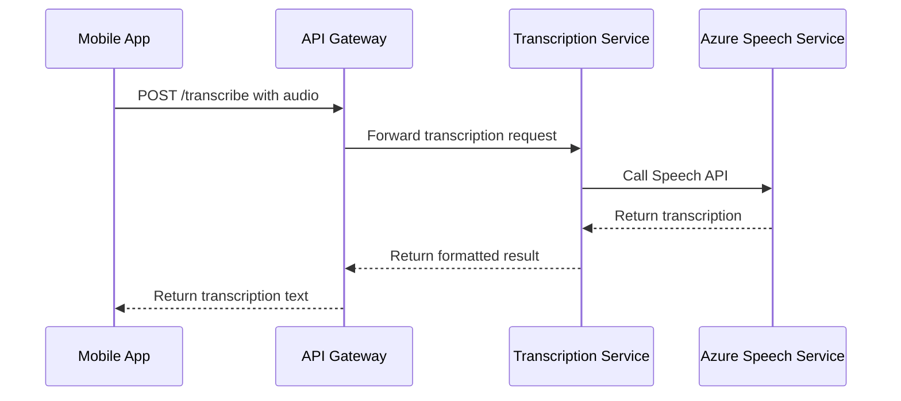

# Azure Speech Service Setup for BetterBooks

This guide explains how to set up Azure Speech Service for audio transcription in your BetterBooks deployment.

## Prerequisites

1. Azure subscription with billing enabled
2. Azure CLI installed and authenticated
3. Access to create Cognitive Services resources

## Step 1: Create Azure Speech Service Resource

### Option A: Using Azure Portal

1. **Navigate to Azure Portal**
   - Go to [portal.azure.com](https://portal.azure.com)
   - Sign in with your Azure account

2. **Create Speech Service Resource**
   - Click "Create a resource"
   - Search for "Speech" and select "Speech"
   - Click "Create"

3. **Configure the Resource**
   ```
   Subscription: Your Azure subscription
   Resource Group: betterbooks-rg (or create new)
   Region: East US (recommended for BetterBooks)
   Name: betterbooks-speech
   Pricing Tier: Free F0 (5 hours/month) or Standard S0
   ```

4. **Review and Create**
   - Review your settings
   - Click "Create" and wait for deployment

### Option B: Using Azure CLI

```bash
# Create resource group (if not exists)
az group create --name betterbooks-rg --location eastus

# Create Speech Service resource
az cognitiveservices account create \
  --name betterbooks-speech \
  --resource-group betterbooks-rg \
  --kind SpeechServices \
  --sku F0 \
  --location eastus
```

## Step 2: Get API Keys and Configuration

### Using Azure Portal

1. Navigate to your Speech Service resource
2. Go to "Keys and Endpoint" in the left menu
3. Copy the following information:
   - **Key 1** or **Key 2** (either works)
   - **Location/Region** (e.g., "eastus")
   - **Endpoint** (for reference, not needed for SDK)

### Using Azure CLI

```bash
# Get keys
az cognitiveservices account keys list \
  --name betterbooks-speech \
  --resource-group betterbooks-rg

# Get endpoint and location
az cognitiveservices account show \
  --name betterbooks-speech \
  --resource-group betterbooks-rg
```

## Step 3: Configure Environment Variables

### For Local Development

Add these variables to your `.env` file:

```bash
# Azure Speech Service Configuration
AZURE_SPEECH_KEY=your-speech-service-key-here
AZURE_SPEECH_REGION=eastus
AZURE_SPEECH_LANGUAGE=en-US
AZURE_SPEECH_PROFANITY_FILTER=false
AZURE_SPEECH_ENABLE_DICTATION=true
AZURE_SPEECH_ENABLE_PUNCTUATION=true
```

### For Production Deployment

#### Using Azure Key Vault (Recommended)

```bash
# Create Key Vault
az keyvault create \
  --name betterbooks-keyvault \
  --resource-group betterbooks-rg \
  --location eastus

# Store speech service key
az keyvault secret set \
  --vault-name betterbooks-keyvault \
  --name azure-speech-key \
  --value "your-speech-service-key"
```

#### Using Kubernetes Secrets

```bash
# Create secret in Kubernetes
kubectl create secret generic azure-speech-secret \
  --from-literal=AZURE_SPEECH_KEY="your-speech-service-key" \
  --from-literal=AZURE_SPEECH_REGION="eastus" \
  --namespace betterbooks
```

## Step 4: Update Configuration Files

The following files have already been updated for Azure Speech Service:

### 1. Context Configuration
File: `config/local/context_config.yaml`
- Service changed from "whisper" to "azure"
- Added Azure-specific configuration options

### 2. Docker Compose
File: `docker-compose.yml`
- Added Azure environment variables to transcription service

### 3. Requirements
File: `platform/backend/services/transcription_service/requirements.txt`
- Added Azure Cognitive Services Speech SDK

## Step 5: Deploy and Test

### Local Testing

1. **Start the services**:
   ```bash
   # Set your Azure Speech key
   export AZURE_SPEECH_KEY="your-key-here"
   
   # Start services
   docker-compose up --build transcription_service
   ```

2. **Test the transcription endpoint**:
   ```bash
   # Test health endpoint
   curl http://localhost:8003/health
   
   # Test supported languages
   curl http://localhost:8003/supported-languages
   
   # Upload audio file for transcription
   curl -X POST "http://localhost:8003/transcribe/file" \
     -H "Content-Type: multipart/form-data" \
     -F "file=@your-audio-file.wav"
   ```

### Production Testing

```bash
# Test on deployed service
curl https://your-domain.com/transcription/health

# Test with audio file
curl -X POST "https://your-domain.com/transcription/transcribe/file" \
  -H "Content-Type: multipart/form-data" \
  -F "file=@test-audio.wav"
```

## API Endpoints

The transcription service provides the following endpoints:

### Core Endpoints
- `GET /` - Service status
- `GET /health` - Health check
- `GET /config` - Current configuration

### Transcription Endpoints
- `POST /transcribe/file` - Upload audio file for transcription
- `POST /transcribe/stream` - Real-time audio stream transcription
- `POST /detect-language` - Detect audio language
- `POST /transcribe/with-translation` - Transcribe and translate

### Utility Endpoints
- `GET /supported-languages` - List supported languages
- `POST /test` - Test endpoint with mock data

## Cost Estimation

### Azure Speech Service Pricing (as of 2024)

**Free Tier (F0)**
- 5 audio hours per month
- Good for development and testing

**Standard Tier (S0)**
- $1.00 per audio hour
- First 5 hours free each month
- Volume discounts available

### Monthly Cost Examples
- **Development**: Free tier sufficient
- **Light usage** (10 hours/month): ~$5
- **Medium usage** (50 hours/month): ~$45
- **Heavy usage** (200 hours/month): ~$195

## Troubleshooting

### Common Issues

1. **"Azure Speech Service not available" Error**
   - Verify `AZURE_SPEECH_KEY` environment variable is set
   - Check that the key is valid in Azure Portal
   - Ensure the region matches your resource location

2. **"Invalid audio format" Error**
   - Supported formats: WAV, MP3, M4A, OGG, FLAC, AAC
   - Ensure audio quality is sufficient (16kHz+ sample rate recommended)

3. **"Region mismatch" Error**
   - Verify `AZURE_SPEECH_REGION` matches your resource's region
   - Common regions: eastus, westus2, westeurope, eastasia

4. **High latency or timeouts**
   - Choose a region closer to your deployment
   - Consider using smaller audio chunks for streaming
   - Check network connectivity to Azure

### Debugging Commands

```bash
# Check environment variables
docker-compose exec transcription_service env | grep AZURE

# View service logs
docker-compose logs transcription_service

# Test Azure connectivity
curl -H "Ocp-Apim-Subscription-Key: YOUR_KEY" \
  "https://YOUR_REGION.tts.speech.microsoft.com/cognitiveservices/v1"
```

### Log Analysis

Look for these log patterns:
- `Azure Speech Service initialized successfully` - Service started correctly
- `AZURE_SPEECH_KEY not provided` - Missing API key
- `Failed to initialize Azure Speech Service` - Configuration issue

## Security Best Practices

1. **API Key Management**
   - Never commit API keys to source control
   - Use Azure Key Vault for production
   - Rotate keys regularly (Azure allows 2 keys for seamless rotation)

2. **Network Security**
   - Restrict access to transcription service endpoints
   - Use HTTPS in production
   - Consider API Gateway for additional security

3. **Data Privacy**
   - Audio data is processed by Azure (review data residency requirements)
   - Consider enabling profanity filtering for user-generated content
   - Implement data retention policies

## Integration with Mobile App

The mobile app should send audio to the backend transcription service rather than calling Azure directly. This approach:

- Centralizes API key management
- Provides consistent error handling
- Allows for preprocessing and postprocessing
- Enables usage tracking and caching

### Mobile App Integration Flow



## Monitoring and Alerts

### Azure Monitor Integration

1. **Enable diagnostic logs** in Azure Portal
2. **Set up alerts** for:
   - High error rates
   - Quota exhaustion
   - Unusual usage patterns

### Application Insights

The transcription service includes metrics for:
- Request duration
- Success/failure rates
- Language detection accuracy
- Audio format distribution

## Next Steps

After completing the Azure Speech Service setup:

1. **Test thoroughly** with various audio formats and languages
2. **Monitor costs** during initial deployment
3. **Set up alerts** for quota limits
4. **Consider implementing caching** for frequently transcribed content
5. **Plan for scaling** based on usage patterns

## Support and Resources

- [Azure Speech Service Documentation](https://docs.microsoft.com/azure/cognitive-services/speech-service/)
- [Python SDK Reference](https://docs.microsoft.com/python/api/azure-cognitiveservices-speech/)
- [Pricing Calculator](https://azure.microsoft.com/pricing/calculator/)
- [BetterBooks Speech Service Issues](https://github.com/your-repo/issues)

## What You Need to Do

1. **Create Azure Speech Service Resource** using the instructions above
2. **Get your API key** from the Azure Portal
3. **Set the environment variable**:
   ```bash
   export AZURE_SPEECH_KEY="your-api-key-here"
   ```
4. **Restart your services**:
   ```bash
   docker-compose restart transcription_service
   ```
5. **Test the integration** using the provided curl commands

The implementation is complete and ready to use once you have the Azure Speech Service resource configured!