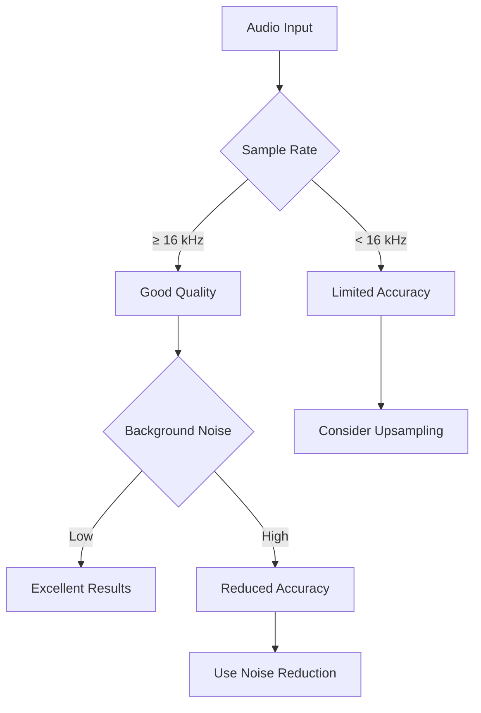
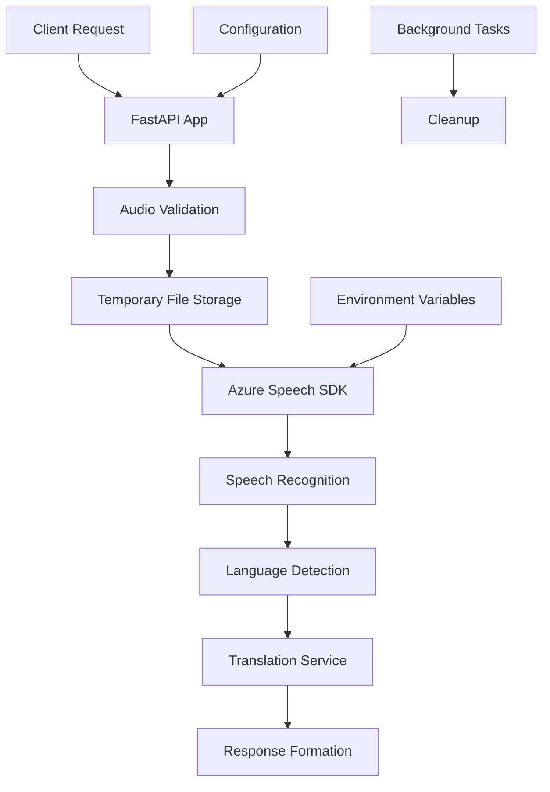

# Transcription Service

Azure Speech Service powered audio transcription microservice for the EchoWright platform. Provides real-time and batch transcription capabilities with advanced features like language detection, translation, and word-level timestamps.

## Features

### Core Transcription Capabilities
- **File Upload Transcription** - Upload audio files for batch transcription
- **Real-time Stream Transcription** - Live audio stream processing
- **Multiple Audio Formats** - WAV, MP3, M4A, OGG, FLAC, AAC support
- **Language Detection** - Automatic source language identification
- **Multi-language Translation** - Transcribe and translate simultaneously
- **Word-level Timestamps** - Precise timing information for each word

### Azure Integration
- **Azure Speech Service** - Enterprise-grade speech recognition
- **Configurable Languages** - Support for 100+ languages and dialects
- **Custom Models** - Domain-specific vocabulary and acoustic models
- **Profanity Filtering** - Optional content filtering
- **Speaker Recognition** - Future capability for multi-speaker scenarios

## Quick Start

### Environment Setup

```bash
# Required Azure credentials
export AZURE_SPEECH_KEY="your_azure_speech_service_key"
export AZURE_SPEECH_REGION="eastus"

# Optional configuration
export AZURE_SPEECH_LANGUAGE="en-US"
export AZURE_SPEECH_PROFANITY_FILTER="false"
export AZURE_SPEECH_ENABLE_DICTATION="true"
export AZURE_SPEECH_ENABLE_PUNCTUATION="true"
```

### Run the Service

```bash
# Install dependencies
pip install -r requirements.txt

# Run with uvicorn
uvicorn main:app --host 0.0.0.0 --port 8004 --reload
```

### Docker Deployment

```bash
# Build image
docker build -t transcription-service .

# Run container
docker run -p 8004:8000 \
  -e AZURE_SPEECH_KEY="your_key" \
  -e AZURE_SPEECH_REGION="eastus" \
  transcription-service
```

## API Endpoints

### Health & Status

```bash
# Basic health check
curl http://localhost:8004/health

# Service information
curl http://localhost:8004/

# Current configuration
curl http://localhost:8004/config
```

### Audio File Transcription

```bash
# Upload audio file for transcription
curl -X POST http://localhost:8004/transcribe/file \
  -H "Content-Type: multipart/form-data" \
  -F "file=@audio.wav" \
  -F "language=en-US"
```

**Response:**
```json
{
  "text": "Hello, this is a test transcription.",
  "language": "en-US",
  "confidence": 0.95,
  "segments": ["Hello,", "this is", "a test", "transcription."],
  "word_timestamps": [
    {"word": "Hello", "start_ms": 0, "end_ms": 500},
    {"word": "this", "start_ms": 600, "end_ms": 800}
  ],
  "service": "azure",
  "duration_ms": 1250
}
```

### Stream Transcription

```bash
# Stream raw audio data
curl -X POST http://localhost:8004/transcribe/stream \
  -H "Content-Type: application/octet-stream" \
  -H "X-Audio-Sample-Rate: 16000" \
  -H "X-Audio-Channels: 1" \
  --data-binary @audio.raw
```

### Language Detection

```bash
# Detect language from audio
curl -X POST http://localhost:8004/detect-language \
  -H "Content-Type: application/octet-stream" \
  --data-binary @audio.raw
```

**Response:**
```json
{
  "detected_language": "en-US",
  "confidence": 0.98,
  "supported_languages": ["en-US", "es-ES", "fr-FR", "de-DE", "zh-CN"]
}
```

### Transcription with Translation

```bash
# Transcribe and translate to multiple languages
curl -X POST "http://localhost:8004/transcribe/with-translation?target_languages=es&target_languages=fr" \
  -H "Content-Type: application/octet-stream" \
  --data-binary @audio.raw
```

**Response:**
```json
{
  "transcription": {
    "text": "Hello, how are you?",
    "language": "en-US"
  },
  "translations": {
    "es": "Hola, ¿cómo estás?",
    "fr": "Bonjour, comment allez-vous?"
  },
  "service": "azure",
  "duration_ms": 2100
}
```

## Audio Format Support

### Supported File Types
- **WAV** - Uncompressed PCM (recommended)
- **MP3** - MPEG Audio Layer III
- **M4A** - MPEG-4 Audio
- **OGG** - Ogg Vorbis
- **FLAC** - Free Lossless Audio Codec
- **AAC** - Advanced Audio Coding

### Optimal Settings
- **Sample Rate**: 16 kHz or higher
- **Channels**: Mono (1 channel) recommended
- **Bit Depth**: 16-bit minimum
- **Duration**: Up to 4 hours per file
- **File Size**: Maximum 100 MB

### Audio Quality Guidelines



## Configuration

### Azure Speech Service Setup

1. **Create Azure Speech Resource**
   ```bash
   # Using Azure CLI
   az cognitiveservices account create \
     --name "echowright-speech" \
     --resource-group "echowright-rg" \
     --kind "SpeechServices" \
     --sku "S0" \
     --location "eastus"
   ```

2. **Get API Keys**
   ```bash
   az cognitiveservices account keys list \
     --name "echowright-speech" \
     --resource-group "echowright-rg"
   ```

### Environment Variables

| Variable | Required | Default | Description |
|----------|----------|---------|-------------|
| `AZURE_SPEECH_KEY` | ✅ | - | Azure Speech Service API key |
| `AZURE_SPEECH_REGION` | ✅ | eastus | Azure region for Speech Service |
| `AZURE_SPEECH_LANGUAGE` | ❌ | en-US | Default language for transcription |
| `AZURE_SPEECH_PROFANITY_FILTER` | ❌ | false | Enable profanity filtering |
| `AZURE_SPEECH_ENABLE_DICTATION` | ❌ | true | Enable dictation mode |
| `AZURE_SPEECH_ENABLE_PUNCTUATION` | ❌ | true | Enable automatic punctuation |

### Configuration File

The service can also load configuration from `/context_config.yaml`:

```yaml
context:
  transcription:
    enabled: true
    service: azure
    azure:
      region: eastus
      language: en-US
      profanity_filter: false
      enable_dictation: true
      enable_punctuation: true
```

## Language Support

### Supported Languages (Selected)

| Language | Code | Recognition Quality |
|----------|------|-------------------|
| English (US) | en-US | ⭐⭐⭐⭐⭐ |
| English (UK) | en-GB | ⭐⭐⭐⭐⭐ |
| Spanish | es-ES | ⭐⭐⭐⭐⭐ |
| French | fr-FR | ⭐⭐⭐⭐⭐ |
| German | de-DE | ⭐⭐⭐⭐⭐ |
| Chinese (Mandarin) | zh-CN | ⭐⭐⭐⭐⭐ |
| Japanese | ja-JP | ⭐⭐⭐⭐ |
| Portuguese | pt-BR | ⭐⭐⭐⭐ |
| Russian | ru-RU | ⭐⭐⭐⭐ |
| Italian | it-IT | ⭐⭐⭐⭐ |

### Get All Supported Languages

```bash
curl http://localhost:8004/supported-languages
```

## Architecture

### Service Architecture



### Data Flow

1. **Audio Input** - File upload or stream data
2. **Format Validation** - Check audio format compatibility
3. **Temporary Storage** - Save uploaded files securely
4. **Azure Processing** - Send to Azure Speech Service
5. **Result Processing** - Parse timestamps and segments
6. **Response** - Return structured transcription data
7. **Cleanup** - Remove temporary files

## Performance & Scaling

### Performance Characteristics

| Operation | Typical Latency | Throughput | Resource Usage |
|-----------|----------------|------------|----------------|
| File Upload (1 min audio) | 5-15 seconds | 10 concurrent | 512 MB RAM |
| Stream Processing | <2 seconds | 5 concurrent | 256 MB RAM |
| Language Detection | 1-3 seconds | 20 concurrent | 128 MB RAM |
| Translation | 10-30 seconds | 5 concurrent | 1 GB RAM |

### Scaling Considerations

**Horizontal Scaling:**
- Deploy multiple service instances
- Use load balancer for request distribution
- Share temporary storage (Azure Blob, S3)

**Vertical Scaling:**
- Increase memory for larger files
- More CPU cores for concurrent processing
- SSD storage for temporary file operations

**Azure Speech Service Limits:**
- 20 concurrent requests per key (standard tier)
- 500 hours of audio per month (standard tier)
- Upgrade to premium tier for higher limits

## Error Handling

### Common Error Scenarios

**503 - Service Unavailable**
```json
{
  "detail": "Azure Speech Service not available"
}
```
*Solution: Check AZURE_SPEECH_KEY and service status*

**400 - Bad Request**
```json
{
  "detail": "Unsupported file type: text/plain"
}
```
*Solution: Upload supported audio formats only*

**500 - Internal Server Error**
```json
{
  "detail": "Transcription failed: Invalid audio format"
}
```
*Solution: Check audio file integrity and format*

### Debugging

```bash
# Check service logs
docker logs transcription-service

# Test Azure connectivity
curl http://localhost:8004/config

# Verify API key
python -c "
import os
from azure_speech_service import AzureSpeechConfig
config = AzureSpeechConfig.from_env()
print('API Key configured:', bool(config.api_key))
"
```

## Integration Examples

### Python Client

```python
import requests
import json

class TranscriptionClient:
    def __init__(self, base_url="http://localhost:8004"):
        self.base_url = base_url
    
    def transcribe_file(self, file_path: str, language: str = "en-US"):
        """Transcribe an audio file."""
        with open(file_path, 'rb') as f:
            files = {'file': f}
            data = {'language': language}
            
            response = requests.post(
                f"{self.base_url}/transcribe/file",
                files=files,
                data=data
            )
            
            response.raise_for_status()
            return response.json()
    
    def detect_language(self, audio_data: bytes):
        """Detect language from audio data."""
        headers = {'Content-Type': 'application/octet-stream'}
        
        response = requests.post(
            f"{self.base_url}/detect-language",
            data=audio_data,
            headers=headers
        )
        
        response.raise_for_status()
        return response.json()

# Usage
client = TranscriptionClient()
result = client.transcribe_file("meeting.wav", "en-US")
print(f"Transcription: {result['text']}")
```

### JavaScript Client

```javascript
class TranscriptionClient {
    constructor(baseUrl = 'http://localhost:8004') {
        this.baseUrl = baseUrl;
    }
    
    async transcribeFile(file, language = 'en-US') {
        const formData = new FormData();
        formData.append('file', file);
        formData.append('language', language);
        
        const response = await fetch(`${this.baseUrl}/transcribe/file`, {
            method: 'POST',
            body: formData
        });
        
        if (!response.ok) {
            throw new Error(`Transcription failed: ${response.status}`);
        }
        
        return response.json();
    }
    
    async getSupportedLanguages() {
        const response = await fetch(`${this.baseUrl}/supported-languages`);
        
        if (!response.ok) {
            throw new Error(`Failed to get languages: ${response.status}`);
        }
        
        return response.json();
    }
}

// Usage
const client = new TranscriptionClient();
const fileInput = document.getElementById('audio-file');

fileInput.addEventListener('change', async (e) => {
    const file = e.target.files[0];
    if (file) {
        try {
            const result = await client.transcribeFile(file);
            console.log('Transcription:', result.text);
        } catch (error) {
            console.error('Error:', error.message);
        }
    }
});
```

## Testing

### Unit Tests

```bash
# Run unit tests
python -m pytest tests/ -v

# Test specific functionality
python -m pytest tests/test_azure_integration.py -v
```

### Integration Testing

```bash
# Test with sample audio file
curl -X POST http://localhost:8004/transcribe/file \
  -F "file=@tests/data/sample.wav"

# Test language detection
curl -X POST http://localhost:8004/detect-language \
  -H "Content-Type: application/octet-stream" \
  --data-binary @tests/data/sample.wav
```

### Load Testing

```bash
# Using Apache Bench for load testing
ab -n 100 -c 10 -T "multipart/form-data" \
  -p tests/data/sample.wav \
  http://localhost:8004/transcribe/file
```

## Security Considerations

### Authentication & Authorization
- API key stored in environment variables
- No sensitive data in logs
- Temporary files cleaned up automatically
- Input validation for all endpoints

### Data Privacy
- Audio files processed in memory when possible
- Temporary files deleted immediately after processing
- No audio data stored permanently
- Azure Speech Service compliance (GDPR, SOC 2)

### Network Security
- HTTPS recommended for production
- CORS configured for web clients
- Rate limiting should be implemented at API Gateway level

## Monitoring & Observability

### Health Metrics
- Service availability status
- Azure Speech Service connectivity
- Processing latency and throughput
- Error rates by endpoint

### Logging
- Structured JSON logging
- Request/response correlation IDs
- Error tracking with stack traces
- Performance metrics logging

### Alerting
- Azure Speech Service downtime
- High error rates (>5%)
- Processing latency spikes
- Memory usage alerts

## Deployment

### Production Deployment

```dockerfile
FROM python:3.9-slim

WORKDIR /app

COPY requirements.txt .
RUN pip install --no-cache-dir -r requirements.txt

COPY . .

EXPOSE 8000

CMD ["uvicorn", "main:app", "--host", "0.0.0.0", "--port", "8000"]
```

### Kubernetes Deployment

```yaml
apiVersion: apps/v1
kind: Deployment
metadata:
  name: transcription-service
spec:
  replicas: 3
  selector:
    matchLabels:
      app: transcription-service
  template:
    metadata:
      labels:
        app: transcription-service
    spec:
      containers:
      - name: transcription-service
        image: echowright/transcription-service:latest
        ports:
        - containerPort: 8000
        env:
        - name: AZURE_SPEECH_KEY
          valueFrom:
            secretKeyRef:
              name: azure-speech-secret
              key: api-key
        - name: AZURE_SPEECH_REGION
          value: "eastus"
        resources:
          requests:
            memory: "512Mi"
            cpu: "250m"
          limits:
            memory: "1Gi"
            cpu: "500m"
```

## Troubleshooting

### Common Issues

**Issue: "Azure Speech Service not available"**
```bash
# Check environment variables
echo $AZURE_SPEECH_KEY
echo $AZURE_SPEECH_REGION

# Test Azure connectivity
curl -X POST http://localhost:8004/test \
  -H "Content-Type: application/json" \
  -d '{"text": "test", "language": "en-US"}'
```

**Issue: "Transcription failed: Invalid audio format"**
- Ensure audio file is in supported format
- Check file is not corrupted
- Verify sample rate is 16 kHz or higher

**Issue: Poor transcription quality**
- Use higher quality audio (16+ kHz sample rate)
- Reduce background noise
- Ensure clear speech pronunciation
- Consider using custom acoustic models

### Support & Resources

- [Azure Speech Service Documentation](https://docs.microsoft.com/en-us/azure/cognitive-services/speech-service/)
- [Supported Languages](https://docs.microsoft.com/en-us/azure/cognitive-services/speech-service/language-support)
- [Speech Service Pricing](https://azure.microsoft.com/en-us/pricing/details/cognitive-services/speech-services/)
- [EchoWright Platform Documentation](../../../../docs/)

## Contributing

### Development Setup

```bash
# Clone repository
git clone <repository-url>
cd platform/backend/services/transcription_service

# Create virtual environment
python -m venv venv
source venv/bin/activate  # On Windows: venv\Scripts\activate

# Install dependencies
pip install -r requirements.txt
pip install -r requirements-dev.txt

# Run tests
python -m pytest tests/ -v
```

### Code Standards
- Follow PEP 8 style guide
- Type hints for all functions
- Comprehensive docstrings
- Unit tests for new features
- Integration tests for API endpoints

---

**Version**: 1.0.0  
**Last Updated**: 2025-01-25  
**Maintainers**: EchoWright Development Team