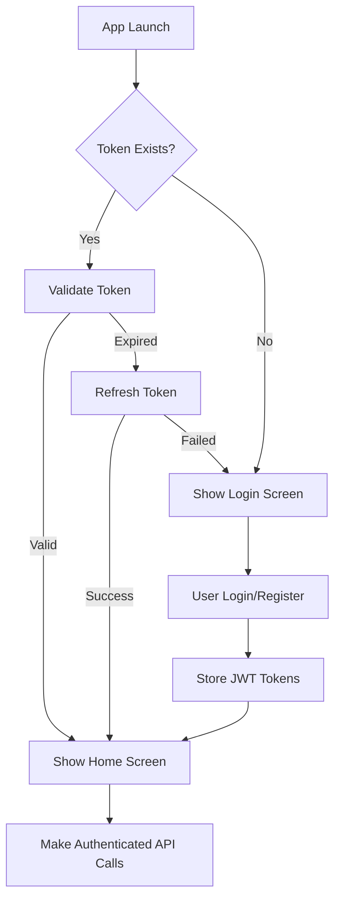

# EchoWright Mobile App

Flutter-based mobile application for iOS and Android that provides full access to the EchoWright audiobook platform with secure authentication.

## Features

- **🔐 JWT Authentication** - Secure login with email/password
- **👤 User Management** - Registration, profile management, sign out
- **📚 Audiobook Streaming** - Stream books directly from cloud backend  
- **🎯 OAuth Ready** - Google and Apple Sign In integration prepared
- **💾 Secure Storage** - Encrypted token storage using Flutter Secure Storage
- **🔄 Token Refresh** - Automatic JWT token refresh for seamless sessions
- **📱 Cross-Platform** - Native iOS and Android support

## Getting Started

### Prerequisites

- **Flutter 3.0+** - [Install Flutter](https://flutter.dev/docs/get-started/install)
- **Xcode** (for iOS development)
- **Android Studio** (for Android development)

### Installation

1. **Navigate to mobile app directory:**
   ```bash
   cd platform/mobile/mobile_app/
   ```

2. **Install dependencies:**
   ```bash
   flutter pub get
   ```

3. **Configure API endpoint:**
   The app is pre-configured to connect to `http://localhost:8002` for development.
   To change this, update `lib/api_config.dart`:
   ```dart
   const String apiBaseUrl = 'http://your-api-gateway-url:8000';
   ```

4. **Run the app:**
   ```bash
   flutter run
   ```

## Authentication Setup

The mobile app includes complete authentication integration:

### Email/Password Authentication ✅
- User registration with email and password
- Login with JWT token storage
- Automatic token refresh
- Secure logout with token cleanup

### OAuth Integration 🚧
OAuth endpoints are prepared but require backend implementation:
- Google Sign In configuration ready
- Apple Sign In configuration ready  
- `GoogleService-Info.plist` configured for iOS

## Architecture

### Key Components

**Authentication (`lib/services/auth_service.dart`)**
- JWT token management
- Secure storage integration
- OAuth provider integration
- Session management

**API Communication (`lib/services/api_service.dart`)**
- HTTP client for backend communication
- Automatic authentication headers
- Book streaming URL management
- Error handling and timeouts

**State Management (`lib/providers/auth_provider.dart`)**
- User authentication state
- Login/logout flow management
- User profile data management

**UI Screens**
- Login screen with email/password and OAuth buttons
- Registration screen with validation
- Profile screen with user data and settings
- Book library with authenticated content loading

### Security Features

- **Flutter Secure Storage** - Encrypted key-value storage for tokens
- **JWT Token Management** - Automatic refresh and secure cleanup
- **Request Authentication** - All API calls include Bearer tokens
- **Session Persistence** - Remember user login across app restarts

## Development

### Testing
```bash
flutter test
```

### iOS Simulator
```bash
flutter run -d "iPhone 15 Pro"
```

### Android Emulator  
```bash
flutter run -d emulator-5554
```

### Code Analysis
```bash
flutter analyze
```

## Configuration Files

### API Configuration (`lib/api_config.dart`)
```dart
const String apiBaseUrl = 'http://localhost:8002';
const Duration apiTimeout = Duration(seconds: 30);
```

### OAuth Configuration
- **iOS**: `ios/Runner/GoogleService-Info.plist`
- **Android**: OAuth configuration in `android/app/google-services.json`

## Authentication Flow



## API Integration

All API calls include automatic authentication:

```dart
// Books are loaded with authentication
final books = await ApiService.getBooks();

// AI completion with authentication  
final response = await ApiService.sendMessage(message, persona);

// User profile data
final user = await AuthService.getCurrentUser();
```

## Deployment

### iOS App Store
1. Configure signing certificates
2. Update `ios/Runner/Info.plist` with production API URL
3. Build for release: `flutter build ios --release`

### Google Play Store  
1. Configure signing key
2. Update API base URL for production
3. Build APK: `flutter build apk --release`

## Troubleshooting

### Common Issues

**OAuth Sign In Not Working**
- Ensure `GoogleService-Info.plist` is properly configured
- Check OAuth client IDs match app bundle identifier

**API Connection Failed**
- Verify API base URL is correct and accessible
- Check network permissions in platform-specific configs

**Token Refresh Failed**
- Clear app data and re-login
- Check backend token refresh endpoint

**Books Not Loading**  
- Verify authentication is working (check user profile)
- Check backend `/books/list` endpoint accessibility

### Debug Information

Check Flutter logs for authentication status:
```bash
flutter logs
```

Look for these log messages:
- `AuthService: Auth token set` - Authentication successful
- `API Response: {single_books: [...]}` - Book loading successful
- Authentication errors will show specific failure reasons

## Backend Integration

The mobile app integrates with these backend endpoints:

- `POST /auth/register` - User registration
- `POST /auth/login` - User login
- `GET /auth/me` - User profile  
- `POST /auth/refresh` - Token refresh
- `GET /books/list` - Book catalog
- `POST /complete` - AI chat completion
- `POST /tts` - Text-to-speech synthesis

See [API Gateway README](../../../backend/services/api_gateway/README.md) for complete API documentation.
