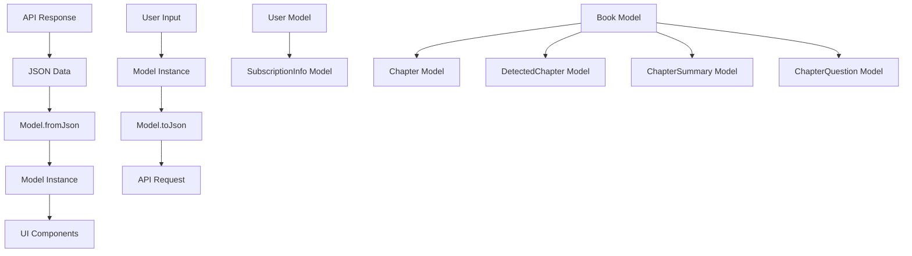

# Mobile Models

This directory contains the data models for the EchoWright Flutter mobile application. These models define the structure of data used throughout the app and handle JSON serialization for API communication.

## Models Overview

### User (`user.dart`)

Represents an authenticated user with profile information and subscription details.

**Key Features:**
- Support for multiple authentication methods (OAuth, email)
- Email verification status tracking
- Subscription information integration
- Helper methods for display formatting
- JSON serialization for API communication

**Properties:**
```dart
class User {
  final String id;                    // Unique user identifier
  final String? email;                // User email (nullable for Apple private relay)
  final String? displayName;          // User's display name
  final String? avatarUrl;           // Profile picture URL
  final bool emailVerified;          // Email verification status
  final bool isActive;               // Account active status
  final DateTime createdAt;          // Account creation timestamp
  final SubscriptionInfo? subscription; // Current subscription
}
```

**Helper Methods:**
- `firstName` - Extract first name from display name
- `initials` - Generate initials for avatar fallback
- `isPremium` - Check if user has active premium subscription

### SubscriptionInfo (`user.dart`)

Represents user subscription and billing information.

**Properties:**
```dart
class SubscriptionInfo {
  final String id;                   // Subscription ID
  final String status;               // Subscription status
  final String productId;            // Product/plan identifier
  final String provider;             // Payment provider (app_store, stripe)
  final DateTime? currentPeriodStart;// Current billing period start
  final DateTime? currentPeriodEnd;  // Current billing period end
  final DateTime? trialStart;        // Trial period start
  final DateTime? trialEnd;          // Trial period end
  final bool isActive;               // Whether subscription is active
  final bool isTrial;                // Whether in trial period
}
```

**Helper Methods:**
- `planDisplayName` - Get user-friendly plan name
- `renewalText` - Get subscription renewal status text

### Book (`book.dart`)

Represents an audiobook with metadata and chapter information.

**Key Features:**
- Support for both single-file and multi-chapter audiobooks
- Integration with AI chapter detection
- Duration tracking for progress indicators
- Cover image and author information

**Properties:**
```dart
class Book {
  final String id;              // Unique book identifier
  final String title;           // Display title
  final String? author;         // Author name
  final String? coverUrl;       // Cover image URL
  final List<Chapter>? chapters;// Chapters for multi-part books
  final String? audioUrl;       // Direct audio URL for single files
  final Duration? duration;     // Total playbook duration
}
```

### Chapter (`book.dart`)

Represents a single chapter within an audiobook.

**Properties:**
```dart
class Chapter {
  final String id;              // Unique chapter identifier
  final String title;           // Chapter title
  final String audioUrl;        // Streaming URL for chapter audio
  final Duration? duration;     // Chapter playback duration
  final int chapterNumber;      // Sequential chapter number
}
```

### DetectedChapter (`book.dart`)

Represents an AI-detected chapter with enhanced metadata and confidence scores.

**Properties:**
```dart
class DetectedChapter {
  final String id;                    // Unique chapter identifier
  final int chapterNumber;            // Sequential chapter number
  final String title;                 // AI-generated chapter title
  final double startTime;             // Start time in seconds
  final double endTime;               // End time in seconds
  final double duration;              // Chapter duration in seconds
  final double confidence;            // AI detection confidence (0.0-1.0)
  final String? summary;              // AI-generated summary
  final List<String> keyTopics;       // AI-extracted topics
  final int wordCount;               // Number of words
  final int speakerChanges;          // Number of speaker changes
}
```

**Helper Methods:**
- `formattedDuration` - Format duration as HH:MM:SS or MM:SS
- `confidencePercentage` - Convert confidence to percentage

### ChapterSummary (`book.dart`)

Represents AI-generated chapter summaries with different styles and analysis.

**Properties:**
```dart
class ChapterSummary {
  final String chapterId;              // Reference to chapter
  final int chapterNumber;             // Chapter number
  final String chapterTitle;           // Chapter title
  final String summaryText;            // Main summary content
  final String style;                  // Summary style (brief, detailed, themes)
  final List<String> keyPoints;       // Key points from chapter
  final List<String> themes;          // Identified themes
  final List<String> charactersMenutioned; // Characters mentioned
  final int wordCount;                 // Summary word count
  final double confidenceScore;        // AI confidence in summary quality
}
```

### ChapterQuestion (`book.dart`)

Represents AI-generated discussion questions for chapter engagement.

**Properties:**
```dart
class ChapterQuestion {
  final String questionId;             // Unique question identifier
  final String questionText;           // The actual question
  final String questionType;           // Type: comprehension, analysis, discussion
  final String difficulty;             // Difficulty: beginner, intermediate, advanced
  final String suggestedAnswer;        // AI-suggested answer or guidance
  final List<String> answerGuidelines; // Guidelines for answering
  final List<String> followUpQuestions; // Related follow-up questions
  final List<String> relatedThemes;    // Themes this question relates to
  final double confidenceScore;        // AI confidence in question quality
}
```

## Model Architecture



## JSON Serialization

### Pattern Implementation

All models follow a consistent pattern for JSON serialization:

```dart
class ModelName {
  // Properties...
  
  /// Create instance from API JSON response
  factory ModelName.fromJson(Map<String, dynamic> json) {
    return ModelName(
      id: json['id'] as String,
      name: json['name'] as String?,
      isActive: json['is_active'] as bool? ?? false,
      createdAt: json['created_at'] != null 
          ? DateTime.parse(json['created_at'] as String)
          : DateTime.now(),
    );
  }
  
  /// Convert instance to JSON for API requests
  Map<String, dynamic> toJson() {
    return {
      'id': id,
      'name': name,
      'is_active': isActive,
      'created_at': createdAt.toIso8601String(),
    };
  }
}
```

### Null Safety Handling

Models handle missing or null data gracefully:

```dart
factory User.fromJson(Map<String, dynamic> json) {
  return User(
    id: json['id'] as String,
    email: json['email'] as String?,                    // Nullable
    emailVerified: json['email_verified'] as bool? ?? false, // Default value
    subscription: json['subscription'] != null         // Nested object
        ? SubscriptionInfo.fromJson(json['subscription'])
        : null,
  );
}
```

### List Handling

Models properly handle list serialization:

```dart
factory Book.fromJson(Map<String, dynamic> json) {
  return Book(
    chapters: json['chapters'] != null
        ? (json['chapters'] as List)
            .map((c) => Chapter.fromJson(c))
            .toList()
        : null,
  );
}

factory DetectedChapter.fromJson(Map<String, dynamic> json) {
  return DetectedChapter(
    keyTopics: (json['key_topics'] as List<dynamic>?)
        ?.map((topic) => topic.toString())
        .toList() ?? [],
  );
}
```

## Helper Methods

### Display Formatting

Models include helper methods for UI display:

```dart
class User {
  /// Get user's first name from display name
  String get firstName {
    if (displayName == null || displayName!.isEmpty) return 'User';
    final parts = displayName!.split(' ');
    return parts.first;
  }
  
  /// Get user's initials for avatar fallback
  String get initials {
    if (displayName == null || displayName!.isEmpty) {
      return email?.substring(0, 1).toUpperCase() ?? 'U';
    }
    
    final parts = displayName!.split(' ');
    if (parts.length >= 2) {
      return '${parts[0].substring(0, 1)}${parts[1].substring(0, 1)}'.toUpperCase();
    } else {
      return parts[0].substring(0, 1).toUpperCase();
    }
  }
}
```

### Business Logic

Models include business logic helpers:

```dart
class User {
  /// Check if user has premium subscription
  bool get isPremium {
    return subscription?.isActive ?? false;
  }
}

class SubscriptionInfo {
  /// Get subscription plan display name
  String get planDisplayName {
    switch (productId.toLowerCase()) {
      case 'com.echowright.monthly':
        return 'Monthly Premium';
      case 'com.echowright.yearly':
        return 'Annual Premium';
      default:
        return 'Premium';
    }
  }
}
```

### Data Validation

Models include validation for data integrity:

```dart
class DetectedChapter {
  /// Format duration as MM:SS or HH:MM:SS
  String get formattedDuration {
    final hours = (duration ~/ 3600);
    final minutes = ((duration % 3600) ~/ 60);
    final seconds = (duration % 60).round();
    
    if (hours > 0) {
      return '${hours}:${minutes.toString().padLeft(2, '0')}:${seconds.toString().padLeft(2, '0')}';
    } else {
      return '${minutes}:${seconds.toString().padLeft(2, '0')}';
    }
  }
  
  /// Convert confidence to percentage
  int get confidencePercentage => (confidence * 100).round();
}
```

## Model Usage in UI

### Basic Usage

```dart
class UserProfileWidget extends StatelessWidget {
  final User user;
  
  UserProfileWidget({required this.user});
  
  @override
  Widget build(BuildContext context) {
    return Card(
      child: Column(
        children: [
          CircleAvatar(
            backgroundImage: user.avatarUrl != null 
                ? NetworkImage(user.avatarUrl!) 
                : null,
            child: user.avatarUrl == null 
                ? Text(user.initials) 
                : null,
          ),
          Text(user.displayName ?? 'User'),
          if (user.isPremium)
            Chip(label: Text('Premium')),
          if (!user.emailVerified && user.email != null)
            Text('Email not verified', style: TextStyle(color: Colors.red)),
        ],
      ),
    );
  }
}
```

### ListView Usage

```dart
class BookListWidget extends StatelessWidget {
  final List<Book> books;
  
  BookListWidget({required this.books});
  
  @override
  Widget build(BuildContext context) {
    return ListView.builder(
      itemCount: books.length,
      itemBuilder: (context, index) {
        final book = books[index];
        return ListTile(
          leading: book.coverUrl != null 
              ? Image.network(book.coverUrl!)
              : Icon(Icons.book),
          title: Text(book.title),
          subtitle: Text(book.author ?? 'Unknown Author'),
          trailing: book.hasChapters 
              ? Text('${book.chapters!.length} chapters')
              : Icon(Icons.audiotrack),
          onTap: () => Navigator.push(
            context,
            MaterialPageRoute(
              builder: (context) => BookDetailPage(book: book),
            ),
          ),
        );
      },
    );
  }
}
```

## Testing Models

### Unit Testing

```dart
import 'package:flutter_test/flutter_test.dart';
import '../lib/models/user.dart';

void main() {
  group('User Model Tests', () {
    test('fromJson creates User with all properties', () {
      final json = {
        'id': '123',
        'email': 'test@example.com',
        'display_name': 'John Doe',
        'email_verified': true,
        'is_active': true,
        'created_at': '2023-01-01T00:00:00Z',
      };
      
      final user = User.fromJson(json);
      
      expect(user.id, equals('123'));
      expect(user.email, equals('test@example.com'));
      expect(user.displayName, equals('John Doe'));
      expect(user.emailVerified, isTrue);
      expect(user.isActive, isTrue);
    });
    
    test('toJson creates correct JSON structure', () {
      final user = User(
        id: '123',
        email: 'test@example.com',
        displayName: 'John Doe',
        emailVerified: true,
        isActive: true,
        createdAt: DateTime.parse('2023-01-01T00:00:00Z'),
      );
      
      final json = user.toJson();
      
      expect(json['id'], equals('123'));
      expect(json['email'], equals('test@example.com'));
      expect(json['display_name'], equals('John Doe'));
      expect(json['email_verified'], isTrue);
    });
    
    test('firstName returns correct first name', () {
      final user = User(
        id: '123',
        displayName: 'John Doe Smith',
        createdAt: DateTime.now(),
      );
      
      expect(user.firstName, equals('John'));
    });
    
    test('initials returns correct initials', () {
      final user = User(
        id: '123',
        displayName: 'John Doe',
        createdAt: DateTime.now(),
      );
      
      expect(user.initials, equals('JD'));
    });
  });
}
```

### Widget Testing with Models

```dart
import 'package:flutter/material.dart';
import 'package:flutter_test/flutter_test.dart';
import '../lib/models/user.dart';
import '../lib/widgets/user_profile_widget.dart';

void main() {
  testWidgets('UserProfileWidget displays user information correctly', (tester) async {
    final user = User(
      id: '123',
      email: 'test@example.com',
      displayName: 'John Doe',
      emailVerified: true,
      createdAt: DateTime.now(),
    );
    
    await tester.pumpWidget(
      MaterialApp(
        home: Scaffold(
          body: UserProfileWidget(user: user),
        ),
      ),
    );
    
    expect(find.text('John Doe'), findsOneWidget);
    expect(find.text('JD'), findsOneWidget); // Initials in avatar
    expect(find.text('Email not verified'), findsNothing); // Should not show
  });
}
```

## Performance Considerations

### Memory Management

- Use `const` constructors where possible
- Implement proper `==` operator and `hashCode` for efficient comparisons
- Consider using `freezed` package for immutable models (future enhancement)

```dart
class User {
  // ... properties
  
  @override
  bool operator ==(Object other) {
    if (identical(this, other)) return true;
    return other is User && other.id == id;
  }
  
  @override
  int get hashCode => id.hashCode;
}
```

### Serialization Performance

- Use efficient JSON parsing with type casting
- Avoid unnecessary object creation
- Cache computed properties when expensive

```dart
class DetectedChapter {
  String? _cachedFormattedDuration;
  
  String get formattedDuration {
    _cachedFormattedDuration ??= _formatDuration(duration);
    return _cachedFormattedDuration!;
  }
  
  String _formatDuration(double seconds) {
    // Expensive formatting logic
  }
}
```

## Adding New Models

To add a new model:

1. **Create Model File**: `new_model.dart` in this directory
2. **Follow Naming Conventions**: Use PascalCase for classes, camelCase for properties
3. **Implement JSON Serialization**: Add `fromJson` and `toJson` methods
4. **Add Helper Methods**: Include display and business logic helpers
5. **Handle Null Safety**: Properly handle nullable properties
6. **Add Documentation**: Include comprehensive dartdoc comments
7. **Write Tests**: Create unit tests for all methods
8. **Update README**: Add model documentation to this file

### Model Template

```dart
/**
 * new_model.dart - Data model for specific entity
 * 
 * Represents [entity] in the EchoWright application.
 * Handles JSON serialization from backend API responses.
 * 
 * Key responsibilities:
 * - Define data structure for [entity]
 * - Handle JSON serialization/deserialization
 * - Provide helper methods for display and business logic
 * - Support null safety and graceful error handling
 */

/// Represents a [entity] in the EchoWright application
class NewModel {
  final String id;                    // Unique identifier
  final String name;                  // Entity name
  final bool isActive;               // Active status
  final DateTime createdAt;          // Creation timestamp
  final List<String> tags;           // Associated tags

  NewModel({
    required this.id,
    required this.name,
    this.isActive = true,
    required this.createdAt,
    this.tags = const [],
  });

  /// Create NewModel from API JSON response
  factory NewModel.fromJson(Map<String, dynamic> json) {
    return NewModel(
      id: json['id'] as String,
      name: json['name'] as String,
      isActive: json['is_active'] as bool? ?? true,
      createdAt: DateTime.parse(json['created_at'] as String),
      tags: (json['tags'] as List<dynamic>?)
          ?.map((tag) => tag.toString())
          .toList() ?? [],
    );
  }

  /// Convert NewModel to JSON for API requests
  Map<String, dynamic> toJson() {
    return {
      'id': id,
      'name': name,
      'is_active': isActive,
      'created_at': createdAt.toIso8601String(),
      'tags': tags,
    };
  }

  /// Create copy with modified fields
  NewModel copyWith({
    String? id,
    String? name,
    bool? isActive,
    DateTime? createdAt,
    List<String>? tags,
  }) {
    return NewModel(
      id: id ?? this.id,
      name: name ?? this.name,
      isActive: isActive ?? this.isActive,
      createdAt: createdAt ?? this.createdAt,
      tags: tags ?? this.tags,
    );
  }

  /// Helper method for display
  String get displayName => name.isNotEmpty ? name : 'Unnamed';

  /// Helper method for business logic
  bool get hasMultipleTags => tags.length > 1;

  @override
  String toString() {
    return 'NewModel(id: $id, name: $name, isActive: $isActive)';
  }

  @override
  bool operator ==(Object other) {
    if (identical(this, other)) return true;
    return other is NewModel && other.id == id;
  }

  @override
  int get hashCode => id.hashCode;
}
```

## Dependencies

No external dependencies - models use only Dart standard library for JSON serialization and date handling.

## Best Practices

1. **Immutability**: Make all properties final
2. **Null Safety**: Handle nullable properties appropriately
3. **JSON Robustness**: Handle missing/malformed JSON gracefully
4. **Helper Methods**: Include useful display and business logic methods
5. **Documentation**: Add comprehensive dartdoc comments
6. **Testing**: Write thorough unit tests for all methods
7. **Performance**: Implement efficient `==` operator and `hashCode`
8. **Consistency**: Follow established patterns across all models