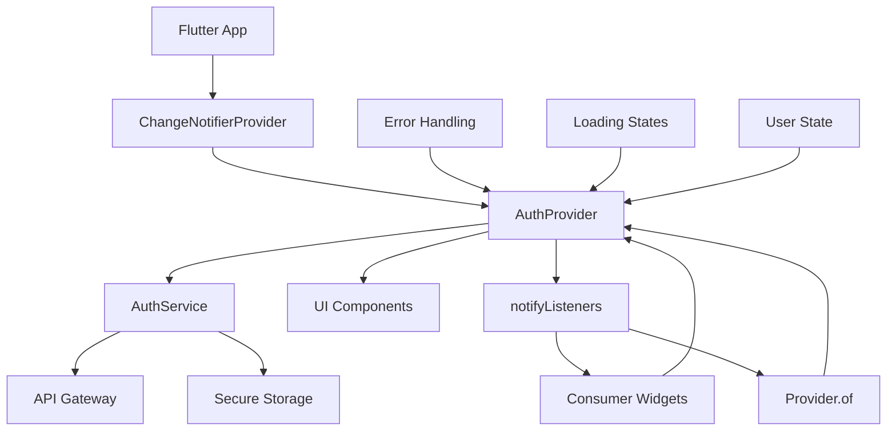

# Mobile Providers

This directory contains the state management providers for the EchoWright Flutter mobile application. Providers use the Provider pattern (ChangeNotifier) to manage global application state and provide reactive data to UI components.

## Providers Overview

### AuthProvider (`auth_provider.dart`)

Manages global authentication state and provides authentication methods to the entire application.

**Key Responsibilities:**
- Manage authenticated user state and session information
- Provide reactive authentication status to UI components
- Handle loading states during authentication operations
- Integrate with AuthService for actual authentication operations
- Persist authentication state across app sessions
- Provide error handling and user feedback

**Usage:**
```dart
import 'package:provider/provider.dart';
import '../providers/auth_provider.dart';

// In main.dart - Wrap app with provider
ChangeNotifierProvider(
  create: (context) => AuthProvider(),
  child: MyApp(),
)

// In UI components - Listen to auth state
Consumer<AuthProvider>(
  builder: (context, authProvider, child) {
    if (authProvider.isLoading) {
      return CircularProgressIndicator();
    }
    
    if (authProvider.isAuthenticated) {
      return HomePage();
    } else {
      return LoginPage();
    }
  },
)

// Direct access to auth provider
final authProvider = Provider.of<AuthProvider>(context, listen: false);
await authProvider.signInWithGoogle();
```

**State Properties:**
- `User? currentUser` - Currently authenticated user or null
- `bool isAuthenticated` - Whether user is currently authenticated
- `bool isLoading` - Loading state for UI feedback
- `bool isInitialized` - Whether provider has completed initialization
- `String? errorMessage` - Latest error message for user display

**Methods:**
- `initialize()` - Initialize auth state on app startup
- `signInWithGoogle()` - Google OAuth sign-in
- `signInWithApple()` - Apple Sign-in
- `signUpWithEmail()` - Email/password registration
- `signInWithEmail()` - Email/password sign-in
- `sendEmailVerification()` - Send email verification
- `requestPasswordReset()` - Request password reset
- `signOut()` - Sign out and clear state
- `refreshUser()` - Refresh user data from backend

## State Management Architecture



## Provider Pattern

### 1. ChangeNotifier Implementation
All providers extend ChangeNotifier for reactive state updates:

```dart
class AuthProvider extends ChangeNotifier {
  // Private state variables
  User? _currentUser;
  bool _isAuthenticated = false;
  bool _isLoading = false;
  
  // Public getters
  User? get currentUser => _currentUser;
  bool get isAuthenticated => _isAuthenticated;
  bool get isLoading => _isLoading;
  
  // State update methods
  void _setAuthenticatedUser(User user) {
    _currentUser = user;
    _isAuthenticated = true;
    notifyListeners(); // Notify UI of state change
  }
  
  void _setLoading(bool loading) {
    _isLoading = loading;
    notifyListeners();
  }
}
```

### 2. Async Operation Pattern
All async operations follow consistent loading and error handling:

```dart
Future<bool> signInWithEmail({
  required String email,
  required String password,
}) async {
  _setLoading(true);
  _clearError();
  
  try {
    final result = await AuthService.signInWithEmail(
      email: email,
      password: password,
    );
    
    if (result.success && result.user != null) {
      _setAuthenticatedUser(result.user!);
      return true;
    } else {
      _setError(result.error ?? 'Email signin failed');
      return false;
    }
  } catch (e) {
    _setError('Email signin failed: $e');
    return false;
  } finally {
    _setLoading(false);
  }
}
```

### 3. Error Handling Pattern
Consistent error handling across all provider methods:

```dart
class AuthProvider extends ChangeNotifier {
  String? _errorMessage;
  
  String? get errorMessage => _errorMessage;
  
  void _setError(String message) {
    _errorMessage = message;
    notifyListeners();
  }
  
  void _clearError() {
    _errorMessage = null;
    notifyListeners();
  }
  
  // Public method for UI to clear errors
  void clearError() {
    _clearError();
  }
}
```

## UI Integration Patterns

### 1. Consumer Pattern
For widgets that need to rebuild when state changes:

```dart
Consumer<AuthProvider>(
  builder: (context, authProvider, child) {
    return Column(
      children: [
        if (authProvider.isLoading)
          LinearProgressIndicator(),
        
        if (authProvider.errorMessage != null)
          ErrorBanner(
            message: authProvider.errorMessage!,
            onDismiss: () => authProvider.clearError(),
          ),
        
        Text('Welcome ${authProvider.userDisplayName}'),
      ],
    );
  },
)
```

### 2. Selector Pattern
For optimized rebuilds when only specific state changes:

```dart
Selector<AuthProvider, bool>(
  selector: (context, authProvider) => authProvider.isAuthenticated,
  builder: (context, isAuthenticated, child) {
    return isAuthenticated ? HomePage() : LoginPage();
  },
)
```

### 3. Provider.of Pattern
For triggering actions without rebuilding:

```dart
class LoginButton extends StatelessWidget {
  @override
  Widget build(BuildContext context) {
    return ElevatedButton(
      onPressed: () async {
        final authProvider = Provider.of<AuthProvider>(context, listen: false);
        await authProvider.signInWithGoogle();
      },
      child: Text('Sign in with Google'),
    );
  }
}
```

## Provider Lifecycle

### 1. App Initialization
```dart
void main() async {
  WidgetsFlutterBinding.ensureInitialized();
  
  runApp(
    ChangeNotifierProvider(
      create: (context) => AuthProvider(),
      child: MyApp(),
    ),
  );
}

class MyApp extends StatelessWidget {
  @override
  Widget build(BuildContext context) {
    return MaterialApp(
      home: Consumer<AuthProvider>(
        builder: (context, authProvider, child) {
          if (!authProvider.isInitialized) {
            // Initialize auth state on app start
            authProvider.initialize();
            return SplashScreen();
          }
          
          return authProvider.isAuthenticated ? HomePage() : LoginPage();
        },
      ),
    );
  }
}
```

### 2. State Persistence
```dart
class AuthProvider extends ChangeNotifier {
  Future<void> initialize() async {
    if (_isInitialized) return;
    
    _setLoading(true);
    
    try {
      // Check for existing authentication
      final isAuth = await AuthService.isAuthenticated();
      
      if (isAuth) {
        final user = await AuthService.getCurrentUser();
        if (user != null) {
          _setAuthenticatedUser(user);
        } else {
          _setUnauthenticated();
        }
      } else {
        _setUnauthenticated();
      }
    } catch (e) {
      print('Auth initialization error: $e');
      _setUnauthenticated();
    } finally {
      _isInitialized = true;
      _setLoading(false);
    }
  }
}
```

### 3. Memory Management
```dart
class AuthProvider extends ChangeNotifier {
  @override
  void dispose() {
    // Clean up any subscriptions or resources
    super.dispose();
  }
}
```

## Testing Providers

### Unit Testing
```dart
import 'package:flutter_test/flutter_test.dart';
import 'package:mockito/mockito.dart';
import '../lib/providers/auth_provider.dart';
import '../lib/services/auth_service.dart';

class MockAuthService extends Mock implements AuthService {}

void main() {
  group('AuthProvider Tests', () {
    late AuthProvider authProvider;
    late MockAuthService mockAuthService;
    
    setUp(() {
      authProvider = AuthProvider();
      mockAuthService = MockAuthService();
    });
    
    test('initial state is unauthenticated', () {
      expect(authProvider.isAuthenticated, isFalse);
      expect(authProvider.currentUser, isNull);
      expect(authProvider.isLoading, isFalse);
    });
    
    test('successful sign in updates state', () async {
      final testUser = User(id: '123', email: 'test@example.com', createdAt: DateTime.now());
      when(mockAuthService.signInWithEmail(any, any))
          .thenAnswer((_) async => AuthResult.success(testUser));
      
      final result = await authProvider.signInWithEmail(
        email: 'test@example.com',
        password: 'password123',
      );
      
      expect(result, isTrue);
      expect(authProvider.isAuthenticated, isTrue);
      expect(authProvider.currentUser, equals(testUser));
      expect(authProvider.isLoading, isFalse);
    });
  });
}
```

### Widget Testing
```dart
import 'package:flutter/material.dart';
import 'package:flutter_test/flutter_test.dart';
import 'package:provider/provider.dart';
import '../lib/providers/auth_provider.dart';

void main() {
  testWidgets('AuthProvider provides authentication state to widgets', (tester) async {
    final authProvider = AuthProvider();
    
    await tester.pumpWidget(
      ChangeNotifierProvider<AuthProvider>.value(
        value: authProvider,
        child: MaterialApp(
          home: Consumer<AuthProvider>(
            builder: (context, authProvider, child) {
              return Scaffold(
                body: Text(
                  authProvider.isAuthenticated ? 'Authenticated' : 'Not Authenticated',
                ),
              );
            },
          ),
        ),
      ),
    );
    
    expect(find.text('Not Authenticated'), findsOneWidget);
    
    // Simulate authentication
    final testUser = User(id: '123', email: 'test@example.com', createdAt: DateTime.now());
    authProvider._setAuthenticatedUser(testUser);
    await tester.pump();
    
    expect(find.text('Authenticated'), findsOneWidget);
  });
}
```

## Performance Considerations

### 1. Selective Updates
Use Selector to prevent unnecessary rebuilds:

```dart
// Bad - rebuilds on any auth state change
Consumer<AuthProvider>(
  builder: (context, authProvider, child) {
    return Text(authProvider.currentUser?.email ?? 'No user');
  },
)

// Good - rebuilds only when user email changes
Selector<AuthProvider, String?>(
  selector: (context, authProvider) => authProvider.currentUser?.email,
  builder: (context, email, child) {
    return Text(email ?? 'No user');
  },
)
```

### 2. Computed Properties
Use getters for computed values to avoid repeated calculations:

```dart
class AuthProvider extends ChangeNotifier {
  User? _currentUser;
  
  // Computed property - calculated once per access
  bool get needsEmailVerification {
    return _currentUser?.email != null && !(_currentUser?.emailVerified ?? true);
  }
  
  bool get isPremiumUser {
    return _currentUser?.isPremium ?? false;
  }
  
  String get userDisplayName {
    return _currentUser?.displayName ?? _currentUser?.firstName ?? 'User';
  }
}
```

### 3. State Validation
Validate state consistency to prevent UI errors:

```dart
class AuthProvider extends ChangeNotifier {
  void _setAuthenticatedUser(User user) {
    _currentUser = user;
    _isAuthenticated = true;
    _clearError();
    notifyListeners();
  }
  
  void _setUnauthenticated() {
    _currentUser = null;
    _isAuthenticated = false;
    _clearError();
    notifyListeners();
  }
  
  // Validation getter
  bool get isStateValid {
    return (_isAuthenticated && _currentUser != null) ||
           (!_isAuthenticated && _currentUser == null);
  }
}
```

## Adding New Providers

To add a new provider:

1. **Create Provider File**: `new_provider.dart` in this directory
2. **Extend ChangeNotifier**: Follow established patterns
3. **Implement State Management**: Use private state with public getters
4. **Add Error Handling**: Consistent error handling across methods
5. **Update Main App**: Add provider to the widget tree
6. **Add Tests**: Create comprehensive unit tests
7. **Update Documentation**: Add provider documentation to this README

### Provider Template

```dart
/**
 * new_provider.dart - Provider for managing specific state
 * 
 * Key responsibilities:
 * - Manage application state for specific domain
 * - Provide reactive updates to UI components
 * - Handle loading and error states
 * - Integrate with relevant services
 */

import 'package:flutter/foundation.dart';

class NewProvider extends ChangeNotifier {
  // Private state variables
  bool _isLoading = false;
  String? _errorMessage;
  DataModel? _data;
  
  // Public getters
  bool get isLoading => _isLoading;
  String? get errorMessage => _errorMessage;
  DataModel? get data => _data;
  
  /// Initialize provider
  Future<void> initialize() async {
    _setLoading(true);
    _clearError();
    
    try {
      // Initialization logic
      final result = await SomeService.initialize();
      if (result.success) {
        _data = result.data;
      } else {
        _setError(result.error ?? 'Initialization failed');
      }
    } catch (e) {
      _setError('Initialization failed: $e');
    } finally {
      _setLoading(false);
    }
  }
  
  /// Public method for UI actions
  Future<bool> performAction(String parameter) async {
    _setLoading(true);
    _clearError();
    
    try {
      final result = await SomeService.performAction(parameter);
      if (result.success) {
        _data = result.data;
        return true;
      } else {
        _setError(result.error ?? 'Action failed');
        return false;
      }
    } catch (e) {
      _setError('Action failed: $e');
      return false;
    } finally {
      _setLoading(false);
    }
  }
  
  // Private state management methods
  void _setLoading(bool loading) {
    _isLoading = loading;
    notifyListeners();
  }
  
  void _setError(String message) {
    _errorMessage = message;
    notifyListeners();
  }
  
  void _clearError() {
    _errorMessage = null;
    notifyListeners();
  }
  
  // Public method for UI to clear errors
  void clearError() {
    _clearError();
  }
  
  @override
  void dispose() {
    // Clean up resources
    super.dispose();
  }
}
```

## Dependencies

- `provider: ^6.1.1` - State management using Provider pattern
- `flutter/foundation.dart` - ChangeNotifier and debugging utilities

## Best Practices

1. **Single Responsibility**: Each provider manages one domain of state
2. **Private State**: Keep state variables private with public getters
3. **Consistent Patterns**: Use established patterns for loading and error states
4. **Performance**: Use Selector for optimized rebuilds
5. **Testing**: Write comprehensive unit tests for all provider methods
6. **Documentation**: Document all public methods and state properties
7. **Error Handling**: Provide meaningful error messages to users
8. **Memory Management**: Properly dispose of resources in dispose() method