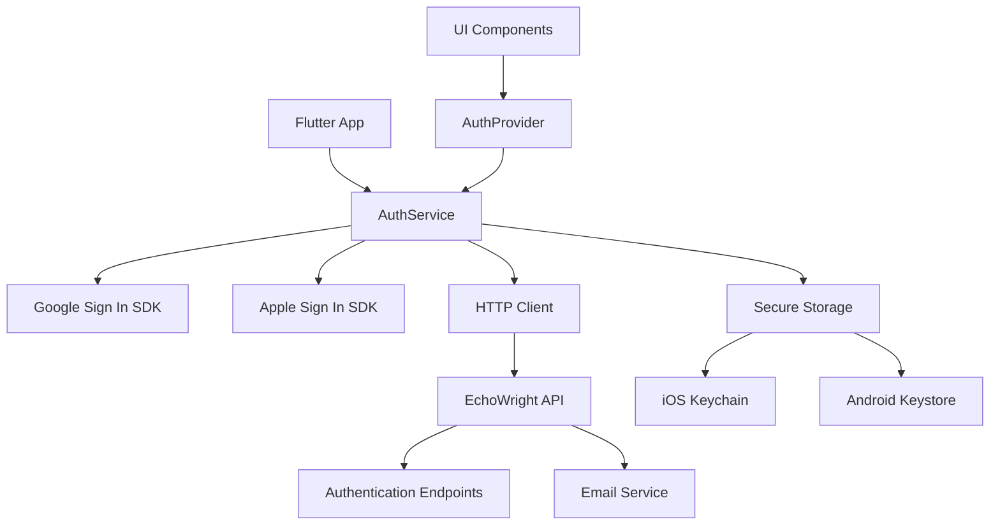

# Mobile Services

This directory contains the service layer for the EchoWright Flutter mobile application. Services handle API communication, authentication, data persistence, and external integrations.

## Services Overview

### AuthService (`auth_service.dart`)

Handles all authentication operations including OAuth, email authentication, and token management.

**Key Features:**
- Google OAuth 2.0 integration using `google_sign_in`
- Apple Sign In integration using `sign_in_with_apple`
- Email/password authentication
- Secure token storage using `flutter_secure_storage`
- Automatic token refresh
- Session persistence across app restarts

**Usage:**
```dart
import '../services/auth_service.dart';

// Google Sign In
final result = await AuthService.signInWithGoogle();
if (result.success) {
  print('Welcome ${result.user!.displayName}');
}

// Email Sign Up
final result = await AuthService.signUpWithEmail(
  email: 'user@example.com',
  password: 'securepass123',
  displayName: 'John Doe',
);

// Check authentication status
final isAuth = await AuthService.isAuthenticated();
final currentUser = await AuthService.getCurrentUser();
```

**Security Features:**
- Platform-specific secure storage (iOS Keychain, Android Keystore)
- Automatic token expiration handling
- Secure nonce generation for Apple Sign In
- Network timeout protection (30 seconds)
- Error handling for network failures and user cancellation

**Storage Keys:**
- `access_token`: JWT access token
- `refresh_token`: JWT refresh token for token renewal
- `user_data`: Cached user profile information
- `token_expiry`: Token expiration timestamp

## Architecture



## Service Design Patterns

### 1. Static Service Classes
Services are implemented as static classes for global access without dependency injection complexity:

```dart
class AuthService {
  // Private constructor to prevent instantiation
  AuthService._();
  
  static const FlutterSecureStorage _secureStorage = FlutterSecureStorage();
  static final GoogleSignIn _googleSignIn = GoogleSignIn();
  
  static Future<AuthResult> signInWithGoogle() async {
    // Implementation
  }
}
```

### 2. Result Pattern
All service methods return result objects with success/error states:

```dart
class AuthResult {
  final bool success;
  final User? user;
  final String? error;
  final bool cancelled;
  
  factory AuthResult.success(User user) => AuthResult._(success: true, user: user);
  factory AuthResult.error(String error) => AuthResult._(success: false, error: error);
  factory AuthResult.cancelled(String message) => AuthResult._(success: false, error: message, cancelled: true);
}
```

### 3. Secure Storage Pattern
Consistent secure storage usage across all services:

```dart
class ServiceBase {
  static const FlutterSecureStorage _secureStorage = FlutterSecureStorage(
    aOptions: AndroidOptions(
      encryptedSharedPreferences: true,
    ),
    iOptions: IOSOptions(
      accessibility: KeychainItemAccessibility.first_unlock_this_device,
    ),
  );
  
  static Future<String?> getSecureData(String key) async {
    return await _secureStorage.read(key: key);
  }
  
  static Future<void> setSecureData(String key, String value) async {
    await _secureStorage.write(key: key, value: value);
  }
}
```

## Configuration

### API Configuration (`../api_config.dart`)

```dart
// Base API configuration
const String apiBaseUrl = 'http://localhost:8000';
const Duration defaultTimeout = Duration(seconds: 30);

// OAuth Configuration
const List<String> googleScopes = ['email', 'profile'];
const List<AppleIDAuthorizationScopes> appleScopes = [
  AppleIDAuthorizationScopes.email,
  AppleIDAuthorizationScopes.fullName,
];
```

### Secure Storage Configuration

```dart
static const FlutterSecureStorage _secureStorage = FlutterSecureStorage(
  aOptions: AndroidOptions(
    encryptedSharedPreferences: true,
    keyCipherAlgorithm: KeyCipherAlgorithm.RSA_ECB_PKCS1Padding,
    storageCipherAlgorithm: StorageCipherAlgorithm.AES_GCM_NoPadding,
  ),
  iOptions: IOSOptions(
    accessibility: KeychainItemAccessibility.first_unlock_this_device,
    synchronizable: false,
  ),
);
```

## Error Handling

### Network Error Handling
```dart
try {
  final response = await http.post(uri, body: body).timeout(_timeoutDuration);
  if (response.statusCode == 200) {
    // Success handling
  } else {
    // HTTP error handling
    final error = jsonDecode(response.body);
    return AuthResult.error(error['detail'] ?? 'Request failed');
  }
} on TimeoutException {
  return AuthResult.error('Request timed out');
} on SocketException {
  return AuthResult.error('No internet connection');
} catch (e) {
  return AuthResult.error('Unexpected error: $e');
}
```

### OAuth Error Handling
```dart
try {
  final credential = await SignInWithApple.getAppleIDCredential(scopes: scopes);
} on SignInWithAppleAuthorizationException catch (e) {
  if (e.code == AuthorizationErrorCode.canceled) {
    return AuthResult.cancelled('User cancelled Apple sign in');
  }
  return AuthResult.error('Apple sign in failed: ${e.message}');
} catch (e) {
  return AuthResult.error('Apple sign in failed: $e');
}
```

## Testing Services

### Unit Testing
```dart
import 'package:flutter_test/flutter_test.dart';
import 'package:mockito/mockito.dart';
import 'package:http/http.dart' as http;

// Mock HTTP client
class MockClient extends Mock implements http.Client {}

void main() {
  group('AuthService Tests', () {
    late MockClient mockHttpClient;
    
    setUp(() {
      mockHttpClient = MockClient();
    });
    
    test('successful email signin returns user', () async {
      // Mock successful API response
      when(mockHttpClient.post(any, headers: anyNamed('headers'), body: anyNamed('body')))
          .thenAnswer((_) async => http.Response(jsonEncode({
            'access_token': 'test_token',
            'refresh_token': 'test_refresh',
            'user': {'id': '123', 'email': 'test@example.com'},
          }), 200));
      
      final result = await AuthService.signInWithEmail(
        email: 'test@example.com',
        password: 'password123',
      );
      
      expect(result.success, isTrue);
      expect(result.user?.email, equals('test@example.com'));
    });
  });
}
```

### Integration Testing
```dart
import 'package:flutter/services.dart';
import 'package:flutter_test/flutter_test.dart';
import 'package:integration_test/integration_test.dart';

void main() {
  IntegrationTestWidgetsFlutterBinding.ensureInitialized();
  
  group('AuthService Integration Tests', () {
    testWidgets('secure storage persists across app restarts', (tester) async {
      // Test secure storage functionality
      await AuthService.signInWithEmail(
        email: 'test@example.com', 
        password: 'password123'
      );
      
      // Simulate app restart
      await tester.binding.defaultBinaryMessenger.handlePlatformMessage(
        'flutter/platform',
        const StandardMethodCodec().encodeMethodCall(
          const MethodCall('System.exitApplication')
        ),
        (data) {},
      );
      
      // Verify authentication persists
      final isAuth = await AuthService.isAuthenticated();
      expect(isAuth, isTrue);
    });
  });
}
```

## Performance Considerations

### Token Management
- Access tokens are cached in memory for quick access
- Automatic refresh before expiration (30 minutes default)
- Refresh tokens stored securely with 7-day expiration
- Background token refresh to avoid UI blocking

### Network Optimization
- 30-second timeout for all API requests
- Automatic retry for network failures (future enhancement)
- Request/response compression (handled by HTTP client)
- Connection pooling for multiple requests

### Secure Storage Optimization
- Minimize secure storage reads/writes (expensive operations)
- Cache frequently accessed data in memory
- Batch secure storage operations when possible
- Use appropriate accessibility levels for iOS Keychain

## Adding New Services

To add a new service to the mobile app:

1. **Create Service File**: `new_service.dart` in this directory
2. **Follow Service Patterns**: Use static methods and result pattern
3. **Add Configuration**: Update `api_config.dart` if needed
4. **Implement Error Handling**: Follow established error handling patterns
5. **Add Tests**: Create unit tests in `test/services/`
6. **Update Documentation**: Add service documentation to this README

### Service Template

```dart
/**
 * new_service.dart - Service for handling specific functionality
 * 
 * Key responsibilities:
 * - Primary service function
 * - Integration with external APIs
 * - Local data management
 * - Error handling and retry logic
 */

import 'dart:convert';
import 'dart:io';
import 'package:http/http.dart' as http;
import '../api_config.dart';

class NewService {
  NewService._(); // Private constructor
  
  static const Duration _timeoutDuration = Duration(seconds: 30);
  
  /// Main service method
  static Future<ServiceResult> performOperation(String parameter) async {
    try {
      final response = await http.get(
        Uri.parse('$apiBaseUrl/endpoint'),
        headers: {'Content-Type': 'application/json'},
      ).timeout(_timeoutDuration);
      
      if (response.statusCode == 200) {
        final data = jsonDecode(response.body);
        return ServiceResult.success(data);
      } else {
        final error = jsonDecode(response.body);
        return ServiceResult.error(error['message'] ?? 'Operation failed');
      }
    } on TimeoutException {
      return ServiceResult.error('Request timed out');
    } on SocketException {
      return ServiceResult.error('No internet connection');
    } catch (e) {
      return ServiceResult.error('Unexpected error: $e');
    }
  }
}

/// Result wrapper for service operations
class ServiceResult {
  final bool success;
  final dynamic data;
  final String? error;
  
  ServiceResult._({required this.success, this.data, this.error});
  
  factory ServiceResult.success(dynamic data) {
    return ServiceResult._(success: true, data: data);
  }
  
  factory ServiceResult.error(String error) {
    return ServiceResult._(success: false, error: error);
  }
}
```

## Dependencies

- `http: ^1.1.0` - HTTP client for API requests
- `google_sign_in: ^6.2.1` - Google OAuth integration
- `sign_in_with_apple: ^5.0.0` - Apple Sign In integration
- `flutter_secure_storage: ^9.0.0` - Secure token storage
- `crypto: ^3.0.3` - Cryptographic utilities
- `url_launcher: ^6.2.1` - URL launching for OAuth flows

## Security Best Practices

1. **Never Log Sensitive Data**: Tokens, passwords, or personal information
2. **Use HTTPS Only**: All API communication must use secure connections
3. **Validate Certificates**: Implement certificate pinning for production
4. **Secure Storage**: Use platform secure storage for all sensitive data
5. **Token Expiration**: Implement proper token lifecycle management
6. **Error Messages**: Don't expose internal details in user-facing errors
7. **Input Validation**: Validate all inputs before sending to API
8. **Timeout Handling**: Set appropriate timeouts for all network requests